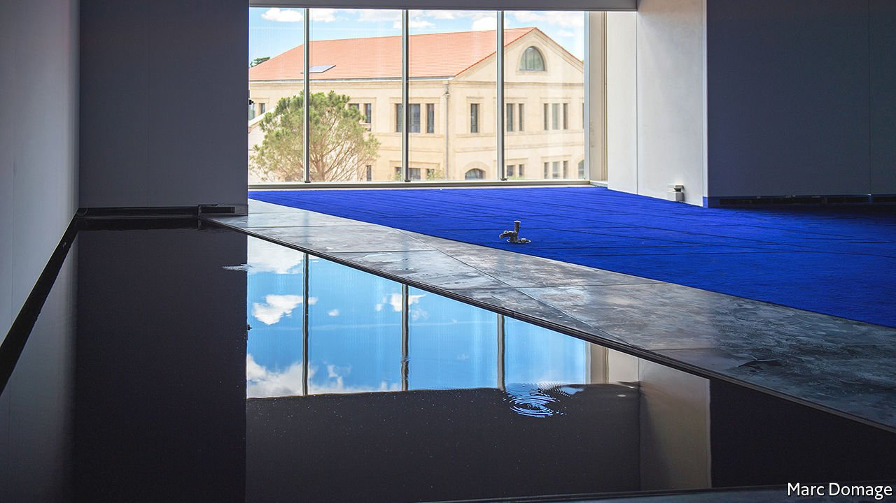

###### Contemporary art

# A bold artist’s work is at once high-tech and primeval 

##### Philippe Parreno pushes the boundaries of what art can be 

 

> Sep 25th 2021 

ON THE AFTERNOON before this summer’s official opening of Luma Arles, an impressive new art centre in the south of France, a triangular pool in the corner of one of the ground-floor galleries began to overflow. Visitors were more amused than perturbed as the water seeped inexorably across the parquet floor. Even when the circular blue carpet in the centre of the room became sodden and dark, onlookers suspected it was part of the show. The gallery had been given over to Philippe Parreno, a French conceptual artist whose work challenges notions of what an art exhibition can be. Mr Parreno watched in silence as the water spread.

Born in Oran, Algeria, and brought up in Grenoble, one of France’s most tech-savvy cities, Mr Parreno, now 57, first came to the notice of the art world in the early 1990s, just as the internet was taking off. Hans Ulrich Obrist, artistic director of the Serpentine Gallery in London, remembers a work he created in a summer garden in Villa Arson in Nice. It was made entirely of artificial fireflies which, by day, no one could see; they were visible only at night when the museum was closed. Andrea Lissoni, who worked closely with the artist at Tate Modern, recalls an early show in New York in which fish-shaped balloons filled with helium were let loose in a gallery, to be arranged and rearranged by visitors. The resulting excitement, especially among children, contrasted exuberantly with the sombre reverence generally considered normal in art galleries.


Different as they were, both shows demonstrated the artistic preoccupations which, says Mr Parreno, have gripped him over the past 30 years. These include an obsessive focus on time rather than objects; the use of various media (whether film, sound or performance); an enthusiasm for working with collaborators rather than alone; the exploration of artificial intelligence and even organic materials such as yeast as artistic “agents” that help shape his artworks; and a preference for site-specific projects rather than shows that can travel from gallery to gallery. Perhaps above all comes Mr Parreno’s insistence that the intervention of the audience is a key part of any exhibition.

For his next trick

Over the decades his work has grown ever-more complex; to some, it has become incomprehensible. In the installation he created in 2016 for the Turbine Hall at Tate Modern, Mr Parreno assembled an array of data about the building, including the temperature of the galleries at different times of the day, recordings of the sounds made by the industrial piping that runs through it, and the wind speed on the roof. All this was relayed by computer and fibre-optic cables into a vast tub of live yeast placed behind glass at one end of the hall.

The energy created was used to subtly change the atmosphere in the hall. Visitors found themselves subjected to clanging roars, recordings of the whoosh of the nearby river and the slap of boats on the shore, while assorted films by Mr Parreno were projected on screens that moved up and down on cables suspended from the ceiling. “It was a space within a space,” he says now, “and within that space you had another space.” He insists the sounds and screens were controlled by the yeast. One critic likened it to an “alien intelligence”.

This sort of art is not for everyone. But for those wanting to understand the French artist’s ambitions, his installation at Luma Arles is a good place to start. It has two parts: an 80-minute film by Mr Parreno and a projection based on how the audience reacts to it. Visitors are invited to sit on benches set in a circle, which is itself mounted in the middle of the floor. From time to time the circle turns, first in one direction, then the other. The window blinds move up and down, depending on the level of sunshine outside. A drone floating at ceiling level records the audience’s reactions and plays their whisperings back into the room. “The whole thing is a learning process,” Mr Parreno says. “Because the audience always responds in a different way, every showing is unique.”

The film, meanwhile, is made from re-edits of several earlier pieces. Out of a sequence on the biology of the cuttlefish, for example, or on the journey taken by the train carrying Robert Kennedy’s body from Los Angeles to the east coast after he was assassinated, Mr Parreno presents a completely new narrative that appears to be nothing less than the story of life.

The first frames depict a starlit darkness at the edge of a galaxy far beyond this one. From there the viewer is transported around the surface of the sun, through the heavens and down towards Earth where a bug-eyed creature (the cuttlefish from an earlier film, “Anywhen”, first shown at Tate Modern) seems to be emerging from a swamp. Humankind evolves and gathers in dense cities, living in squalid apartments in Chinatown or the opulent interior of the Waldorf Astoria hotel, and all along the railway sidings of America. The “other” is ever-present, in the form of the immigrant, the alien and various characters with different voices all performed by Nina Conti, an English ventriloquist. The effect is surreal and mesmerising.

Designed by Frank Gehry, the Luma itself is a grandiose tower that looms over the old city of Arles, visually harking back to a confident, pre-pandemic world. By contrast, Mr Parreno’s installation—tech-heavy yet refashioned from earlier works, made in collaboration with others, telling stories about fragile humanity—suits the moment. The seepage from the overflowing pool in the corner of the gallery turned out to be the result of a tap accidentally left on by a workman. But such is Mr Parreno’s wizardry that you would be forgiven for thinking it was all part of the story. ■

