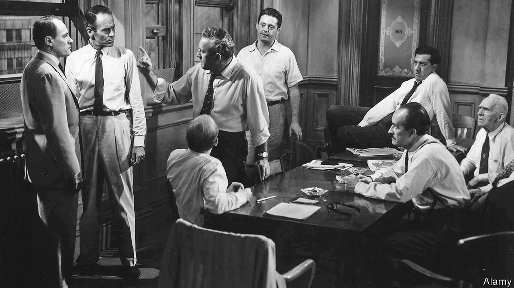

###### Justice on screen

# A new book explores the curious origins of “12 Angry Men” 

##### The film went on to become a landmark in American civic entertainment 

 

> Sep 25th 2021 

Reginald Rose and the Journey of 12 Angry Men. By Phil Rosenzweig. Fordham University Press; 314 pages; $27.95 and £22.99

IN 1954 A young screenwriter received a summons for jury service in New York. For the rest of his life he would describe how he sat with his peers in a homicide case, helping argue the conviction down from manslaughter to assault. The accused had punched a loudmouth who had pulled a knife in a bar and, after being struck, fell and banged his head. Reginald Rose recalled that he left the court, sat down at his typewriter and wrote the screenplay for the landmark film “12 Angry Men”.


But a bit of sleuthing reveals that he may not have served on the jury. Phil Rosenzweig, the author of this fascinating book about Rose’s masterpiece, searched in court records and found the most similar case. The names of all 12 jurors and both alternates are listed; Rose’s is not among them. Yet the crime was too obscure to be known beyond the courtroom. The best explanation, Mr Rosenzweig writes, is that Rose was called up but dismissed, perhaps staying on to watch the trial.

At any rate, something inspired him. Alongside “To Kill a Mockingbird” and “Death of a Salesman”, two other mid-century dramas, “12 Angry Men” became a staple of American civic entertainment. Like them it appeared in several forms: first as a live teleplay, later as a film starring Henry Fonda and in a long afterlife on stage. The film, made in 1957, depicts a roomful of jurors—all white men from various walks of life—struggling to reach a consensus in a murder case. Fonda’s lone holdout eventually persuades the others to join him in a verdict of not guilty. Along the way they confront prejudice, conformity, class and the sharp edges of the legal system.

Mr Rosenzweig devotes ample space to Rose’s life and works, but the book is strongest on the making of the classic film. The screenwriting challenge was “to devise a case against the defendant that was strong enough for almost all jurors to vote guilty, and then to chip away at the evidence” so they could plausibly change their minds. Two weeks of rehearsal preceded filming. As the cast members ran through their lines, Sidney Lumet, the director, “moved through the room to envision each shot”. Early on he elevated the camera, gradually bringing it lower and closer to the action to build claustrophobic tension.

Most of the 12 actors had backgrounds in theatre and filming had a repertory feel. “You didn’t screw around on a Hank Fonda set,” said the assistant director; but the atmosphere was much friendlier than that depicted on screen, Lumet’s praise buoying everyone’s spirits. The days “were filled with kissing and hugging and wild exclamations of joy”, said Rose, a quiet writer among effusive show-business types. “Actors have never been more loved than when they were loved by Sidney Lumet.”

A critical success and a favourite in Europe, the film bombed in America on its release, failing to hold up against bigger hits such as “Funny Face”, “The Ten Commandments” and “The Bridge on the River Kwai”. Yet over the years its stature grew, and it was remade several times. The American Film Institute now recognises it as one of the 20th century’s best movies. Not much is sacred in American public life any more. The jury itself is one of the holdouts. ■

