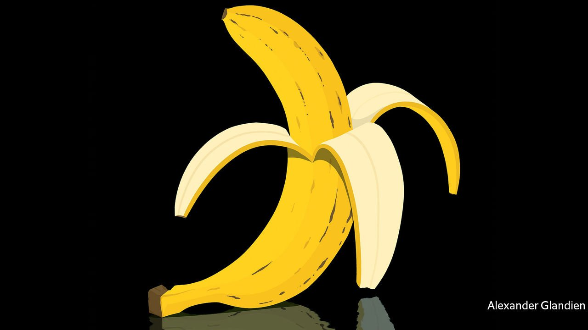

###### Reason and its discontents

# Steven Pinker’s new defence of reason is impassioned but flawed 

##### In “Rationality” he answers his critics but underplays the importance of scepticism 

 

> Sep 22nd 2021 

Rationality. By Steven Pinker. Viking; 432 pages; $32. Allen Lane; £25

STEVEN PINKER is too honest to deny that he risks blowing into his own sails. If he tried to use a reasoned argument to validate rationality, he acknowledges, he would be assuming the thing he aims to establish. And so he approaches his target from the side, first showing how rationality perfects human understanding, then reflecting on how reason has brought material and moral progress. Unfortunately, though rationalists may feel affirmed, non-believers are unlikely to be converted.


Mr Pinker, a professor at Harvard, has a lot to get off his chest. His previous book, “Enlightenment Now”, a paean to reason’s role in history, had a mixed reception in 2018. It met with praise (), but also objections that it was simplistic, Panglossian and selective in its evidence. A personal attack followed last year, with a vicious and shoddy campaign demanding that the Linguistic Society of America cancel him. Meanwhile, in recent decades, research in economics and psychology has underlined just how far Homo sapiens falls short of rational beings who maximise their economic welfare and engage in truth-distilling debate.

Since Mr Pinker cannot simply argue for reason, fully seven of the book’s 11 chapters instead set out a rationalist’s catechism—a primer of formal logic, probability, causation and so forth. In these passages he justifies reason by showing what it can do, using games and logical puzzles.

For instance, imagine that 1% of women suffer from breast cancer and a test for the condition is 90% accurate, but reports false positives 9% of the time. If a woman tests positive, what is the chance that she has the disease? The most common answer among a sample of doctors was 80-90%, but the correct answer is just 9%. The reason is that the false positives in the 99% of women who are breast-cancer-free overwhelm the true positives in the 1%. Without further data, you cannot say any more about whether this particular woman is among the true positives or the false ones.

On the face of it, the doctors’ error is damning evidence against human rationality. However, in an ingenious piece of intellectual judo, Mr Pinker turns the argument back on the irrationalists. The fact that people are easily confused by probabilities, he writes, is no more evidence that they are incapable of reason than optical illusions are evidence that people cannot make sense of what they see.

They are led astray partly by how the questions are set out. By way of illustration, Mr Pinker cites “the Linda problem”, first posed by the celebrated academics Daniel Kahneman and Amos Tversky.


Respondents tend to say that Linda is more likely to be a feminist bank teller than just a bank teller, which cannot be true as the set of bank tellers includes all the feminists and non-feminists alike. Mr Pinker argues that such cognitive illusions may arise because people are using their intelligence to hypothesise about a social reality in which they meet a person called Linda, rather than to frame the problem as a logical puzzle. When they are told to imagine 1,000 women like Linda and asked how many belong in each category, the error rate tumbles.

QAnon and on

Ever the optimist, Mr Pinker sees the glass half-full. He rejects the idea that the human brain is “a basket of delusions”. The rationalist techniques he describes help people correct biases and hasty judgments. They extend humans’ remarkable powers of thought, just as microscopes and telescopes extend the range of their sight. The miracle is not that people make mistakes, but how easily they can be helped to see through them. Anyone can learn to reason better; indeed, Mr Pinker goes on to argue that rationality should join reading, writing and arithmetic as a fourth R.

This is all very well, but it produces an inverted doughnut of a book. To begin and end with, Mr Pinker serves up helpings of jam, in which he deals with today’s attacks on reason from anti-vax conspiracy theorists on the right and social-justice warriors on the left. In between is that ring of puzzle-solving stodge designed to show that people are capable of being rational. For all their utility, these seven chapters are divorced from the drama of the moment, and bewilderingly Spockian in their lack of empathy. When Mr Pinker at last declares on page 283 that “This is the chapter most of you have been waiting for”, you wonder why some kindly editor didn’t urge him to get to the point sooner.

The pity is that when Mr Pinker writes about the conspiracy and outrage that have infected American public life he has much to say that is interesting. He is wise enough not to blame everything on social media, nor to assert that simply elucidating Bayes’s theorem would temper QAnon supporters’ fever dreams about Democratic child-murderers. Instead he observes how humans evolved “not as intuitive scientists but as intuitive lawyers”, using motivated reasoning to fight their corner. People are titillated by conspiracy and gossip. And narrative and myth have a psychological and sociological function beyond literal truth and falsehood.

Rather than explore these ideas in greater depth, however, Mr Pinker rushes on to make the case for reason as the best defence against them. Rationality is impartial, he observes. In this, it corresponds to the ethical insight that a fair system is one that treats people dispassionately. “Rationality, then,” he writes exultantly, “is not just a cognitive virtue but a moral one.” As for the critics who accuse him of a naive faith in progress, they misunderstand him. In fact he believes that rationality is what wrings progress from an unforgiving universe. To illustrate his point, Mr Pinker finishes up with a parade of thinkers such as Erasmus, John Locke and Jeremy Bentham who paved the way for material and moral improvements by deploying reason against cruelty and violence.

Yet that will not do. Rationality involves people knowing they are right. And from the French revolution on, being right has been used to justify appalling crimes. Mr Pinker would no doubt call the Terror a perversion of reason, just as Catholics brand the Inquisition a denial of God’s love. It didn’t always seem that way at the time.

Mr Pinker is on the side of the better angels. He is right about the value of reason. He acknowledges the contingency of what is known. But he puts too little emphasis on the need to temper rationality with scepticism, and on the way certainty slides into hubris. He is not sufficiently interested in how rationality gels with the rest of a person’s outlook. As with many doughnuts, this book has a hole in the middle. ■

