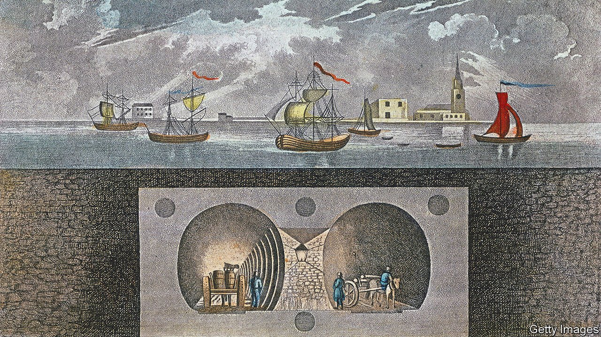

###### What lies beneath

# The lost rivers and forgotten history of London 

##### A lifelong Londoner, Tom Chivers delves into—and below—the city’s streets 

 

> Sep 25th 2021 

London Clay: Journeys in the Deep City. By Tom Chivers. Doubleday; 464 pages; £20

IN 1858 LONDON was hit by the “Great Stink” after the banks of the Thames became clogged with raw sewage. Exacerbated by a heatwave, the stench was overpowering. To dispel it—and the threat of cholera—Joseph Bazalgette, a civil engineer, created a sewer system that, although decrepit, is still in use today. As part of this Victorian megaproject, the Fleet river, by then little more than an open drain, was encased in cement and lost to public view.


More than a century and a half after the stream disappeared, most Londoners are unlikely to have heard of it, or to know that, where it joined the Thames, the Fleet was once almost 100 metres wide. Residents might also be surprised to learn that Westminster Abbey, where monarchs and other worthies are interred, was built on what in the 13th century was an island. The city is littered with such transformations and unexpected tales.

In “London Clay” Tom Chivers delves into the capital’s streets and uncovers some of these stories. Much of his journey is conducted above ground, but in one passage he descends to the “malodorous” Fleet, wisely clothed head-to-toe in protective gear. He finds sweeter aromas pursuing the Ambrook river in a wood in south London, and intrigue in the basement of a government building where the Tyburn is rumoured to bubble up. Forgotten waterways are not his only interest: he stomps around Bermondsey, once surrounded by marshes, and peers into a sinkhole, the site of an abandoned Tube station.

A lifelong Londoner (and a poet), Mr Chivers knows the local history and geography well. His book bounces back from Jack the Ripper to Geoffrey Chaucer by way of Elizabethan theatre, taking in asides on the mishmash of contemporary architecture and the idiosyncrasies of passers-by. A memorable assortment of modern-day characters includes environmentalists, a youth worker and a Roman Catholic priest. The drifting focus is sometimes discombobulating, at other times charming.

The book’s anchor is what lies beneath. As its title suggests, London’s geology is dominated by clay, along with sand and gravel in the river valley’s bedrock. Mr Chivers overlays a street map with colours representing the different substrata—“half eccentric artwork, half primary-school science project”—which becomes a springboard for his digressions. Quirks of geology may not interest everyone, but his travel-book-cum-memoir will open readers’ eyes to what is around and below them.

Its delight in exploration is matched by a thoughtful meditation on grief. Mr Chivers reflects on the death of his mother when he was a teenager, visiting her grave and recalling her efforts to preserve the site of a 16th-century theatre. He likens the scars of his sorrow to the flow of a river you cannot see: “It remains, the trace of a buried channel, and gives its form to the land that is your life after loss.” ■

