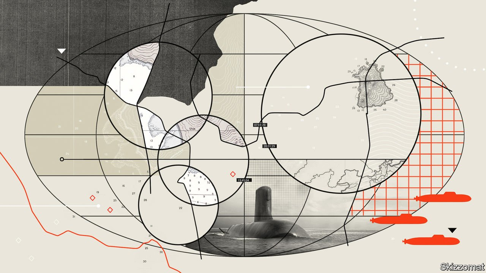
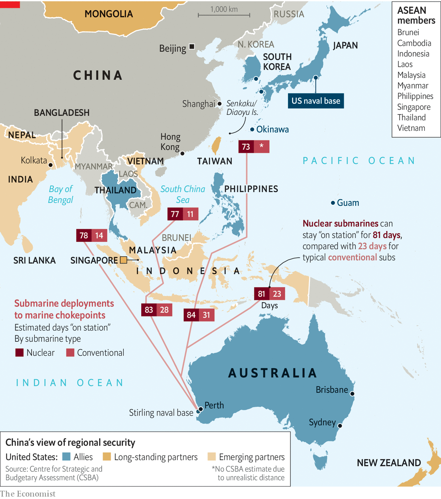
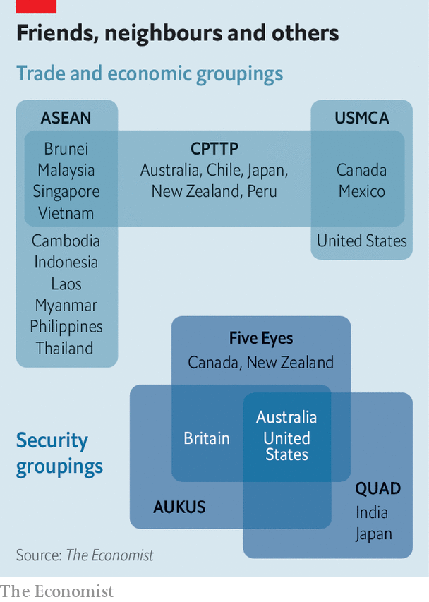
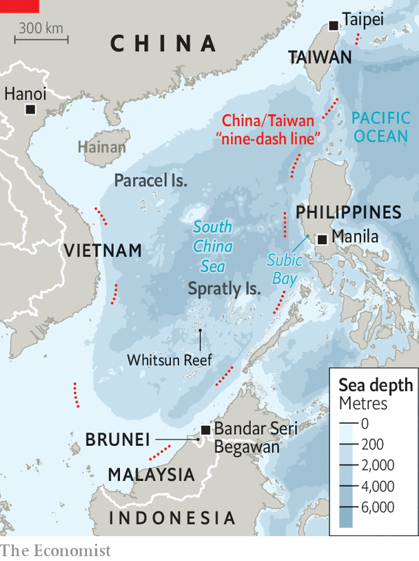
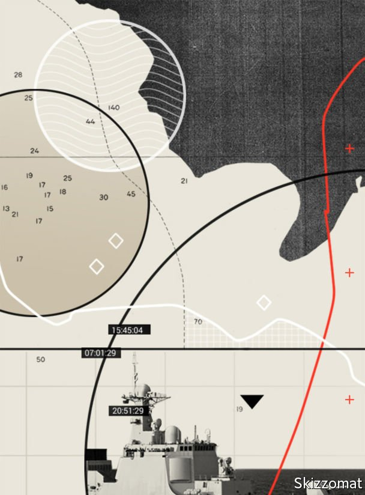
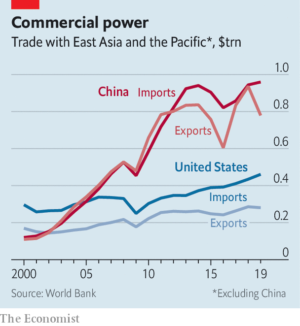

###### The new geopolitics of Asia

# AUKUS reshapes the strategic landscape of the Indo-Pacific 

##### A major submarine deal underscores how the new theatre for great-power competition is maritime 

 

> Sep 25th 2021 

IN THE EARLY 19th century, Chinese and Indian labourers in what is now Western Australia noted that the sweet-smelling logs being burned in the colony’s fires were sandalwood—a valuable commodity in their native lands. By the 1870s Australian sandalwood was one of the colony’s major exports, shipped from Perth to Bombay, Singapore, Hong Kong and Shanghai, where it was particularly prized.

Trade between the nations continued from then on, with Australia providing a range of raw materials, but never at a particularly impressive rate. Then China’s market reforms took off in the 1990s, and with them an unprecedented appetite for coal and ores of all sorts. By the 2010s China was Australia’s biggest trading partner, a hungry buyer not just of bulk materials but of high-end seafood and beefy shiraz.


For a long time Australia’s political establishment ducked the need for a proper debate on the risks of basing the country’s prosperity on trade with autocratic China and its security on an alliance with America. In the past couple of years Chinese high-handedness has made that contradiction harder to ignore or to tolerate.

Late last year China laid out a set of 14 grievances that was striking in its scope, animosity and hypocrisy. It included Australia passing a law against foreign interference in domestic politics, blaming China for cyber-attacks and suggesting that Chinese journalists might be state agents. Australian lobster, wine, barley, coal, sugar and timber suddenly faced an unofficial Chinese trade embargo and piled up unsold. The case for viewing China as a long-term challenge to national interests was rested.

One result of this is a strong possibility that in the 2030s there will be new boats plying the old sandalwood routes north from Perth: a fleet of at least eight Australian nuclear submarines based on either America’s Virginia class or Britain’s Astute class, built with technology from some combination of the two countries’ defence contractors. These submarines are the most dramatic component of an agreement between America, Australia and Britain called AUKUS which the three nations announced on September 15th. Negotiated in the strictest of secrecy over a period of months, it envisages a wide range of diplomatic and technological collaboration, from cyber-security to artificial intelligence. But given that the three countries already collaborate closely in many areas—they make up, with Canada and New Zealand, the “Five Eyes” intelligence-sharing pact—it is the novelty of Australia’s nuclear submarines that has garnered the most attention. And quite rightly.

As an arms deal it is big; at least eight nuclear submarines suggests a contract value in the tens of billions of dollars. As a strategic shift it is bigger. The pact is America’s most dramatic and determined move yet to counter what it and others in the Indo-Pacific region see as a growing threat from China. As Stephen Walt of Harvard University writes, “it is a move designed to discourage or thwart any future Chinese bid for regional hegemony.”

The  but from the opposite end of Eurasia. Although President Joe Biden stressed that AUKUS was about “investing in our greatest source of strength—our alliances”, America’s oldest ally and Britain’s physically closest one, , had been stabbed in the back, as Jean-Yves Le Drian, its foreign minister, put it.

In 2016 Australia signed a contract for 12 diesel-electric “Shortfin Barracuda” submarines with Naval Group, a company in which the French state has a majority stake. On the very day of the AUKUS announcement, according to the French defence ministry, Australia notified France that it was satisfied with the progress that the programme was making. After the announcement the Barracuda was dead in the water. On September 17th President Emmanuel Macron took the extreme measure of withdrawing France’s ambassadors from Washington and Canberra (though not London, a sleight within a sleight conveying France’s belief that Britain, as a tag-along in the troika, was beneath disdain).

France, the European Union’s leading military power, will see its suspicion that the English-speaking allies are never really to be trusted as vindicated. The arguments for strategic autonomy engendered by that suspicion will now be made again, and perhaps acted on, both with respect to policy in the Indo-Pacific—where France has numerous territories, nearly 2m citizens and 7,000 troops—and elsewhere. Placating the French will in part be a matter of accommodating those arguments. In a phone call on September 22nd during which Mr Biden and Mr Macron “agreed that the situation would have benefited from open consultations among allies”, America recognised “the importance of a stronger and more capable European defence, that contributes positively to transatlantic and global security and is complementary to NATO”. France’s ambassador will return to Washington next week, but the lessons it has drawn will linger.

And as one door closes another opens. France and India joined again in a three-day naval exercise earlier this year; Mr Macron and Narendra Modi, India’s prime minister, spoke this week. India will be delighted by the focused attention of a big arms supplier which is sympathetic to its notion of non-alignment. It would love some help with nuclear submarines, whether from France or AUKUS.

HMAS Perfidious Albion

The importance of nuclear submarines lies in the projection of force. Diesel-electric submarines like the Shortfin Barracuda can be very quiet indeed when in electric mode. As such they would be well suited to protecting Australia’s coastal waters—better in some ways than nuclear-powered boats, which can never completely silence the hum of their reactors’ plumbing. In deeper seas and when travelling greater distances, though, nuclear subs can hide between sound-muffling layers of warm and cold water and make use of their far greater range and sustained speed.

A conventional sub dispatched to patrol the contested waters of the South China Sea from HMAS Stirling, the naval base in Perth which is home to Australia’s submarine fleet, would be able to stay on station for just two weeks before returning for refuelling and upkeep, according to calculations by the Centre for Strategic and Budgetary Assessments, an American think-tank. A nuclear sub could lurk for as long as its crew could be fed (see map). Its missions there could include intelligence-gathering and disgorging special forces as well as holding Chinese surface ships and submarines at risk.

 


To go from a diesel-electric fleet to a nuclear fleet is thus a change of strategy, not just of propulsion. It provides a way to project power from the shipping lanes which feed the all-important Malacca Strait to the waters off Taiwan. Add on the capacity to launch much longer-range missiles—a submarine could deliver missiles to China’s mainland while sitting to the east of the Philippines—and the country has a greatly expanded offensive capacity.

The new boats’ specifications and exact provenance are to be defined during an 18-month scoping period. If, over the years that it takes for them to arrive, Australia does in fact lease one or two American Virginia-class subs to train crews and fill the gap, that would further strengthen its ties with America’s navy. It would also spur the development of relevant infrastructure at HMAS Stirling and possibly also at Darwin on the north coast and Brisbane on the east, infrastructure visiting American boats could use too. A day after the AUKUS news came the announcement of a substantial increase in America’s military presence in and around Australia.

Responding to the AUKUS announcement on September 16th, China’s “wolf-warrior” government spokesman, Zhao Lijian, said the submarine co-operation “seriously undermined regional peace and stability, intensified an arms race and undermined international non-proliferation efforts”. While the source needs to be taken into account, the deal does raise potential proliferation issues.

The fact that a submarine is nuclear-powered does not mean that it must carry nuclear missiles (and Mr Biden stressed that Australia’s would not). There are currently no American nuclear warheads capable of sitting on the sort of missiles that can be fired from the Virginia or Astute boats and thus, probably, the new Australian class. But if the new submarines use reactors like America’s and Britain’s, Australia will need the fuel those reactors use: highly enriched uranium (HEU) of the sort that is used to make bombs. Australia would not necessarily need to develop enrichment technology itself. Its possession of HEU provided by others would still make it unique among the non-nuclear-weapons states signatory to the Nuclear Non-Proliferation Treaty (NPT).

Unique, but not in breach: the NPT allows such uses. If Australia and the International Atomic Energy Agency, which polices the NPT, found a way for the HEU to be used on submarines and still kept under IAEA safeguards, they would be setting a precedent which might strengthen the treaty a bit. If they do not, the precedent could point the other way: if safeguards are not the norm, exploiting HEU for submarine propulsion might become cover for making bombs. South Korea recently showed it can launch a ballistic missile from a submarine—a capability most of the nuclear-weapons states have, but which no other non-nuclear-weapon state has ever seen a need for. Were it to start developing nuclear power for its submarines without IAEA safeguards, its motives would come under very close scrutiny.

If Australia’s strategic stance is changed by the deal, so is America’s. Since the second world war it has projected power across the region via what Bruce Cumings, a historian, calls an “archipelago of empire”—island bases from Hawaii in the east to Guam, Okinawa in Japan and, in the Indian Ocean, Diego Garcia, leased from Britain without the consent of its natives. In Australia, America has now, in effect, a beefed-up continent-sized base for its own operations as well as a reinvigorated ally.

This should slow—but not yet reverse—the shift in the maritime balance of power between America and China, which is sustaining spectacular levels of shipbuilding and missile-making. It also points to an emerging facet of security co-operation under Mr Biden; coalitions of the willing defined by what the counterparts want and are able to offer. Strong doses of pragmatism are likely to be features of the new, often transactional, arrangements.

One area where this should be seen is the Quad, a 14-year-old diplomatic grouping of America, Australia, India and Japan. The idea of a “free and open Indo-Pacific” originated with Japan, but has been taken up with gusto by the Quad’s members. The Quad is broadly welcome in the region, because it gives smaller Asian states options other than Chinese ones. Beyond phrasemaking, though, it has not really achieved all that much. It has certainly not stopped China from threatening its members.

Japan faces daily challenges from Chinese aircraft and vessels around its uninhabited Senkaku Islands, which China claims as its own Diaoyu Islands. Not long ago, a high-altitude brawl between Indian and Chinese troops in the Himalayas turned deadly. In order to deal with overland threats, C. Raja Mohan of the National University of Singapore recently wrote in Foreign Policy, a magazine, India feels the need to protect its maritime flank. Having been shaken by America’s precipitous withdrawal from Afghanistan, it sees in AUKUS welcome evidence of long-term American commitment.

 


On September 24th the Quad’s four heads of government will meet for the first time in person, in Washington, DC—a token of revived intent and energy. There has been talk of India joining the other three members’ “Blue Dot” initiative, which sets standards for transparency and environmental impact in infrastructure projects, and is intended to provide developing countries with an alluring alternative to China’s Belt and Road Initiative. A vaccination programme unveiled at a virtual summit of the Quad in March aimed to get jabs into Asian arms, though not as yet to much effect.

How the Quad will work with AUKUS remains to be seen. It is possible that Japan, which gave swift endorsement to the pact, might seek to join it; it is America’s most important East Asian ally, it has done much to upgrade its security relationship with Australia and it has submarine expertise (though not of the nuclear sort). Perhaps more likely would be a “Quad+2” dialogue which, by bringing in Britain and France, allowed AUKUS, the Quad and the French to align their activities.

On a strait path

Another country which was quick to endorse AUKUS was Taiwan, which faces near-constant bullying from China—in one operation in early September, China sent 19 military aircraft, including nuclear-capable bombers, into Taiwan’s “air defence identification zone”. Sam Roggeveen of the Lowy Institute, a think-tank in Sydney, argues that Australia’s new capabilities must surely lead to “heightened expectations that [it] will take America’s side in any dispute with China [over Taiwan]”.

The other major grouping in the region is ASEAN, a ten-member organisation which includes all the countries with coasts on the South China Sea other than China and Taiwan. It is in that sea that China’s maritime expansionism is most sharply felt. Some four years ago it completed a massive terraforming programme there, destroying coral reefs to make way for huge artificial islands housing runways and fortifications.

That gave China forward bases from which to apply force to all the parts of the sea within the “nine-dash line” it asserts as the edge of its domain (see map). That such staging posts are necessary is a telling indication of just how far from China, and international norms, the line sits. Gregory Poling of the Centre of Strategic and International Studies, another think-tank in Washington, thinks China hopes they would prove strong enough to deny American air and surface forces access to the South China Sea in the event of conflict. It is worth noting that such denial, even if achieved, would not necessarily apply to submarines, which could still gain access to the sea’s surprisingly deep core.

 


China’s intimidation of other countries which claim parts of the sea, including Brunei, Malaysia, the Philippines and Vietnam, has largely been carried out through “grey zone” activities by the coastguard, survey vessels and fleets of Chinese fishing vessels forming “maritime militias”. These activities can be highly effective. They had brought exploration for oil and gas in the waters of Vietnam and the Philippines to a halt—China demands joint exploration both out of resource hunger and as a way to force acknowledgment of its claims.

Bill Hayton, the author of “The South China Sea: The Struggle for Power in Asia”, argues that China’s aim is to establish a Sino-centric world in which client or satellite states in an expanding sphere of influence become compliant. But a penchant for the bully’s stick and a sparing approach to the ingratiator’s carrot has undercut its strategy.

When, in 2016, a tribunal in The Hague ruled that China’s claims in the South China Sea were without merit, the new president of the Philippines, Rodrigo Duterte, made it clear he would ignore the ruling—despite the fact that it was a finding in his country’s favour in a case his country had brought to the court. He expected an investment bonanza in return.

It did not transpire. Now Mr Duterte has tilted back towards America on the promise of covid-19 vaccines (Filipinos do not trust Chinese-made ones). The Philippines has renewed its protests over China’s claims in the sea. Last March 220 Chinese fishing vessels showed up at the Whitsun Reef, which is within both the nine-dash line and the Philippines’ 200-nautical-mile “exclusive economic zone”. In response the country’s foreign secretary, Teodoro “Teddy Boy” Locsin, tweeted: “China, my friend, how politely can I put it? Let me see…O…GET THE FUCK OUT.”

Vietnam and Malaysia have now followed the Philippines in lodging objections to China’s territorial claims with the UN. Mr Hayton contends that, overall, China’s insular terraforming and flagrant bullying have left it with less influence than it had to begin with.

The Biden administration senses an opening through which it can simultaneously appeal to ASEAN’s members and reshape the role some countries in the group play in regional security. In their visits to the region Anthony Blinken, the secretary of state, and Lloyd Austin, the defence secretary, have not demanded that ASEAN side with America against China while spouting bombast about democracy and freedom in the manner of Mike Pompeo, Mr Blinken’s predecessor under President Donald Trump. They place new emphasis on practical, as opposed to geopolitical, beefs with China: the damage Chinese coercion is inflicting on the rights of Vietnamese gas drillers or livelihoods of Filipino fishers. They do not explicitly ask ASEAN countries to take sides and, as Derek Grossman of the RAND Corporation, an American think-tank, notes, American officials speak reassuringly of “guardrails” around America’s fierce competition with China which will keep bystanders safe should things turn ugly.

 


Some members of ASEAN, such as the Philippines and Singapore, openly welcomed the advent of AUKUS. As one hard-nosed Singaporean strategist puts it, anything that maintains a balance of power in the region is desirable. Vietnam is likely to approve, too, if more quietly.

Others are more reticent. They realise that AUKUS is a challenge to the hallowed notion of “ASEAN centrality”, a totemic rhetorical device which seeks to have others acknowledge its relevance and to keep great-power struggles away from its turf. The office of the new Malaysian prime minister, Ismail Sabri Yaakob, said AUKUS would “provoke other powers to act more aggressively in the region”. (Given that China recently flew 16 military aircraft through Malaysian air space the base level of aggression is already pretty high.) It called, not for the first time, for ASEAN to be a “zone of peace, freedom and neutrality” or ZOPFAN, a call that the hard-nosed Singaporean strategist says is both backward-looking and bordering on the delusional.

In general, Mr Biden is making good use of the fact that, where China has only one proper ally (Pakistan) and few real friends, America still boasts formidable convening powers in the region. There is one signal way, though, in which America is failing to use its power: trade.

America’s abdication of economic leadership was announced on Mr Trump’s first day in office, when he pulled America out of negotiations to establish the Trans-Pacific Partnership (TPP), at the time an ambitious 12-country free-trade initiative with detailed provisions and standards covering tricky issues such as intellectual property and state support for industry. The negotiations, which included four ASEAN nations, had been the central non-military pillar of President Barack Obama’s “pivot to Asia”; as his vice-president, Mr Biden was a cheerleader for it. But congressional antipathy rules out any chance of him re-engaging with the idea.

 


This highlights two deep problems for America. One is that Mr Trump’s term in office undercut old assumptions about America’s reliability as an ally. Mr Biden is about as well known a quantity as it is possible to imagine in foreign-policy circles. But there is truly no way of knowing what might follow him. The other is that when it comes to trade, especially in Asia, where China has grown to great dominance (see chart), America is fighting with its hands behind its back.

On tech America can do things. You can imagine America finding ways to encourage Japan and India to work more closely with AUKUS on AI, quantum computing and other facets of modern security. Add South Korea and Taiwan, and you have an array of tech nations which would be in a powerful position to set open standards for next-generation technologies, offering countries an alternative to Chinese standards and thereby possibly marginalising it. Not so on trade more broadly.

A hole in the strategy

Though America’s withdrawal from TPP was a huge blow to the others involved in the process, in 2018 efforts led by Australia and Japan helped bring a new version of the deal, known as the Comprehensive and Progressive Agreement for Trans-Pacific Partnership (CPTPP), into being.

On September 16th, a day after the AUKUS announcement, China, which has struck bilateral agreements with many of its neighbours, asked to join the . This may be intended more as a way of making mischief than as a serious attempt to join. (Taiwan responded by applying, too.) The reason that China pushed negotiations for a much less stringent 15-country trade deal, the Regional Comprehensive Economic Partnership, is that it has none of the CPTPP’s requirements on labour laws and checks on state-owned enterprises, strictures that China would be hard put to live within.

But China’s gambit makes stark the fact that America is unable to match it. And its lack of economic leadership remains, in the words of Bilahari Kausikan, Singapore’s former top diplomat, “the big hole in American strategy”. ■

