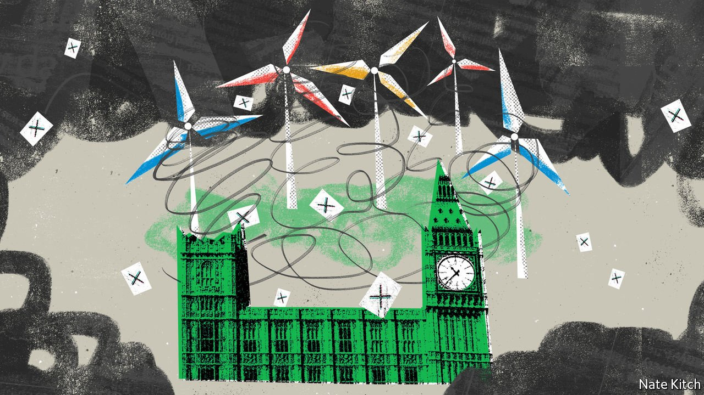

###### Bagehot

# An anti-green backlash could reshape British politics 

##### And as radically as Brexit did 

 

> Sep 22nd 2021 

WHATEVER A BRITISH voter’s natural political hue—Tory blue, Labour red or Liberal Democrat orange—these days it ends up green-tinged. The Tory government talks effusively about “building back greener”. Labour wants a “green industrial revolution”. Liberal Democrats have used their position as the third party to argue for everybody to go further and faster. And then there are all the people who want to raze the carbon economy to the ground the day after tomorrow: not just the Green Party but also extremist groupuscules such as Extinction Rebellion and Insulate Britain.

Which leaves a gap in the market for something different: anti-green politics. Brexit transformed Britain by tapping into ordinary people’s resentment of distant elites, and anti-greenery could do the same. Environmentalism is driven by populists’ two big bogeymen, scientific experts and multilateral institutions. Green campaigners vie to befuddle the public with acronyms and jargon. Multilateral institutions override democratic legislatures in order to co-ordinate global action. In the public mind, greenery is coming to mean global confabs that produce yet more directives, and protesters who block city centres and motorways.


Greenery suffers from the classic problems of technocratic policymaking, namely offering distant rewards in return for immediate sacrifices and imposing uneven costs. Over-50s, the most reliable voters, won’t be around to see the world boil. Poorer people are likely to suffer more than richer ones from the green transition, not just because they have less disposable income but also because they are more likely to work in the dirty economy. The impression of injustice is reinforced by the fact that many of the most vocal green activists have a material interest in the green economy as bureaucrats, lobbyists and entrepreneurs.

A fuel-price rise in 2018 inspired France’s gilets jaunes; Germany’s Alternative für Deutschland and Finland’s Finns Party have lambasted green hysteria. In Britain, by contrast, anti-greenery is still nascent. Some on the Tory right have complained that their party is in the grip of the green lobby. A few MPs in the “red wall”—once-safe Labour seats in northern England that turned Tory over Brexit—have warned that green levies on driving could see those voters switch back again. The closure of some London streets to through-traffic has sparked protests.

But such rows are about to get a lot louder. Turbulence on the global energy market is drawing unflattering attention to British energy suppliers, which are struggling with the transition from coal- and gas-fired plants to renewables. The more the business secretary, Kwasi Kwarteng, says about there being “absolutely no question of the lights going out”, the more consumers will worry. And other environmental policies on the horizon will also hit them hard. From 2030 the sale of new petrol and diesel cars will be banned. The electric cars that will replace them are rapidly improving, but not yet as cheap or as convenient. For city-dwellers it is hard enough to find parking without having to look for a charging-point too, and long journeys require planning.

Since the discovery of gas in the North Sea in 1965, most British homes have used the fuel to heat their homes. But the government plans to take gas-fired boilers off the market in the coming years, to be replaced by hydrogen boilers or heat pumps. The date for the switchover is slipping, since neither technology is ready for mass roll-out. Air-source heat pumps are larger than gas boilers, produce lower temperatures and cost much more. People’s enthusiasm for greenery may reach its limits if familiar, well-functioning products are replaced by more expensive, inferior ones.

In the past decade climate-change denialism has given way to something cannier and harder to pin down. Nigel Farage, the former leader of the UK Independence Party and a major force behind Brexit, claims that he is as green as the next man—indeed that he voted for the Green Party back in the 1980s—but that he’s in favour of “sensible environmentalism” rather than the establishment kind that taxes “poor people to give money to rich people and big corporations while China’s going to ignore it all”.

Anti-greens are also seeking to reshape politics indirectly: not just by creating new parties, but by changing the hue of the established ones from inside. For neither of Britain’s biggest parties is as deep-dyed green as it appears to onlookers. The Conservative Party certainly has big names who preach environmentalism, like Zac Goldsmith, a posh Brexiteer. But it has always also been the party of homeowners who care about their energy bills, motorists who want to get the last mile from every gallon and older people who don’t want to change their ways. More recently, they have been joined by red wall voters with little spare cash. Labour, for its part, is an uneasy coalition of graduates, who cheer every green initiative, and lower-paid workers, who are nostalgic for the days of well-paid jobs in heavy industry and primarily concerned with making ends meet.

Hot air emissions

How to avert an anti-green backlash? Politicians need to avoid unforced errors, such as switching over from gas boilers before reliable replacements are ready. They need to shield vulnerable groups from the costs of the energy transition, remembering how the mood turned against globalisation when politicians failed to honour promises to compensate the losers. They need to see the world through the eyes of people who accept that climate change is a problem but must ceaselessly struggle to get by in the here and now. The prime minister, Boris Johnson, won easy applause at a UN round table on climate action this week by expressing frustration that the “something” the world is doing to limit global warming is “not enough”. The audience he really needs to convince is the one that laughed along to his provocations before he re-entered Parliament in 2015, such as mocking wind power as too weak to pull the skin off a rice pudding. ■

To read our coverage of climate change, register for The Climate Issue, our fortnightly , or visit our 

For more coverage of matters relating to Brexit, visit our 

