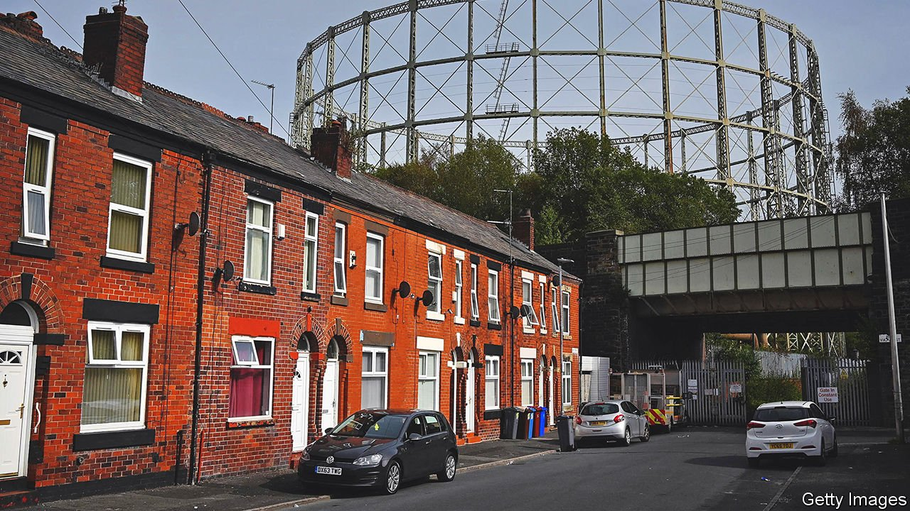
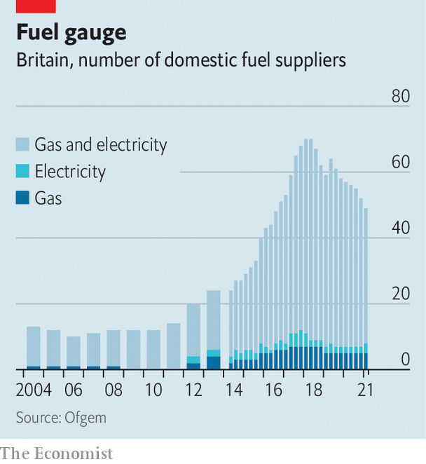

###### Energy prices

# Britain’s gas market is broken 

##### Soaring energy bills are a problem for firms, households and the government 

 

> Sep 21st 2021 

“THE HISTORY book on the shelf/Is always repeating itself.” So sang ABBA in the 1974 Eurovision Song Contest, in the song that catapulted the Swedish band to global fame: “Waterloo”. Half a century later those words seem apt. The band has reunited, with a new album due in November. Its members are going on a virtual tour, performing as CGI avatars that look like their younger selves. And in Britain, where ABBA dominated the charts for more than a decade after that Eurovision victory, echoes of the 1970s are growing louder, too.

Back then, Britain was struggling with energy shortages and industrial disruption. In 1974 the government limited many manufacturers to a three-day week. Today, Britain once again faces interrupted energy supply,  and government bail-outs. On September 20th Kwasi Kwarteng, the business secretary, promised Parliament that “there’ll be no three-day working weeks, no throwback to the 1970s”. As always with such political reassurances, the words mattered less than that they were considered necessary.


The backdrop is , especially for . They are painful for many countries, but particularly so for Britain. Since oil and gas were discovered off its north-east coast half a century ago, gas has generated much of its electricity and heated almost all its homes. But North Sea gas is running out; and as Britain has replaced coal-fired plants with wind power in order to reduce carbon emissions, it has become painfully dependent on natural-gas imports, especially in calm weather.

Compounding the problem, during the past decade the government has allowed upstart suppliers to capture a significant slice of the retail energy market with business models that left them ill-prepared to weather market turbulence. Now, in the run-up to the COP26 climate conference in November in Glasgow, Britain must choose between letting its energy market collapse and offering vast subsidies for fossil fuels.

The origins of the mess lie in the 1980s and 1990s, when privatisation created an oligopolistic energy market dominated by the “Big Six”, which paid their shareholders juicy dividends and their bosses fat salaries. The government responded to anger over high energy bills with further liberalisation, which created a fragmented market (see chart). Some of the new entrants were innovative, such as Bulb, which offers consumption-tracking apps, and Octopus, which discourages consumption when demand is high with dynamic pricing. But most were thinly capitalised and produced no energy, merely buying it on global wholesale markets and selling it on. Some paid little attention to ensuring continuity of supply or hedging against price fluctuations.

 


Such me-too operations were always vulnerable to a demand squeeze. But the risks rose in 2017 with the closure of a big gas-storage facility, which left Britain able to store just 2% of its annual demand. Other big gas importers, by contrast, can store 20-30%. And the risks rose further in 2019, when the government capped consumer prices in response to continued grumbles about high energy bills.

The perfect storm came this summer. As pandemic restrictions eased, global demand for energy rose. Gas supply in Russia, a big producer, was disrupted, and unusually calm weather stilled British wind turbines. In August Ofgem, the industry regulator, said that from October the price cap would rise by 12%. But since then the wholesale price of gas paid by British energy firms has risen by more than 70%. The result is that British energy firms are tied into contracts to supply gas to households at far less than they must pay to get it. Seven have failed since August, and industry insiders say that without government intervention, dozens more will. Ofgem, says the boss of one of the bigger firms, has been “asleep at the wheel”.


Some energy-intensive businesses found themselves thrust into a no-day week. CF Industries, an American-owned fertiliser company, ceased production at its two British sites, saying it was no longer economic. The effects rippled through the food-supply chain. Commercial carbon dioxide (CO), a by-product of fertiliser production, is used to stun animals before slaughter, package fresh food and keep food cool during transport. In normal times, CF Industries accounts for more than half of Britain’s supply. The British Meat Processors Association, a trade body, warned of imminent meat shortages.

On September 21st the government announced that following talks, CF Industries would be restarting CO production. Subsidising its energy prices would, admitted George Eustice, the environment secretary, cost “many millions”.

The government can expect to have to fork out much, much more. When a retail energy firm fails, Ofgem transfers its customers to another provider. This year, however, the survivors are reluctant to take on what may add up to millions of loss-making accounts. Ofgem is likely to raise the energy-price cap again next spring, but not by enough to bring bills in line with global prices. So the government is considering underwriting losses from transferred customers, or forming a temporary, publicly owned and loss-making firm to supply them over the winter.

Either option will be expensive. Precisely how expensive depends on how many firms fail, how soon and how high gas prices go. Officials say they hope that the cost to taxpayers can be kept “in the billions”. After a decade of neglecting energy security, the bill is coming due. ■

