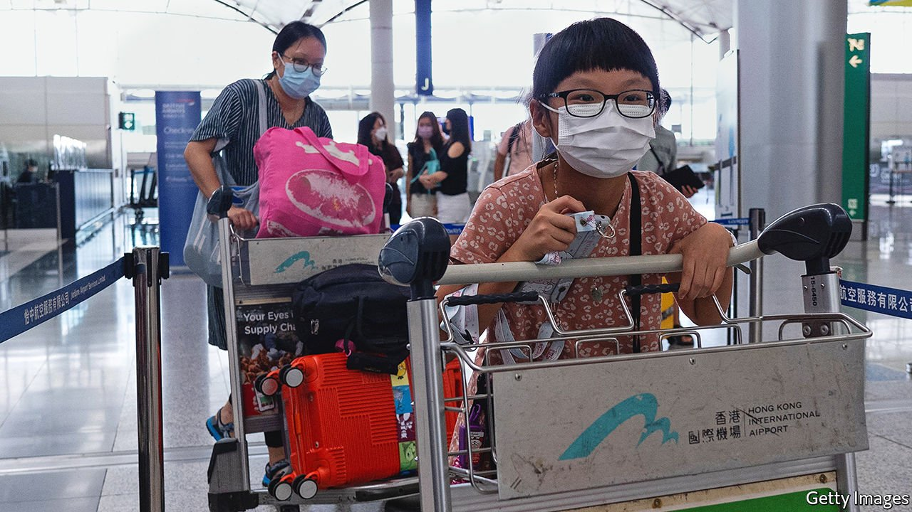

###### The Hong Kongers

# Britain’s newest immigrant group is unlike any that came before 

##### The Hong Kongers are older and more influenced by YouTube 

 

> Sep 23rd 2021 

ON A SUNNY afternoon hundreds of Hong Kongers, many so new to Britain that they have not lost the habit of outdoor mask-wearing, have gathered in Beddington Park in the south London borough of Sutton. Trish Fivey, the mayor, gives a short speech welcoming them. Sutton is already multicultural, she says. She looks forward to another group joining the mix.

It is a fine sentiment. But the Hong Kongers are quite different from other immigrants, including other ethnic Chinese. Many have a distinct legal status and are socially atypical. They live in specific places, which they chose in a novel way. They have created distinctive self-help groups. In just a few months, they have begun to rewrite Britain’s immigrant story.


Cantonese speakers have settled in Britain for decades, though not in great numbers. Some early migrants ran Chinese restaurants, which were ubiquitous enough by 1945 to let George Orwell describe them as standard destinations for natives seeking good cheap meals. But the latest rush began recently. In June 2020 Beijing passed a national-security law that criminalised much political activity in Hong Kong. Seven months later the British government created a new visa that enabled many Hong Kongers to settle. By the end of June this year 65,000 people had applied.

Most new migrants globally are young and unencumbered. In 2019 more than two-thirds of immigrants to Britain were aged between 15 and 29, according to the International Passenger Survey. A survey by Hongkongers in Britain, a self-help group, however, found that the average age of Hong Kong residents intending to come to Britain was 37. More than two-thirds are university-educated, and the majority have children.

One reason for the odd demographic is that the new visas are designed for people born before 1997, when Britain relinquished control of Hong Kong, and their dependents. Another is that parents are especially keen to flee. In February Hong Kong’s government ordered schools to curtail “political or other illegal activities” and cultivate “a sense of national identity” and “law-abiding awareness”—all code for obedience to the Communist Party.

Middle-class Hong Kongers’ anxieties about the suppression of democracy and civil liberties are mixed with a desire to give their children more options in life. British citizenship, which they can obtain after six years, will provide that. One recently arrived Hong Konger in Bristol, who wishes to remain anonymous, says that she began to think about living abroad several years ago, when her daughter was born. She left in a hurry as the political situation in Hong Kong deteriorated.

The 2011 census of England and Wales found 102,000 people who had been born in Hong Kong. They were concentrated in cities such as Manchester and in inner-London boroughs like Camden and Westminster (which includes Chinatown). The new arrivals, by contrast, are heading straight for suburbia. They favour unexciting London boroughs such as Kingston upon Thames and Sutton.

They flock to such places because they rely on the same advice as each other. Richard Choi of the Sutton Hongkongers Group says that many listen to online influencers known in Hong Kong as “key opinion leaders”, or KOLs. In Cantonese-language YouTube videos, KOLs discuss the relative merits of British cities and districts, as well as school-inspection reports, rail fares and how to find reliable builders.

They can be frank. One YouTuber, Ophelia Chan, recommends Milton Keynes partly because it is modern (which, along with its suburban character, is what some Britons find objectionable about it) and points out that you can take a bus directly to Bicester Village, a shopping outlet. She calls Birmingham crime-ridden, underlining her point with a graphic of a masked bandit. Like others, she is keen on Sutton.

Perhaps the most extraordinary thing about the Hong Kongers is the speed with which they have organised themselves. In little more than a year, several well-run groups have sprung up to help migrants settle in and to lobby on their behalf. They have conducted surveys, arranged housing, legal advice and English courses, organised walking tours, testified in Parliament and much more besides.

Sadly, this self-reliance is not a choice, but a necessity. Newly arrived Hong Kongers often fear recently established Chinese community groups that are aligned with the government in Beijing. Jabez Lam, a veteran organiser at the Hackney Chinese Community Service, says that most Hong Kongers who ask him for help will not give their names. They are right to worry about hostility from other Chinese people, he says. He was roughed up in Chinatown after defending pro-democracy protesters in Hong Kong.

Hong Kongers’ groups have two ambitions. First, they want migrants to integrate rapidly. Hence the English lessons, an enthusiasm for working with churches and gatherings like the one in Sutton, which brought Hong Kongers together with locals. “If Hong Kongers just get together with Hong Kongers, it doesn’t help—it’s another Chinatown,” explains Mr Choi. The groups stress that the migrants’ values, such as a belief in freedom and democracy, are also British ones.

Second, they want Hong Kongers to think of themselves as a community in exile. “Hong Kong is not only a place any more. It’s a diaspora, sharing values,” says Simon Cheng of Hongkongers in Britain. However comfortable and integrated they become, he thinks, Hong Kongers must remember why they had to flee. Asked if he has a model in mind, he points to British Jews. The newest group to arrive in Britain wants to emulate one of the oldest. ■

