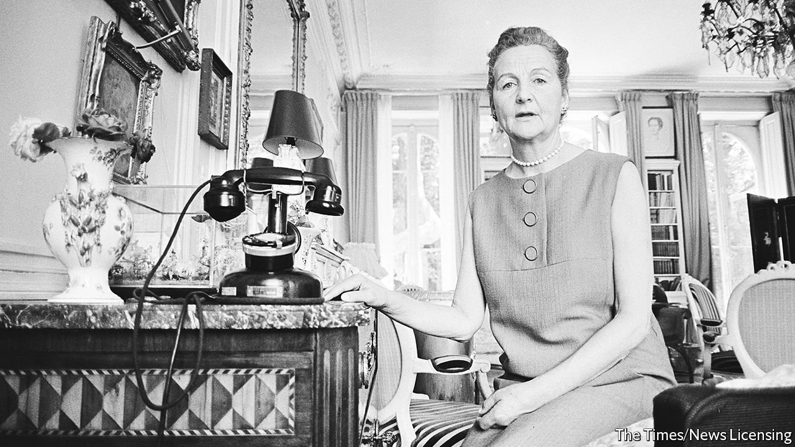

###### Baron net

# Debrett’s goes digital 

##### A traditional guide to toffs moves with the times 

 

> Sep 25th 2021 

DROPDOWN MENUS can be telling. Buy a subscription to the Times, a conservative paper, and under the “Titles” option it offers you a duly conservative selection: “Mr”, “Mrs”, “Miss”, “Ms” and “other”. The left-leaning Guardian offers no titles at all. Debrett’s is different. It offers not merely “Mr” and “Mrs” but also “Lord”, “Lady”, “Sir”, “Hon.”, “Capt.”, “Col.” and “Rev.” Signing up is less like online shopping than assuming a part in a Jane Austen adaptation.

Dropdowns are needed because the publication has just gone digital. This is in many ways disappointing. Debrett’s Peerage &amp; Baronetage, a snob’s guide to Britain’s aristocracy, feels as though it ought to be written on vellum and served by butlers, rather than hosted on internet servers. Austen’s “Persuasion” opens with Sir Walter Elliot thumbing the Baronetage’s much-loved pages. Nancy Mitford mocked its chronicles of “ancestors with P.G. Wodehouse names” and “Walter Scott fates”. In Evelyn Waugh’s “Brideshead Revisited”, when Sebastian Flyte is asked about his family, he says crisply: “There are lots of us. Look them up in Debrett.”


Its tissue-fine pages used to whisper discreetly of a forgotten world, one of silver spoons and iron conventions that covered the correct way to address a duke (“Your Grace”); a duke’s daughter (“Your Ladyship”) and “Divorced Ladies” (however you like). But as times change, so must formats. When the queen has a Twitter account (@RoyalFamily) and 4.6m followers, it was perhaps inevitable that Debrett’s would move online.

It has also branched out, not quite selling the family silver but allowing the lower classes to gaze on it, like an aristocrat opening the country seat for afternoon teas. It offers advice on etiquette, including table manners (“it is vulgar to bite into bread”); Zoom (“never eat on-screen”); and social kissing (“under no circumstances should there be a suggestion of saliva”).

Keeping it perfectly up to date is, says Wendy Bosberry-Scott, its editor, all but impossible, since “people are born, get married and die every day”. Here, being digital is an advantage. One year a particularly important duke died the day it went to press: Debrett’s had to call the printer and replace the page. “It cost a fortune.”

The entire database, dating back to 1769, is now searchable: 2,000 hereditary titles, more than 700 life peers and around 150,000 assorted relatives—or, as Debrett’s calls them, “collateral” (aristocrats, like accidents, cause fallout). Even including collateral, it covers little more than 0.2% of the British population. It is an influential 0.2%, including many prominent politicians, among them David Cameron, the former prime minister whose rash decision to hold a referendum unexpectedly took Britain out of the European Union (motto: “Prudently and Constantly”).

But Britain, though still class-ridden, is less dominated by titled toffs today. In the 1860s, three-quarters of MPs were from patrician backgrounds; now they are exceptions, not the rule. This is good for Britain, but bad for Debrett’s. Walk into a library in 1900 and you would have found shelves of such volumes: Debrett’s, “Burke’s Peerage” and “Kelly’s Handbook”: class bound in red cloth. Now Kelly’s has gone; Burke’s was last printed in 2003; and the most recent print edition of Debrett’s, in 2019, had a run of just 700. It was almost certainly the last. As few know better, things are born, and die, every day. ■

