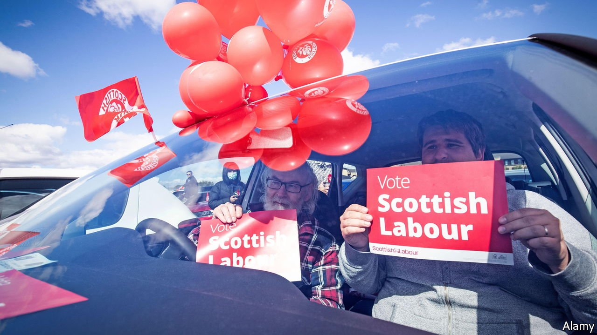

###### North-south divide

# Reforming the selection of leaders is only the start of Sir Keir’s troubles 

##### His party will struggle to right itself in Westminster if it cannot make headway in Holyrood 

 

> Sep 23rd 2021 

AS LABOUR MEMBERS prepared for the party’s conference in Brighton, starting on September 25th, their leader, Sir Keir Starmer, guaranteed fireworks by proposing a change to how his successors would be selected. If he gets his way, out goes the one-member-one-vote system introduced in 2014 and back comes an electoral college, with votes split between MPs, party members and unions. It is an attempt to sideline the left-wingers who led Labour to electoral disaster under Sir Keir’s far-left predecessor, Jeremy Corbyn.

Sir Keir has a fight on his hands. “Deeply undemocratic,” fumed Mr Corbyn. A prominent member of Momentum, the radical faction around Mr Corbyn, threatened “civil war”. And even if he succeeds in pushing through his proposals, he must then focus on winning back the “red wall” seats lost to the Tories in the English Midlands and north, and to the Scottish National Party north of the border.


In 2015 Scottish Labour returned a single MP to Westminster. It picked up a handful of seats in the snap election of 2017 but lost them again two years later. It has also shrivelled in the devolved administration, with 22 seats, behind not just the governing Scottish National Party (SNP), but the Tories, who have 33. “Scotland was the first red wall to fall,” says Anas Sarwar, a former dentist who became Scottish Labour’s leader earlier this year. “And unless we build it back, the party will keep losing.”

How hard that will be has been highlighted by recent research from the Scottish Election Study (SES), a group of academics. It showed that almost all Scottish voters (92%) take a position on whether to break away from the United Kingdom, and that of those, 91% align their vote for the Scottish parliament with that position. Furthermore, says Ailsa Henderson of Edinburgh University, who runs the SES, in recent years Scottish votes for seats in Westminster have come into line with those cast for the Scottish Parliament. “There’s now very little proper split-level partisanship, with people consistently backing one party at Holyrood and another at Westminster.”

The SNP thus scoops up the votes of the almost half of Scots who support independence, leaving the three main national parties to fight over the rest. Unless Sir Keir and Mr Sarwar can break that link between pro- and anti-independence positions, on the one hand, and party loyalty on the other, the prospect is therefore not just endless nationalist government in Holyrood, but at most a handful of Labour MPs—and probably permanent opposition for Sir Keir’s party—in Westminster.

Until voters think Labour capable of forming a government in Westminster, says Mr Sarwar, they will be reluctant to vote for it in Scotland. He is seeking to link the “twin nationalisms” of the Tories and the SNP in Scottish minds, and to offer a positive vision of a united Britain. Labour needs to wrest the task of defining Britishness back from the hands of the prime minister, Boris Johnson, he says, and that of defining Englishness from Nigel Farage, a long-time foe of the European Union, and—a rather less glowing version—from Nicola Sturgeon, the SNP’s leader.

It was Scottish Labour that led the party back to power nationally in 1997, points out Sir Alistair Darling, who won an Edinburgh seat a decade earlier and went on to serve as chancellor of the exchequer. “We won seats in areas Labour never had before. We were ten years ahead of the UK party.” On the doorstep he would hear how much voters disliked the hard-left administrations running London and Liverpool, but that when it came to general elections, they were willing to cast their vote for “our kind of Labour”. ■

