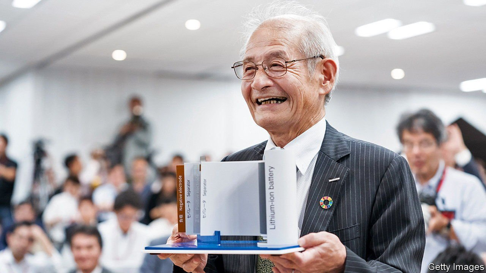

###### Do me a solid

# Japanese companies want to win back their battery-making edge 

##### They think that solid-state technology will help them do so 

 

> Sep 23rd 2021 

WHEN YOSHINO AKIRA, a Japanese chemist, worked on rechargeable batteries in the 1980s, it was with a view to powering portable devices. His Nobel-prizewinning research led to the first commercial lithium-ion (Li-ion) battery. These now power everything from smartphones to electric vehicles (EVs). But the Japanese firms that, building on Mr Yoshino’s work, dominated the Li-ion business early on have lost their edge. CATL, China’s battery giant, and the energy arm of LG, a South Korean group, have eclipsed Japan’s Panasonic as the world’s largest suppliers of EV batteries. Others are catching up in the production of materials and components.

Japanese battery-makers want to regain their rightful place at the head of the pack. To do so they are betting on solid-state batteries. These still shuttle lithium ions between the anode and the cathode to charge and discharge, but the electrolyte where this shuttling happens is solid not liquid. That makes the batteries more stable and potentially more powerful. It also dispenses with the need for bulky cooling systems, required for fast-charging Li-ion systems. Cars equipped with solid-state batteries could be lighter, which increases range.


Japan submits more battery-tech patents a year than any other country; second-ranked South Korea files half as many. Japanese firms and inventors accounted for more than one in two solid-state-related patents between 2014 and 2018. More are coming. Japan’s government is pouring money into research, including a centre headed by Mr Yoshino. Industrial and chemicals firms, of which Japan has plenty, are gearing up to make the materials needed to bring the technology to market.

Murata, a big manufacturer which bought Sony’s battery division in 2017, plans to begin mass-producing smaller solid-state batteries this autumn. Nakajima Norio, Murata’s boss, sees “lots of potential in wearables”, since the batteries do not burn or get hot (which is why they are already used in things like pacemakers). This month Toyota announced plans to invest $13.5bn by 2030 in next-generation car batteries, including the solid-state variety. Honda and Nissan, two other carmakers, are also eyeing the technology.

Naturally, if making solid-state batteries were easy, manufacturers would be churning them out. It isn’t. Water mucks up the materials, so factories must be kept ultra-dry. Mitsui Kinzoku, an engineering firm, has been testing mass production of solid electrolytes and found that it is “indeed a very difficult process”, in the words of Takahashi Tsukasa, who is involved in the project. Toyota hopes to begin manufacturing in the mid-2020s, but even its technology chief, Maeda Masahiko, has cautioned that “we can’t be optimistic yet”.

Even if they can get the technology right, Japanese firms are not running unopposed, as they had been in Li-ion’s early days. Most big carmakers, including Ford, Hyundai and Volkswagen, have solid-state cars in the works. They may want to make the batteries themselves. Volkswagen has a big stake in QuantumScape, an American solid-state-battery startup backed by Bill Gates. Last month a group of British organisations, including Johnson Matthey, a big chemicals firm, and Oxford University formed a consortium to work on the technology. That’s some solid competition. ■

For more expert analysis of the biggest stories in economics, business and markets, , our weekly newsletter.

