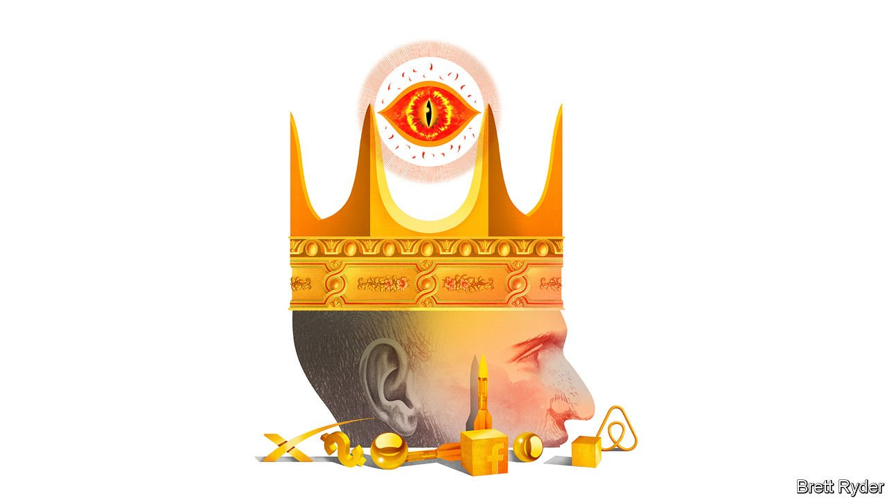

###### Schumpeter

# Peter Thiel, scourge of Silicon Valley 

##### A venture capitalist reinvents the military-industrial complex 

 

> Sep 25th 2021 

FOR A MAN who wants to live for ever, Peter Thiel has already done enough in his 53 years to leave mere mortals exhausted—and mostly frustrated. The venture capitalist, techno-Utopian and scourge of the liberal left is a myriad of contradictions.

He co-founded PayPal, a payments platform that, as a young libertarian, he hoped would undermine the world’s monetary system. Instead it gave him the money to bestride Silicon Valley, a place he disdains. He was the earliest outside investor in Facebook, a tech giant on whose board he remains, though he mocks social media. As a hedge-fund manager, he bet on an economic meltdown in America ahead of the financial crisis of 2007-09, but called the bottom of the market too soon. He was one of the most prominent financiers to throw his weight behind Donald Trump’s bid for the presidency in 2016. Yet his efforts to populate the Trump administration with radical-thinking acolytes failed.


Max Chafkin, who trawls through this litany of inconsistencies in a new book, “The Contrarian”, writes fluently. But he fails to find an explanation that ties the threads together. At his most charitable, he praises Mr Thiel as a creator of immense wealth because of the tech firms he has backed (besides PayPal and Facebook, they include sharing-economy giants such as Airbnb and Lyft, plus a host of other blitzscaling platforms). At his most damning, he portrays his subject as a tax-avoiding “nihilist” whose right-leaning ideology is mostly aimed at increasing his wealth and power.

And yet strangely Mr Chafkin, a business writer, only obliquely refers to the most intriguing business story. Between the lines, a picture emerges of an erratic visionary whose work, however creepy, isn’t done. Mr Thiel is applying the radicalism that inspired PayPal to cryptocurrencies and decentralised payment platforms. The “Make America Great Again” schtick that drew him to Mr Trump has led to investments in military, surveillance and space technology that have helped double his net worth in the past year. His yearning to reclaim Silicon Valley from software-loving peaceniks and return to its roots in the cold-war military-industrial complex is bearing fruit—and spreading beyond California.

In short, his peculiar brand of libertarianism appears to have a new lease of life. With one hand, he wants to free individuals from government shackles by enabling them to create their own currencies. With the other, he is selling technology to a strong security establishment so that it can protect them from potential enemies. It is enough to make Silicon Valley’s mixture of hippies and yuppies hyperventilate on their yoga mats.

It is not the first time a man described by Mr Chafkin as socially awkward has built a movement of like-minded people bent on shaking up the tech industry. The PayPal mafia that he helped bring together at the turn of the century continues to flourish. Besides him, its best-known member is Elon Musk, whose SpaceX rocket company is backed by Mr Thiel’s Founders Fund, a venture-capital (VC) firm. Last valued at $74bn, on September 18th it returned the first-ever civilian crew from orbit. It is in the vanguard of America’s re-energised aerospace industry.

Others, too, have stuck by Mr Thiel for decades and share his security obsessions. Palantir, a data-analytics firm worth $52bn, is used by the American armed forces, immigration authorities and numerous police departments. It was co-founded by Mr Thiel in 2003 and is run by an old friend, Alexander Karp (who used to sit on the board of The Economist’s parent company). In the run-up to its initial public offering last year, Mr Karp told potential investors the company, though born in Silicon Valley, shared few of its values. “Our software is used to target terrorists and keep soldiers safe…we have chosen sides,” he said.

Anduril, a startup defence contractor also backed by Mr Thiel, is building pilotless drones for military surveillance. Marc Andreessen of Andreessen Horowitz, a VC firm (who is also a Facebook director), has written of the emergence of a new generation of Silicon Valley-style defence companies. “There are some in our industry who view serving such agencies and missions as controversial. We do not,” he wrote in 2019, announcing a co-investment with Mr Thiel’s Founders Fund in Anduril. It was last valued at about $4.6bn.

Even without Mr Trump, Mr Thiel continues to mix business and politics. This year he joined forces with Narya, a vc fund led by J.D. Vance, the author of “Hillbilly Elegy”, to invest in Rumble, a video platform popular among right-wingers. He is backing Mr Vance in the Republican Senate primary in Ohio. Blake Masters, Mr Thiel’s co-author on “Zero to One”, a bestseller published in 2014, hopes to represent the Republicans in the Arizona Senate race. The New Yorker has speculated that “The Rise of the Thielists” could provide the Republican Party with a post-Trump ideology.

The cryptoking

If that is the case, it would probably involve continued pillorying of big-tech firms, especially Google, which Mr Thiel has long accused of being a monopoly. The new ideology would be anti-China, a country Mr Thiel portrays as using artificial intelligence (AI) to centralise control over the economy. “If AI is communist, crypto is libertarian,” he wrote last year. It would look favourably on cryptocurrencies and blockchains. He is a big backer of Block.one, a blockchain-software company whose crypto unit, Bullish, is planning to go public via a $9bn reverse merger with a special-purpose acquisition company.

All this takes tech investing beyond Silicon Valley into new realms, some of them menacing to many observers. That will not worry Mr Thiel. Palantir is named after a “seeing stone” most often used by Sauron, ruler of J.R.R. Tolkien’s evil empire of Mordor in “The Lord of the Rings”. Evidently Mr Thiel, ever the contrarian, does not view Mordor as harshly as most Tolkien fans do. As he once told a friend: “I’d rather be seen as evil than incompetent.” ■


