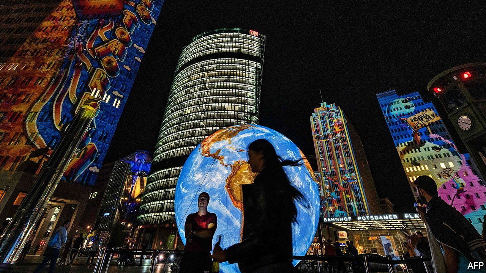
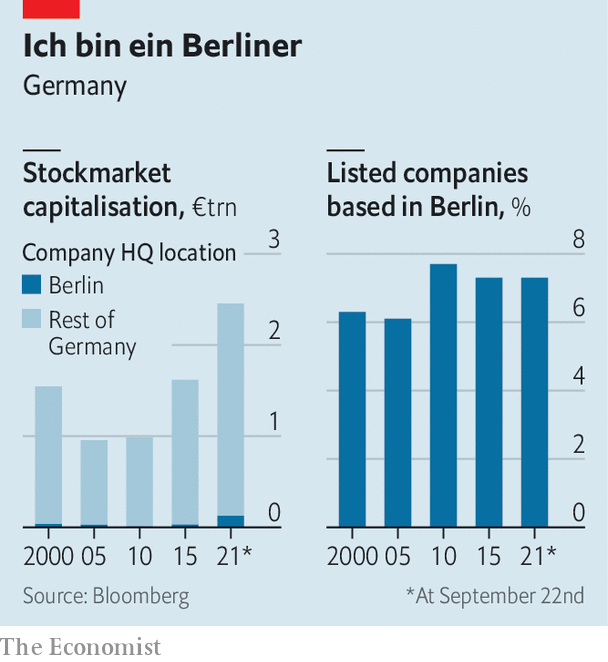

###### Deutschland AG

# The revival of Berlin Inc 

##### The German capital reasserts itself as a business hub 

 

> Sep 25th 2021 

CONVENTIONAL WISDOM has it that the capital of Europe’s most powerful economy is poor, bolshie, chronically indebted and utterly reliant on subsidies from richer states. The debacle of the construction of the Berlin-Brandenburg airport, completed in 2020 nine years late and more than €4bn ($4.7bn) over budget, confirmed every prejudice about the city. A political storm is brewing over property firms and rents.

Reputations are hard to shed. But Berlin’s business circles are trying. During the tenure of Klaus Wowereit, mayor from 2001 to 2014, no firm in the DAX, the index of Germany’s bluest chips, called Berlin its home. After the DAX’s expansion on September 20th from 30 to 40 companies, five have headquarters in the city. Zalando (an online fashion retailer) and HelloFresh (a pedlar of meal kits) joined three other Berliners, Deutsche Wohnen (one of the beleaguered real-estate firms), Siemens Energy (a spin-off from the engineering giant) and Delivery Hero (a food-delivery darling), themselves recent additions. Berlin’s share of Germany’s total market capitalisation has risen since 2000 (see chart).


Before the second world war Berlin was a cradle of mighty firms such as Daimler and Siemens. After the city’s partition by the victorious allies, many companies moved their offices and factories to West Germany. Banks moved to Frankfurt, publishing houses to Hamburg and industry to southern Germany. The exodus intensified after the erection of the Berlin wall in 1961. After East and West Germany reunified in 1990 these businesses had little reason to move back. Instead the city attracted artists and aspiring club owners, lured by low rents and countless abandoned factories and warehouses that made for fabulous studios and party venues. These new, cool residents had lots of fun, made little money and paid hardly any tax. In 2003 Mr Wowereit described his city as “poor but sexy”.

 


It is that sexiness that now helps explain Berlin’s business revival. The young and hip it attracted brought fresh talent, including entrepreneurs and techies. In August Google announced that a chunk of its €1bn investment in cloud-computing infrastructure will go to Berlin (alongside Hanau, near Frankfurt). Amazon Tower, a skyscraper in Berlin’s Friedrichshain district named after its biggest occupant, will house 3,500 of the online giant’s workers. In the first half of this year Berlin-based startups received €4bn in venture capital, half the German total. In spring Olaf Koch, the former boss of Metro, a retailer, set up a food-tech investment fund in the city with the aim of raising €500m.

Between 2017 and 2020 Berlin’s digital economy expanded by 30%, ten times faster than its overall output. Last year, as the pandemic put a premium on all things digital, employment in Berlin tech increased by 8.5%. Ramona Pop, Berlin’s economy minister, expects jobs in the city’s digital industry to double in the next few years to 200,000. “Berlin is spearheading the digitisation of the entire German industry,” she proclaims. After making Germany poorer for decades Berlin is making it a little richer: in 2019 the city’s GDP per person was slightly above the national average. ■


