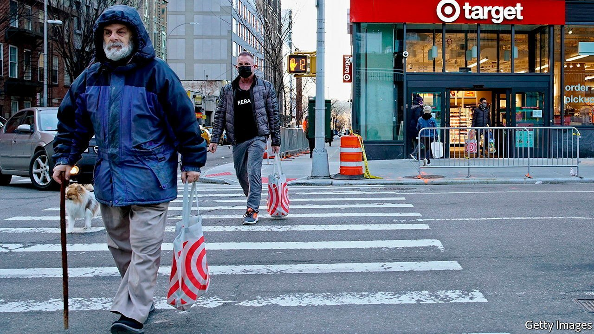
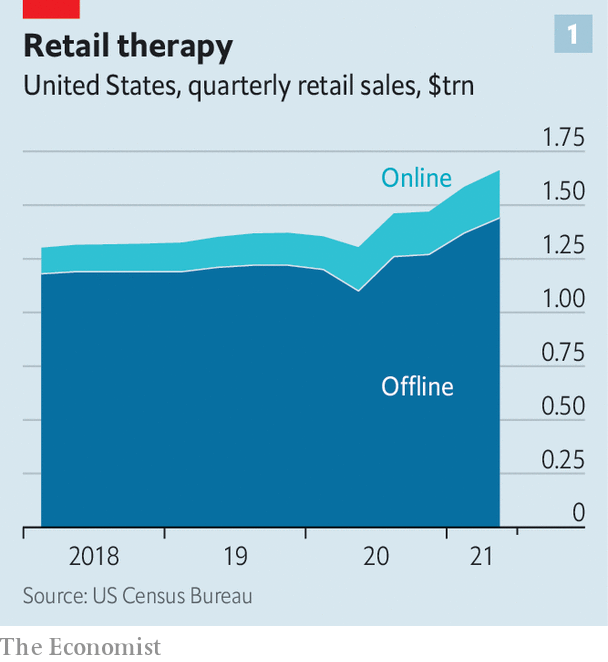
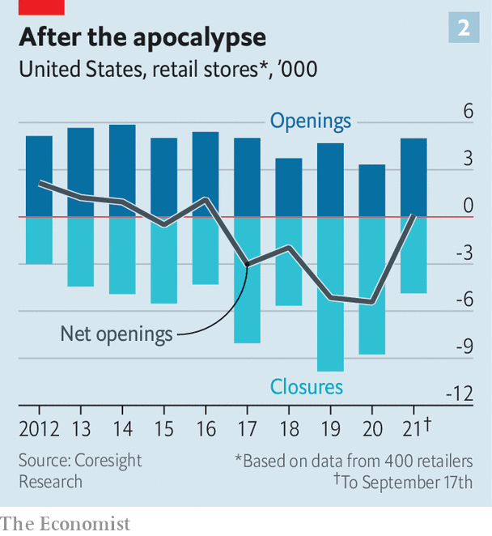
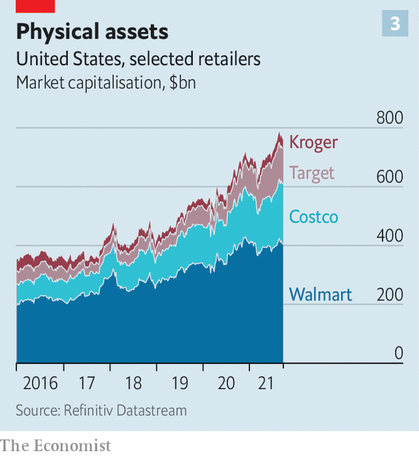

###### Aftershock

# Two new shocks for American shopping 

##### Big retailers must cope with shortages and with consumers’ stampede back to the aisles 

 

> Sep 21st 2021 

VISITORS TO A big supermarket in America these days could be forgiven for feeling disoriented. From one angle, all-American consumerism is on full display, with throngs struggling to steer overflowing trolleys. Retail sales (excluding cars) rose at a seasonally adjusted rate of 1.8% in August, compared with July, the fastest since March. Other images, though, look distinctly unAmerican. To their horror, some shoppers see empty shelves where their favourite brands of biscuits, detergents and loo roll typically sit—the result of supply-chain disruptions as outbreaks of the infectious Delta variant of covid-19 shut factories and ports around the world.

Unlike early in the pandemic, when shops were stripped bare by panic-buying, America’s consumers mostly have alternatives to pick from. But the shortages are a sign that things in the country’s $5.6trn retailing industry are not back to normal. If the supply shock weren’t enough, retailers must also deal with demand from shoppers once again keen to stroll the aisles rather than scroll through apps. Having survived the initial pandemic upheaval, shops are in the throes of another.


Start with the bottlenecks. Congestion in ports from China to California has . Domestic trucking costs are up, too, owing to a surge in online deliveries. This is less of a problem for premium goods like iPhones than for the cheaper wares peddled by big retailers, where shipping makes up a bigger slice of the list price. Walmart went so far as to charter vessels directly to ensure steady supplies.

Companies also . Depending on whom you ask, this is down to workers being spooked by Delta, spoilt by generous covid-era benefits or rethinking their lives and careers in the wake of the pandemic. Whatever the reason, the result is an absence of customer service at big stores. Helpers who normally direct shoppers to the right shelf are nowhere to be found. With many cash registers closed, long queues form at the few open ones. In-store placards that used to promote products now advertise vacancies.

In August Walgreens, a chain of chemists, said it would raise wages, matching a move earlier in the month by its main rival, CVS. Target raised wages earlier this year. Walmart has done so several times in the past 12 months. As with higher shipping costs, this puts pressure on margins. Additional expenses might be coming from the federally mandated covid-19 tests for employees who refuse to get vaccinated. This month the Retail Industry Leaders Association, which counts Target among its members, warned about insufficient domestic testing capacity to meet this requirement.

 


The shift back to bricks and mortar presents a second set of problems. E-commerce, which shot up from 11% of American retail sales before the pandemic to nearly 16% in the panicky second quarter of 2020,  to 13% of the total. Target’s comparable digital revenues grew by 10% year on year in the three months to June, down from a rate of nearly 200% the year before. Meanwhile, offline sales shot up by a third in the same period, to $1.4trn, handily outpacing e-commerce (see chart 1). Coresight Research, a firm of analysts, reckons that so far this year shop openings have exceeded closings (see chart 2). If the trend continues, it would be the first time since 2016 that America has added net new outlets.

 


The retailers’ investments in online capacity will not go to waste. Once seen as a costly mistake, Walmart’s $3.3bn takeover in 2016 of Jet.com gave America’s mightiest conventional retailer a platform on which it built a successful digital business. Some 3,000 of its 4,700 domestic stores now offer same-day deliveries. Similarly, Target’s $550m acquisition of Shipt, a same-day delivery platform, a year later formed the basis of an integrated technological network that now stretches from a data centre in India to its 2,000 or so stores in America.

Even Amazon recognises that the future is “omnichannel”, mixing digital and in-store experiences, and plans to expand its piddling physical footprint, maybe with a chain of department stores. Americans’ rediscovery of the pleasures of in-person shopping helps explain why the online giant no longer looks unstoppable; its share of American retail sales dipped from 7.8% in the first quarter to 7% in the subsequent one (though it is above its pre-pandemic level of under 6%). Target, Walmart and their peers stand to benefit more in the short run from renewed physical shopping than the beast of Bezosville. But a shopper stampede to outlets requires another reshuffling of resources, before the retailers’ foray into cyberspace has been completed.

 


Investors have faith that the biggest firms can withstand the pandemic aftershocks, as they did the original covid-quake. The combined market value of the three largest bricks-and-mortar generalists—Costco, Target and Walmart—has swelled to some $730bn, from $520bn or so at the start of the pandemic (see chart 3). In the past year Costco’s and Target’s share prices have outperformed that of Amazon by a factor of two and nearly four, respectively.

Beyond the big firms, which have more or less maintained their market shares in the pandemic, the picture is one of wreckage. As in many sectors, covid-19 has put struggling merchants out of their misery. Last year nearly 9,000 shops shut for good, while just over 3,000 opened, according to Coresight. Casualties include such venerable names as Neiman Marcus (a department store for the well-off) and JCPenney (one for everybody else). Targets and Walmarts may be abuzz with activity. Derelict malls marooned amid the cracked concrete of empty parking lots have replaced rustbelt factories as the poster children of creative destruction’s toll. ■

For more expert analysis of the biggest stories in economics, business and markets, , our weekly newsletter.

