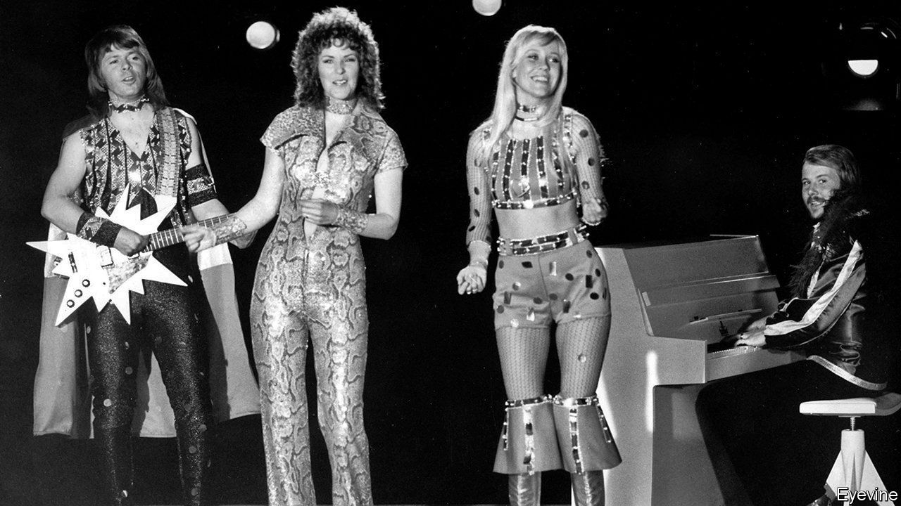

###### Gimme! Gimme! Gimme!

# Universal Music is a hit 

##### Investors rush to sample the streaming boom 

 

> Sep 25th 2021 

A ROCKSTAR’S WELCOME greeted Universal Music Group when it launched on Amsterdam’s Euronext exchange on September 21st in Europe’s largest listing of the year. Giddy investors all but threw their knickers at the newly public company, whose share price finished the day up by 36%, valuing the world’s biggest record label at €45bn ($53bn).

Not long ago Universal looked like a flop. In 2013, as digital piracy ravaged the music industry, SoftBank, a Japanese group, bid €7bn for the label. Vivendi, Universal’s French owner, was thought mad for turning down the offer. In fact the decision was inspired. A streaming boom has since lifted worldwide recorded-music revenues by half. Two-thirds of last year’s sales of $22bn went to the three “major” labels: Universal, Sony Music and Warner Music Group.


Investors’ rush owes in part to a dearth of alternative tickets to this hot market. Sony Music is locked inside a conglomerate. Warner went public last June, since when its value has risen by half (including a bump of 12% on September 21st, amid the Universal frenzy), but its catalogue is half the size of Universal’s. The listing of Universal gives investors the chance at last to get their hands on what JPMorgan Chase, a bank, dubbed a “must-own asset”.

Now, after their chart-topping run, the majors face the equivalent of a difficult second album. Streaming is nearing saturation-point in the rich world. Three in five American homes subscribe to a service like Spotify, up from one in five in 2016. DIY audio tools are helping unsigned artists take a small but growing share of the business. And regulators are asking whether labels are giving artists a fair share of streaming profits. On September 22nd Britain’s government ordered a competition probe into the music industry.

Keeping the hits coming will therefore rely on conquering emerging markets, where revenues are lower (Spotify costs the equivalent of $4 per month in South Africa, less than half what Americans pay), and on licensing music to new forms of media. This year Universal has signed deals with TikTok and Snap, allowing the apps’ users to sample clips from Universal’s back catalogue in their videos. Future deals with gaming, streaming and other entertainment platforms are likely. “Fortnite”, an online game, and Roblox, which lets users make their own games, have already become popular virtual-concert venues. Next year ABBA, a troupe of septuagenarians on Universal’s books, will appear in a series of gigs in London as digital “ABBA-tars”. As the streaming boom slows, labels will need new ways of bringing in money, money, money. ■


