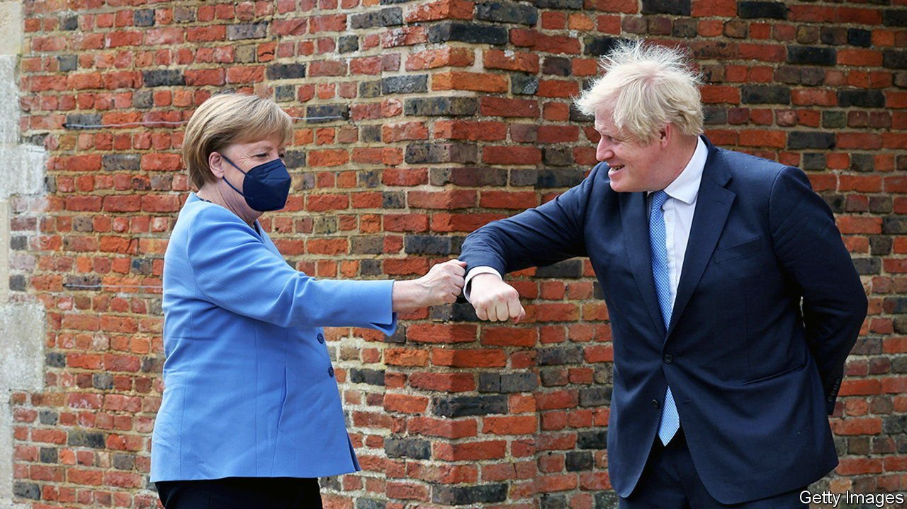
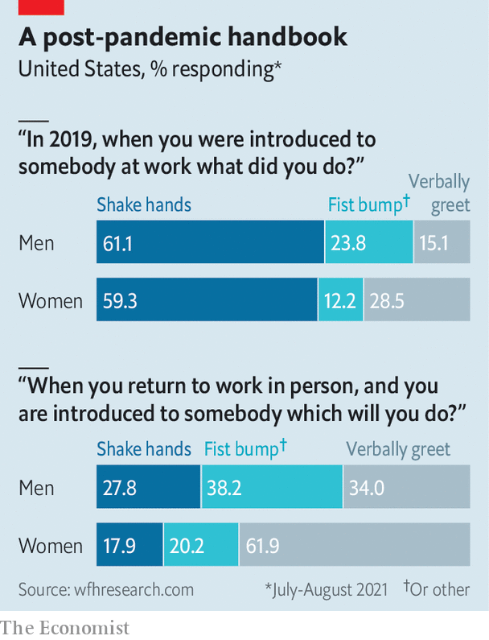

###### New civility

# Wave goodbye to the handshake? 

##### The business world’s commonest greeting is going out of fashion 

 

> Sep 25th 2021 

 


IN THE 1800S greeting an associate in the West meant doffing your hat. A hand may have been kissed. But seldom was it shaken—a gesture deemed too pally. The handshake has since become de rigueur even in Asia, which had resisted it in favour of bows. Now Jose Maria Barrero, Nick Bloom and Steven Davis, three economists, find that 19th-century mores are back. As part of a long-running survey of American business practices they find the handshake is out, especially among women: 62% now prefer a verbal greeting, up from less than 30% before covid-19. Whatever the replacement—fist bump, anyone?—Baroness de Fresne’s tip sounds pertinent. Proffering your hand, she wrote in her etiquette manual from 1858, shows “poor upbringing and is liable to be considered an affront”.


