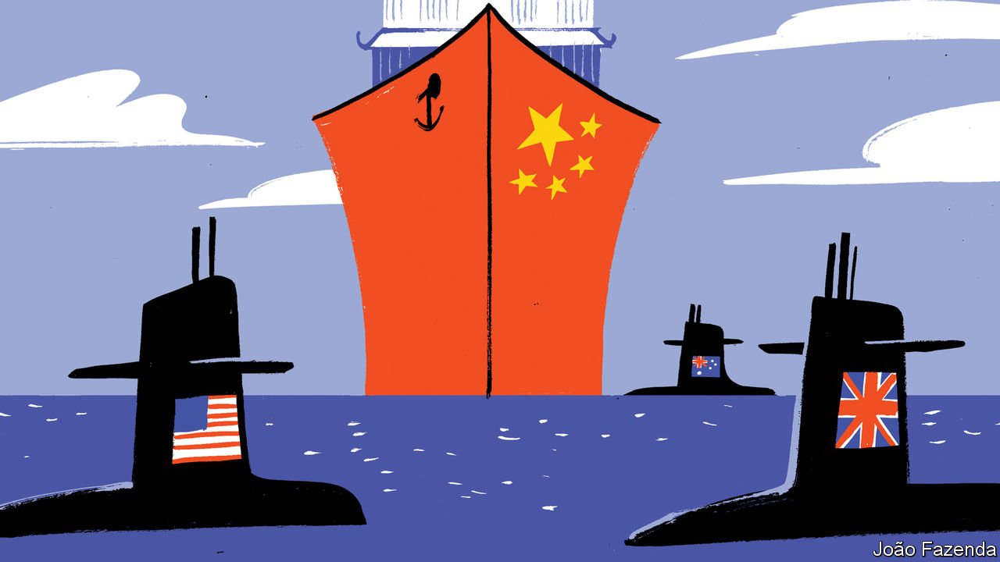

###### Chaguan

# China believes that America is forging alliances to stop its rise 

##### A new pact between America, Australia and Britain is seen as evidence 

 

> Sep 25th 2021 

FOR CHINESE leaders, the rows about AUKUS, a new security pact between America, Australia and Britain, confirm cherished prejudices about the Western world. China has always believed that America’s network of global alliances is a cover for hegemony, even if American leaders offer warm words about defending universal values, standing up for friends and opposing “attempts by stronger countries to dominate weaker ones”, as President Joe Biden did at the UN on September 21st.

Chinese suspicions are, in this case, bolstered by French anger over AUKUS, which was born out of Australia’s decision to break a deal to buy diesel-electric submarines from France, in favour of buying nuclear-powered ones from America. When a French government minister accused Britain of returning to the American fold and “accepting a form of vassal status”, that was a vindication for China. Indeed, the Frenchman’s attack could be printed, without alteration, in the People’s Daily, a mouthpiece of China’s Communist Party. For all that, at least to date, the Chinese official response has been a study in caution, avoiding loud expressions of solidarity with France. That is revealing, because China normally praises French leaders when they call for Europe to pursue “strategic autonomy” in its foreign and security policies. Chinese diplomats know that France’s vision of autonomy is code for avoiding over-reliance on America.


Instead, China has so far pursued narrower, rather technical lines of attack on AUKUS, related to the eight nuclear-propelled submarines that Australia is to buy from America. China’s ambassador to the International Atomic Energy Agency, a nuclear watchdog, accused America of undermining non-proliferation work by transferring nuclear know-how and weapons-grade uranium to Australia, saying this would make it harder to stop Iran and North Korea from seeking similar technologies. The foreign ministry in Beijing added some tut-tutting about countries forming small cliques. By the standards of recent America-bashing in China, such grumbles barely count as throat-clearing.

After speaking to various wise owls in Beijing, both Chinese and foreign, Chaguan has explanations to offer. It is true that AUKUS confirms prejudices dear to Chinese officials and scholars. The first of these is that power is the driver of geopolitics, even if smaller countries talk of putting their faith in multinational co-operation, the rules-based order and other pretty phrases. If Australia would rather be America’s vassal than France’s partner, that merely confirms China’s bleak, might-makes-right worldview. That view is reflected in lectures that China delivers to envoys in Beijing. With tiresome regularity, it is the lot of Western ambassadors to be informed that, if their small or midsized home country has dared to challenge China, it can only be because their government is foolishly trying to please America, whose hand is behind all of China’s troubles.

The AUKUS pact also reinforces a talking point that the Western world is far from united about China, especially when it comes to speaking out about questions of principle, such as the crushing of Hong Kong’s democratic opposition or the repression of Muslims in Xinjiang. These are mostly Anglo-Saxon obsessions, Chinese diplomats and scholars like to suggest. Alas, they sigh, Americans, the British and their friends in the Anglosphere think it is their birthright to run the world, like some gang of finger-wagging missionaries or sunburnt colonial administrators. Chinese officials praise leaders whom they see as more focused on business interests, such as Angela Merkel in Germany.

Still, China has not hastened to woo France in its hour of wrath. For one thing, China may see a benefit in letting Western powers feud, uninterrupted. For another, France’s furious response is a bit undignified. In Chinese culture, a public tantrum may signal nao xiu cheng nu, or “from shame to rage”, meaning the specific form of high-decibel meltdown staged by someone facing humiliation. Ticking off reasons why France might be cross, a Chinese scholar lists the cancelled contract worth tens of billions of dollars, and a “loss of face” caused by Australia’s hint that French submarines are not capable enough to deter China.

Nor is AUKUS hailed as a chance to divide the West. Wang Yiwei, director of the Institute of International Affairs at Renmin University in Beijing, notes China’s relatively weak anti-submarine capabilities. “For Australia to have nuclear submarines is very dangerous for China,” he says. “They are not needed for Australia’s national defence. This is about China.”

An arms race looms

Chinese leaders have a double view of America. They remain exceedingly wary of American areas of strength, from its armed forces to its high technology. Chinese leaders can see for themselves America’s robust economic growth, compared with Europe or Japan. Yet they increasingly believe that Western societies are growing decadent. “The key competition between China and the US is about domestic governance,” explains Professor Wang, before listing America’s failings, from economic and racial inequalities to its handling of covid-19. “In the view of the Chinese ruling elite, US domestic governance is in serious trouble,” he says.

In Beijing it is seen as enraging that this failing ex-hegemon remains strong enough to defy or dream of containing China. Mr Biden is called a weak, transitional figure. Chinese diplomats have treated his envoys, including his secretary of state, Anthony Blinken, and climate envoy, John Kerry, with studied belligerence. Under President Xi Jinping, a stern autocrat, China is impatient with being criticised. It rejects Mr Biden’s assertion that the relationship can be at once sharply competitive and co-operative when needed. Above all, China is sure that America is trying to create alliances to stop its rise. A cautious initial reaction to AUKUS should not be misread. Discretion is not the same as calm. ■

