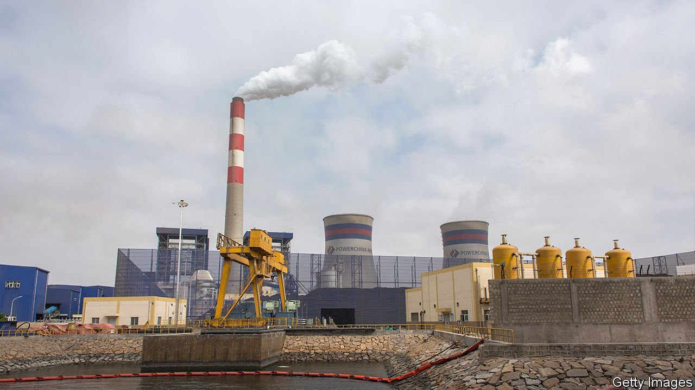
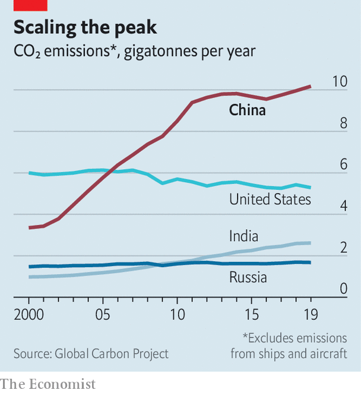
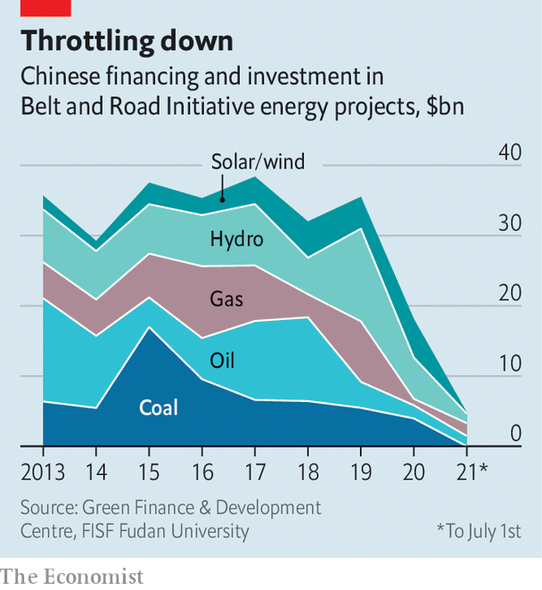

###### Low-hanging fruit

# China pledges to stop financing coal plants abroad 

##### Will it have more to offer at the climate summit in Glasgow? 

 

> Sep 22nd 2021 

IN A SPEECH by video-link, Xi Jinping, China’s president, told the UN on September 21st that his country would stop supporting new coal-power projects overseas. Since 2013, 95% of the funding for coal-fired power plants that came from outside the countries where the plants are located has come from China, Japan and South Korea. In April South Korea vowed to end state-backed financing of coal plants abroad; in June Japan pledged to do the same. Climate campaigners are celebrating China’s decision to follow suit.

By some estimates, 70% of all coal plants being built today rely to some degree on China’s cash. Cutting off this source will hobble the building and operation of such projects in poor countries, where demand for power is often difficult to meet without foreign help. But by mentioning only overseas coal, Mr Xi glossed over China’s own dependence on the stuff. Last year, the country’s power plants produced over half the world’s coal-generated electricity. It continued adding new coal-fired power capacity at a pace of roughly a new coal plant a week. China is already moving away from funding coal plants abroad anyway, mostly because of the falling price of renewable energy.


However, the gesture is at least a sign that China does not want to be seen as a spoiler of global climate-change efforts. John Kerry, President Joe Biden’s climate envoy, had been urging China to make a pledge of this kind. But China had warned that climate-change co-operation with America could be jeopardised by tension in the two countries’ relationship. Now tongues are wagging about whether China might have more good news to announce at COP26, the UN climate summit that is due to be held in Glasgow in November. (Mr Xi is unlikely to attend in person—since the pandemic began, he has shunned travel abroad.)

 


The speculation mainly surrounds China’s plans for cutting emissions of greenhouse gases. The most tantalising possibility is that the country will move forward the date by which it aims for its carbon emissions to reach a peak: currently 2030. (A year ago, Mr Xi also said China would strive for “carbon neutrality”—a balance between carbon emissions and carbon reduction—by 2060). Given that China is the world’s largest emitter, an earlier peak could make a big difference to the world’s climate prospects, especially if it is followed by a marked decline.

 


Many analysts argue that China could, with effort, achieve an emissions peak in 2025. But Li Shuo, an analyst for Greenpeace, an environmental NGO, says China is unlikely to make a formal commitment to this effect. It would require shutting down many coal plants and overhauling the current five-year economic plan, which took effect this year.

A G20 summit in July gave a flavour of things to come. Italy presided over the event and was keen to extract a commitment to phase out coal power. China, among others, was reluctant. It also resisted a push for faster decarbonisation to prevent more than 1.5°C of global warming above preindustrial temperatures (the Paris agreement on climate change, reached in 2015, calls for the stabilisation of temperatures somewhere between 1.5°C and “well below” 2°C). But with thermometers showing roughly 1.1-1.2°C of warming already, it would take a Herculean effort to achieve that goal. China knows much of the task would fall on its shoulders.■

Some of this article already appeared on our website, on September 4th, under the headline “”

For more coverage of climate change, register for The Climate Issue, our fortnightly , or visit our 

