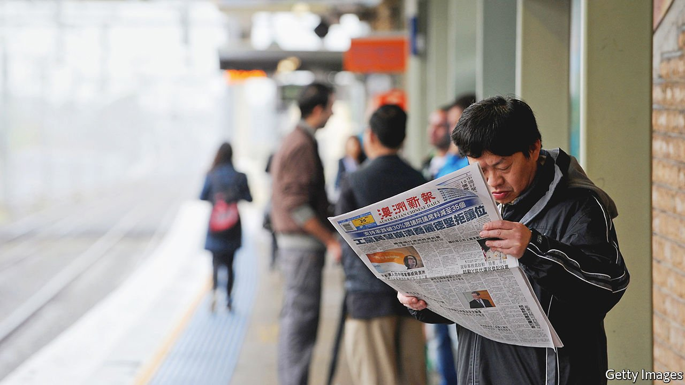

###### Black, white and red all over

# In the West, China holds growing sway over Chinese-language media 

##### WeChat is helping to amplify the Communist Party’s voice 

 

> Sep 23rd 2021 

IN 2019, AT a conference in China of Chinese-language media firms from around the world, a senior official deviated from his script to make his point clear. It was, he said, the “duty and mission” of such firms to help “retransmit” news from China’s state-controlled press at “important times”. But the more than 400 delegates from over 60 countries, including America, Australia, Britain and Canada, would have needed no reminding. Their presence itself was a sign that China had already succeeded in bringing much of the world’s Chinese-language media under its thumb. Widespread use of WeChat, a censored Chinese social-media platform, is helping it shut out those that are not.

China’s main spending on propaganda abroad has been on the foreign-language news services of its state-controlled media. In recent years it has lavished billions of dollars on building a global television network aimed at rivalling the BBC and CNN, as well as on the overseas expansion of its newspapers. But it has also been working hard to boost its influence among media abroad that are not under the Communist Party’s direct command. Those that use the Chinese language are among its main targets. There are tens of millions of ethnic Chinese living outside the country. The party likes to think of them as potential defenders of its cause in an increasingly China-sceptical West.


Chinese officials say there are more than 1,000 Chinese-language media outlets overseas. Some are newspapers that have long been partisan. Until the 1980s, the most widely circulated ones were run and owned by people from Hong Kong and Taiwan. They were staunchly anti-Communist. Those with Taiwanese connections were usually backed by the Kuomintang, the party that was toppled by the Communists in 1949 and took refuge on the island. During the Tiananmen Square protests of 1989, the party grew alarmed by widespread support within the diaspora for the pro-democracy demonstrators. It began stepping up efforts to bend Chinese-language media abroad to the party’s propaganda needs.

The party was helped by dramatic changes within the global newspaper industry as a result of the spread of the internet and falling revenue from print advertising. Many cash-strapped Chinese-language outlets were delighted by offers of paid content from Chinese state media with which they could fill their pages. Owners of Chinese-language newspapers became all too willing to sell their stakes to tycoons with business interests in China, who were eager to show their loyalty to the party by regurgitating its propaganda.

In some cases China’s own state-owned firms became big shareholders. The majority of Chinese-language news organisations outside China are now either directly or indirectly owned by the Chinese government, says Rose Luqiu of Hong Kong Baptist University. In February Sing Tao, a Hong Kong-based Chinese-language newspaper that is widely read in America, was bought by Kwok Hiu-ting, the daughter of a mainland-Chinese property developer. That prompted America to require the newspaper to register as a “foreign agent”, a designation that the Trump administration applied to several mainland-controlled media as a way of highlighting their ties with the Communist Party.

China has also used heavier-handed methods. Journalists and editors who have family members in mainland China are sometimes warned either directly or through their relatives to write copy that pleases the party. Businesses are pressed not to place advertisements in Chinese-language outlets that criticise China. News organisations that try to remain independent struggle to recruit journalists because potential candidates fear retribution, says the founder of one such outlet. Such organisations are subject to cyber attacks. To avoid difficulties, many Chinese-language media practise self-censorship. Most of the big ones in America now read like the  People’s Daily, the party’s official mouthpiece.

Some still resist the party’s embrace. A handful are controlled by overseas-based practitioners of Falun Gong, a spiritual sect that the party banned in 1999 and calls an “evil cult”. The website of New Tang Dynasty Television, or NTDTV, a Falun Gong-backed outfit, is more frequently visited in America than that of the official Chinese state broadcaster, according to Alexa, an internet research company. There are also services funded by Western governments, such as the BBC, Deutsche Welle, Voice of America and Radio Free Asia, that publish Chinese-language news online. Some international media have news websites in Chinese. Mandarin-speaking vloggers on YouTube broadcast political commentary that is critical of the Chinese government. Several of them have hundreds of thousands of subscribers.

To the party, however, the most crucial subset of the diaspora is made up of the millions of people who were born in China and have gone abroad to work or study, or as émigrés. This group is still outnumbered by foreign-born ethnic Chinese, many of whom are the descendants of people who left China generations ago. But their ranks have been growing fast. China wants to ensure that they do not turn their backs on the party, not least because it fears their potential influence over friends and relatives in China itself.

People in this group rely heavily on WeChat, a super-app that nearly everyone uses in China, to stay connected with people on the mainland and communicate with other China-born contacts abroad. In Australia, over 60% of Chinese-language news consumers say they read most of their news on WeChat, according to a survey by two academics in that country: Wanning Sun of the University of Technology Sydney and Haiqing Yu of RMIT University. WeChat has almost 700,000 daily active users in Australia.

Many Chinese newspapers increasingly rely on WeChat to reach new readers. To make that easier, they often censor themselves. In China, WeChat purges content that the party does not like. The international version of the app is less tightly controlled, but it is difficult for news organisations considered hostile by the party to set up public accounts on it to push their articles to users. In December the platform even deleted a post by Australia’s prime minister, Scott Morrison, in which he said that Australia was a “free, democratic, liberal country”. He was criticising a Chinese diplomat’s Twitter post of a faked image of an Australian soldier killing a child in Afghanistan. WeChat said it had removed Mr Morrison’s message because it had used “misleading words” to “distort historical events and deceive the public”.

In May China’s leader, Xi Jinping, called for a bigger push to explain to people abroad “why the Chinese Communist Party is capable, why Marxism works and why socialism with Chinese characteristics is good”. He has found willing assistants. ■

