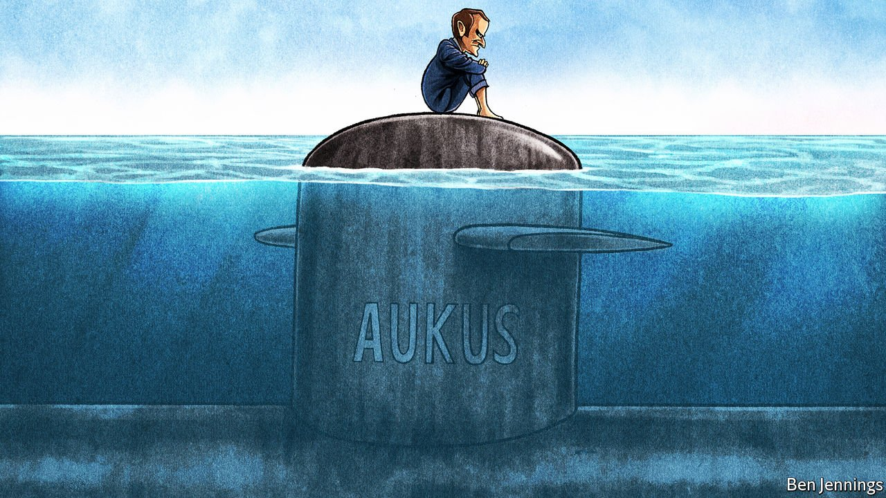

###### Charlemagne

# France’s humiliation by America will have lasting effects 

##### Snubbed over subs, President Emmanuel Macron is even keener to build up European autonomy 

 

> Sep 25th 2021 

THE TIDE was pleasingly high, the seaweed on the white sands of the Cornish beach carefully combed out of sight. Seven world leaders sauntered back from their seafront photo for talks. As they walked, only one was treated to the American presidential arm, a full across-the-back hold, and for a total of 37 seconds: the French president, Emmanuel Macron. The high art of diplomatic choreography renders such fleeting gestures priceless. Was it not a kind of consecration? Britain’s Boris Johnson may have hosted the G7 meeting in June. But France’s president got the honours.

When Joe Biden was elected, France saw a rare chance to establish itself as America’s favourite European interlocutor. Brexit, went the argument, had relegated Britain’s usefulness in its transatlantic ally’s eyes. Germany was about to lose to retirement Angela Merkel, the continent’s de facto leader and Americans’ European of choice. Who better to step in than Mr Macron, an English-speaker who had once been selected as a French-American “young leader”? None other than Barack Obama, Mr Biden’s old boss, had called the French candidate in 2017 to wish him good luck. “Is this Emmanuel?” Mr Obama’s voice boomed through on speakerphone in the campaign office in Paris, urging Mr Macron to keep campaigning hard right to the end.


Moreover, France, a fellow child of revolution and America’s oldest ally, seemed to have unusually good links to the new administration. Antony Blinken, the secretary of state, was educated at a lycée in Paris, as was Robert Malley, the special envoy for Iran. America supplies intelligence and logistics to French-led counter-terrorist operations in the Sahel. French and American navies train together, including in the Indo-Pacific, where France keeps over 7,000 troops (and has nearly 2m citizens). France’s pursuit of its own strategy in building up a geopolitical presence in the region in the face of an assertive China was “good for America”, notes Michael Shurkin, an American security analyst.

So it was with a mix of consternation, anger and pique that the French learned—just hours beforehand—of America’s new defence pact with Australia and Britain, which torpedoed an existing French contract to sell submarines to Australia. To lose a big defence deal was one thing. To be kept in the dark for months by three close friends, who evidently saw no place for you, was quite another. “Allies don’t do this to each other,” snapped Jean-Yves Le Drian, Mr Macron’s foreign minister, calling it a “stab in the back” and accusing the trio of “lying, duplicity, a major breach of trust and contempt”. France recalled its ambassador to America (as well as its one to Australia) for the first time since 1793. This week it was Boris Johnson who jetted off triumphantly to the White House, while Mr Macron sat nursing his wounds in the Elysée.

It is as hard to overstate the depth of the colère in Paris as it is to fathom America’s failure to anticipate it. France is as capable as anybody of acting with ruthless self-interest and disregard for others. A prickly, proud nation, it does not hesitate to say out loud what others keep to themselves. But the secret pact was as brutal a blow as any Western ally has landed on another in recent times. Trust is the first casualty. It took seven days for Mr Macron to accept Mr Biden’s call. Mr Biden agreed that there ought to have been “open consultations among allies”. Mr Macron agreed to send his ambassador back to Washington. Confidence-building talks will be launched. But the scars will remain.

What might be the consequences of all this? In the short run, a slighted France will be a more distrustful, irascible partner on other matters, less willing to compromise or give ground on trade, say, or over regulatory disputes. France cannot dictate what the European Union does; public European sympathy for France has so far been notably scant. But it can shape and block positions. Postponed meetings and summits may feel like poor tools of retaliation, but the cumulative effect can be corrosive.

The episode will also force the French, if not to rethink their ability to pursue their own Indo-Pacific strategy, then at least to confront the limits of it when measured against an Anglophone alliance. Some voices outside government, especially on the political right, are calling for a more dramatic, de Gaulle-like flourish. In 1966 the general distanced France from NATO and went off to sweet-talk the Russians. Ahead of the French presidential election next April, rival candidates are calling for some sort of replay. Gérard Araud, a French ex-ambassador to America, warns of “a Gaullist temptation”.

The ghost of de Gaulle

Mr Macron has indeed argued that France should act as a “balancing power”. Following America’s shambolic retreat from Kabul, the submarine episode has weakened the voice of French Atlanticists. But Mr Macron is no anti-American. He may not seek full-on confrontation with China, but he has long urged Europeans to consider it a strategic rival on industrial and security matters.

The geopolitical conclusion that he will probably draw from all this, rather, is that he was right. That America is an unreliable ally for continental Europeans at a time of a rising China; that this is not a fleeting trend; and that Europe needs greater self-reliance. Which brings France back to its persistent but generally thankless efforts to build European “strategic autonomy”.

During their call, Mr Biden acknowledged that European defence “is complementary to NATO”, as Mr Macron has always argued. But the concept still unnerves fellow Europeans. Most of them, especially those near the Russian border, are happy to rely on America’s security guarantee. Few share France’s willingness to splurge on defence, or its expeditionary military culture. (Germany, especially, does not.) Nobody agrees what “strategic autonomy” actually means. Low odds, however, seldom deter Mr Macron. After the latest snub, the unhugged French president will doubtless conclude that he has little choice but to keep trying. ■

