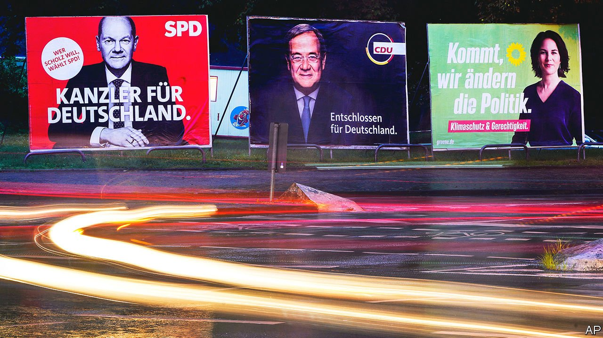
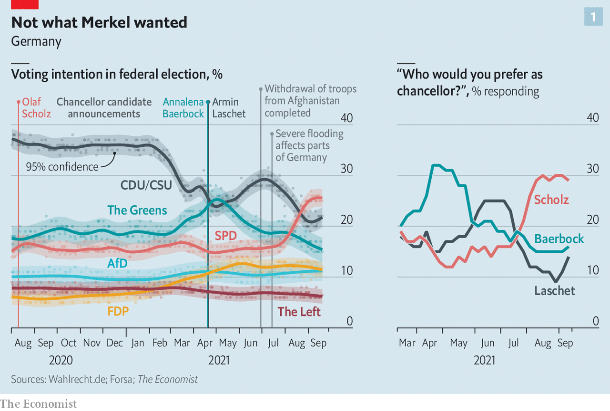
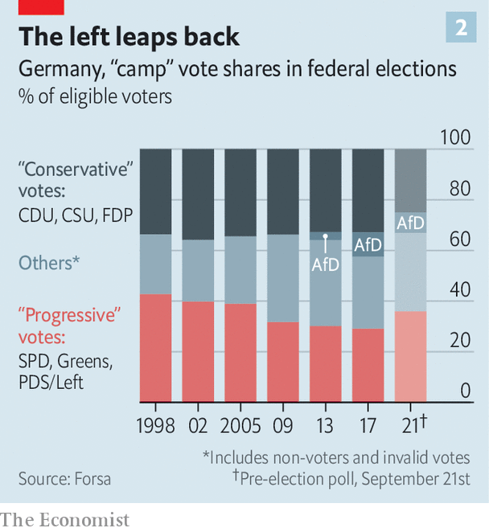

###### Hunting for the Merkel middle

# German candidates fight to woo moderate voters 

##### But none has the outgoing chancellor’s knack of soothing them 

 

> Sep 25th 2021 

THE MOOD among her comrades is “euphoric”, says Sonja Hergarten, a volunteer for Germany’s Social Democratic Party (SPD) at a campaign stand in Munich’s university district. At the last election, in 2017, she had the unenviable task of persuading Germans to vote for Martin Schulz, a little-known politician who had returned from a career in Brussels to lead the SPD’s campaign. This time the candidate is , a familiar face to most Germans as the finance minister and vice-chancellor, and a much easier sell. As if to prove the point, a grinning passer-by exclaims “Toll, toll, toll!” (“Great, great, great!”).

A few hours later Mr Scholz himself arrives in town. Speaking below the impressive façade of Munich’s neo-Gothic Neues Rathaus (town hall), he presents a list of modest social-democratic priorities, including affordable housing (an important local issue), pension security and the preservation of jobs during Germany’s climate transition. Then comes his leitmotif: “respect” for the labour of “the craftsman or the logistics worker”, which implies lifting the minimum hourly wage to €12 ($14), a signature policy. Mr Scholz hammers the governing Christian Democrats (CDU), the senior partner in the “grand” coalition with his SPD, for pushing tax cuts when the state has incurred €400bn in pandemic debt. Afterwards, Mr Scholz receives the adoration of autograph-hunting fans with the reserve customary to his home town of Hamburg. His famous Smurf-like grin turns rictus after the seventh selfie.


Until this summer the SPD had been in the doldrums for years, haemorrhaging members, money and support. If the extraordinary comeback suggested by opinion polls (see chart 1) is confirmed on September 26th, the victory will belong to Mr Scholz. An experienced politician who sits on his party’s right, he is by far the most popular of the candidates seeking to replace Angela Merkel as chancellor, and the SPD’s campaign has been organised accordingly. Mr Scholz’s visage dominates the stylish red posters that festoon the Munich stand, along with reassuring phrases like “Kompetenz für Deutschland”. They have been a huge hit with voters, says Ms Hergarten, sporting a “#TeamOlaf” face-mask.

 


Yet the real story of the campaign has been the weakness of Mr Scholz’s rivals, chief among them , candidate for the centre-right CDU and its Bavarian sister, the Christian Social Union (CSU). In April Mr Laschet prevailed over the more popular (and populist) Markus Söder, the CSU leader, for the parties’ joint candidacy only because CDU grandees feared yielding to the Bavarians would doom their party for a generation. Mr Laschet’s dire approval ratings have dragged his party down with him. “People dread the idea of seeing him on the evening news for four years,” says Frank Stauss, a campaign strategist. A faint air of the ludicrous has attached to Mr Laschet throughout the campaign.

This feeling is not entirely dispelled at a recent campaign stop in a beer garden in Celle, a small town in the northern state of Lower Saxony. The 5’8” bespectacled Mr Laschet, with a slow-moving entourage and security detail, is welcomed onstage to the strains of “Eye of the Tiger”, a macho boxing anthem. A local official introduces him as if he were Rocky Balboa.

Yet Mr Laschet is a strong speechmaker once he finds his stride. He aims his pitch at Germany’s “normal people,” who rise at seven and drive to work each day; the sorts, in fact, that fill the Celle beer garden. Like Mr Scholz, he pledges to combine climate protection and support for industry, while weaving in foreign-policy and security themes that CDU strategists reckon are their comparative advantage over the SPD. Mr Laschet also finds time to wage a bit of a culture war against Germany’s hyperactive language police—a jab mostly at the Greens. Several attendees say Mr Laschet’s performance has dispelled their original scepticism. “He’s obviously not a person who opens hearts immediately,” says Sabine Rudnick, a party foot-soldier. But the media exaggerate his foibles, she reckons.

Touching the void

In 2001, four years before she took office, Mrs Merkel outlined her electoral strategy to Der Spiegel, a weekly. “Think of the [political] middle as a point,” she said. “Divide the scale into three sections to the right and left of this point, and we have to get the larger part of the middle third of the voters.” A majority of German voters indeed place themselves in the centre of the political spectrum, and more of them lean left than right. Mrs Merkel, who will leave office after 16 years with approval ratings of over 80%, was able to extend the reach of the CDU/CSU to groups like older women and ethnic minorities while defusing conflicts that might rouse opponents (a trick known to electoral strategists as “asymmetric demobilisation”). Some of her deeds in office, such as keeping Germany’s borders open to over 1m migrants in 2015-16, earned her lasting support from Green and other progressive voters.

This is the first time in modern German history that a sitting chancellor has not sought re-election. The void left by Mrs Merkel’s departure has led to what Kajo Wasserhövel, an SPD politician-turned-consultant, says is the most extraordinary campaign he has witnessed in four decades. Within four months the lead has bounced between the Greens, the CDU/CSU and now the SPD. Yet voters’ basic preferences have been broadly stable, says Peter Matuschek at Forsa, a pollster. Instead, the parties—and especially, in what has been a highly personalised campaign, their lead candidates—have stumbled in their bids to appeal to the Merkel Mitte (middle).

As the candidate of Mrs Merkel’s party, Mr Laschet, the premier of North Rhine-Westphalia, Germany’s largest state, had the easiest task. A centrist who saw off a threat from the CDU’s conservative wing to win the party leadership in January, he had hoped that simply aspiring to the moderate course of Mrs Merkel’s two grand coalitions would allow him to coast to victory. Two-thirds of Germans feel personally well-off; the party assumed few voters would see much reason for rupture. The CDU/CSU manifesto is strikingly thin, even by the standards of a party that has always been more interested in power than ideas.

But voters have long noticed that Mrs Merkel’s party has been struggling to articulate an identity that will outlast her. Before covid-19 struck, the CDU/CSU had slumped to around 26% nationally and suffered a string of reverses in state elections. Yet the incumbency effect of the pandemic, which saw the party briefly soar to 40%, bred complacency. Mr Laschet sometimes acted as if the chancellorship was a bequest from Mrs Merkel rather than an office to be fought for. Playing it safe looked risky even when the Greens, the most radical of the leading parties, were expected to be the progressive challenger. In July Mr Laschet, touring the flood-hit regions of his state, was caught chuckling on film. Many voters saw confirmation of a fundamental unseriousness.

But when Mr Scholz, who represented a more credible brand of continuity than Mr Laschet, unexpectedly rose from the dead, the CDU/CSU was left flat-footed. Its campaign has floundered ever since. The party’s tone veers from statesmanlike one day to blindly partisan the next, pushing an implausible argument that the impeccably moderate Mr Scholz wants to invite the hard left into coalition. Mr Söder, still smarting from his defeat, sounds more antagonist than ally. The CDU/CSU has lost the support of perhaps 7m voters since the start of the year, and fewer than half those who remain prefer Mr Laschet as chancellor. If he had drawn the lesson of complacency from Mrs Merkel’s reign, he forgot about her competence.

The Greens placed a different bet. Germany’s Mitte had shifted, they argued; voters wanted something more imaginative than the clapped-out grand coalition they had been lumbered with for eight years. The shift was subtle, but important: the Greens no longer presented themselves as a vanguard but as a vessel for voters’ ambitions. The party’s co-leaders, Annalena Baerbock and Robert Habeck, are found delivering this message on a warm late summer evening in Frankfurt’s Römerberg square. Mr Habeck, who cultivates the image of a rugged philosopher-statesman, delivers a disquisition on the nature of freedom, while Ms Baerbock, the Greens’ first ever chancellor-candidate, offers down-to-earth details on party policy. She presents her inexperience—she has done little more than hold a Bundestag seat—as a virtue when set against the failures of Germany’s establishment. The speeches make a neat pairing. “These two have brought our party to heaven,” beams Omid Nouripour, the local Green MP.

The pitch indeed proved effective, for a time. When the Greens chose Ms Baerbock in April, at the height of the CDU/CSU infighting, the party briefly topped the polls. They still hope to perhaps double their 2017 score, but if the dream of capturing the chancellery has  it is because the party believed too strongly in the power of its own myth. “I admire Annalena Baerbock, but how will the Greens pay for it all?” asks Vanessa Erb, a 19-year-old watching the speeches. The Greens have an answer to this and most other questions, but they fail to cut through to an electorate that remains concerned about climate change but wary of anything that reeks of radicalism. Nor has the party’s deep bench, with expertise that extends to security, fiscal policy and migration, pulled the Greens out of their single-issue ghetto.

This leaves Mr Scholz out in front. His claim to Mrs Merkel’s job lies in his experience, which includes stints as federal labour and finance minister, and seven years running Hamburg; an air of just-the-facts competence; and a demeanour so unruffled that mini-scandals around financial supervision fail to stick. “A Merkel voter in 2017 does not have to travel a long way to become a Scholz voter in 2021,” says Mr Stauss. Yet his success has rested on two conditions. One is his luck in his opponents. Had Mr Habeck or, especially, Mr Söder led their parties’ campaigns, the race would have looked very different.

The other is the acquiescence of the SPD’s left wing—including the two co-leaders of the party—which has been surprisingly complete for an outfit with a habit of vicious public rows. Mr Scholz’s personal popularity belies his party’s struggle to regain voters’ trust. Just 14% of Germans say the SPD is best placed to manage Germany’s problems, a number that has barely shifted even as the CDU/CSU’s has plummeted. But Mr Scholz’s anointment over a year ago gave time for the party’s wings to come to terms. “I’m very grateful that the top of the SPD is working closely together,” says Lars Klingbeil, the party’s secretary-general and an architect of its internal harmony. Mr Scholz’s platform has enough red meat to satisfy the leftists, and they are hungry for the power that is now within grasp.

 


As Germany’s politics have fragmented, its voters have become more promiscuous. Parties have been able to fish for votes from across as well as within their respective progressive or conservative camps: in the 2019 European elections, for example, the Greens attracted over 1m voters who had backed the CDU/CSU in the 2017 national vote. Their growth means this year is likely to reverse a decades-long shrinkage of Germany’s “progressive” block of voters (see chart 2). In July a study by the Konrad Adenauer Foundation, which is linked to the CDU, found that only a quarter of Germans had an unbreakable link to a single party. (Supporters of the hard-right AfD, whose views place them out of reach for other parties, are the exception.) Voters are open to new governing arrangements, and indeed have elected them: there are 14 flavours of coalition in Germany’s 16 states.

Send for plenty of coffee

So it is fitting that the election outcome remains highly uncertain. The SPD’s lead over the CDU/CSU is small, and there are several unknowns. Turnout is hard to predict; an unusually high share of postal ballots is expected; and the state of the polls may create its own dynamic. Some CDU/CSU waverers could make a late return to the flock if spooked by the prospect of an SPD-led government, for example.

But the difficulty of the coalition negotiations that will follow can be safely predicted. Germany is probably headed for its first three-way national coalition in decades; an ominous prospect given the array of domestic and international challenges that will confront it (see ). Either of the two likeliest results—a “Jamaica” government led by Mr Laschet, or a more left-leaning “traffic-light” arrangement under Mr Scholz, with the Greens and the liberal  as junior partners in each case—will unite parties that disagree on much. That risks entrenching gridlock at just the moment Germany’s partners will have hoped for resolve. If so, this will not be the outcome Germany’s resolutely centrist voters might have sought. But it is one that they will have earned. ■

For more coverage of the German elections, visit our dedicated 

