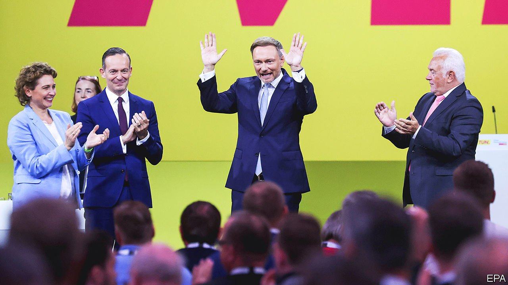

###### A dash of yellow

# Germany’s pro-business Free Democrats may be essential to forming a government 

##### Christian Lindner, the party’s leader, could hold the key 

 

> Sep 23rd 2021 

CHRISTIAN LINDNER, the leader of Germany’s pro-business Free Democratic Party (FDP), is likely to emerge as a crucial figure after the election. Polling suggests it will be hard to form a coalition without the FDP. The 42-year-old Mr Lindner will relish the chance to cap his rapid political ascent with a job inside Germany’s next government—ideally as finance minister. His enemies would see that as their worst nightmare.

The FDP advocates tax cuts, slashing red tape, pension reform and limits to European fiscal integration. More recently it has urged a faster easing of lockdown rules. The party has doubled its support in the past year, thanks in part to the collapse of the conservative CDU/CSU. A snappy dresser and charismatic performer who regularly tops “Germany’s hottest politician” lists, Mr Lindner dominates his party to the exclusion of its other talents. At a recent campaign event in Berlin he was swarmed by admirers after delivering a fiery speech in which he sniped viciously at the Greens’ plans for debt-funded investment.


For decades the FDP was the kingmaker of German politics, propping up coalitions led by the CDU/CSU or the SPD. But the next government will probably need three parties to make up the numbers. That could mean a choice between a right-leaning “Jamaica” coalition, with Armin Laschet as chancellor, or an SPD-run “traffic-light” grouping, led by Olaf Scholz. Both would include the FDP and the Greens as junior partners. In 2017 Mr Lindner aborted Angela Merkel’s attempts to form a Jamaica coalition, declaring it better not to govern at all than to govern badly. “The FDP didn’t give us a millimetre,” says Lisa Paus, a Green MP involved in the talks.

This year Mr Lindner will hope to give Jamaica another try. He gets on well with Mr Laschet, with whom he built a CDU-FDP coalition in North Rhine-Westphalia in 2017. But as the SPD’s prospects have grown, Mr Lindner has opened the door to Mr Scholz by quietly softening his stance on fiscal issues. His price for making possible a traffic-light government would be the finance ministry, a perch from which he would seek to rein in the spending plans of the SPD and Greens (and France’s aspirations to deepen euro-zone integration). Many Greens and Social Democrats detest Mr Lindner’s brand of politics, and the feelings are mutual. From this witches’ brew of resentment and mistrust, a government may somehow emerge.

