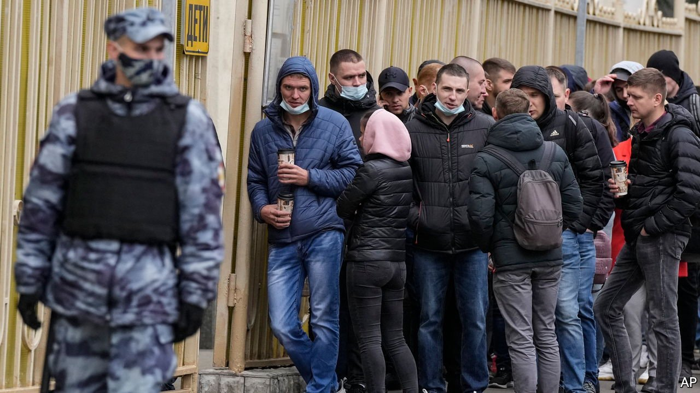

###### The conjuror in the Kremlin

# How Russia’s election was fixed 

##### As if by magic, Vladimir Putin has another new, obedient parliament 

 

> Sep 25th 2021 

IN MIKHAIL BULGAKOV’s great novel “The Master and Margarita”, set in Stalin’s Moscow in the 1930s, Satan’s mischievous company performs magic tricks in a comedy theatre. It showers the audience with banknotes. People leap and scramble to catch them as they flutter down. Next day, needless to say, they are all worthless.

Russia’s general election, theatrically staged by the Kremlin between September 17th and 19th, had a touch of Bulgakov about it. Even so, United Russia, the party that supports President Vladimir Putin, had seen its popularity fall to less than 30% in polls taken ahead of the vote. Turnout was as low as ever. But as if by magic the ballot papers gave the Kremlin more than two-thirds of the seats—and a supermajority—in the Duma, Russia’s parliament.


In the run-up to the show, the Kremlin had banned opposition politics, barred independent observers, muzzled independent media and blocked every internet site tied to Alexei Navalny, the jailed opposition leader. It built an electronic platform that let people vote online, allowing the security service to snoop and bully without recourse to old-fashioned physical ballot-stuffing.

In Moscow alone, 2m people out of 7.5m eligible voters registered to vote online. Many had no choice. An IT specialist at VTB Bank, Russia’s second-largest owned by the state, explained to your correspondent that the bank’s bosses ordered all its staff to vote online and tracked down anyone who did not, threatening them with dismissal.

The three-day voting show began with thousands of military and state workers, ferried in by their bosses, lining up in orderly queues to perform their duty. But millions of Russians opposed to the Kremlin waited until the last day, many hoping to minimise the chances of fraud.

Guided by Mr Navalny’s smart-voting system, they aimed to consolidate their protest vote by plumping for any party other than United Russia and for any first-post-the-post candidate with the best chance of beating the Kremlin nominee in whichever constituency.

In a few regions, particularly in the Urals and in Siberia, where the Kremlin has found it hardest to rig, United Russia got around 35% of the vote on a turnout of under 40%, barely beating the Communist Party, which won the most protest votes. In some areas, such as Khabarovsk in the far east, the Communists actually won. But the national result was officially recorded as a triumph for Mr Putin, thanks to electronic voting and old-fashioned fakery in “electoral sultanates”, such as Chechnya, where United Russia claimed 96% of the vote.

Moscow and St Petersburg, where anti-Kremlin sentiment is strongest, set an example. In St Petersburg, observers were dragged out of polling stations. In Moscow the cheating was more high-tech. As polling stations closed, United Russia was clearly heading for defeat in most of the capital’s constituencies. One station after another publicised results that put smart-vote candidates in the lead. But at 4am the picture magically changed and every seat there was marked down to United Russia.

That was after 2m online votes had been dumped into the system, showing 45% support for United Russia. Even so, there was a 15-hour delay in publishing the result of the electronic vote. “The robot decided to have a think and a smoke,” quipped Mr Navalny via his lawyers on Instagram.

Using the electoral commission's open data, Sergei Shpilkin, a respected analyst who has long tracked Russian elections, reckons that in reality only 14m people voted for United Russia in an electorate of around 110m. Another 14m votes were acquired through falsification, he calculates. So the true result was the worst the Kremlin has had in a federal poll since Mr Putin first became president 21 years ago. ■

