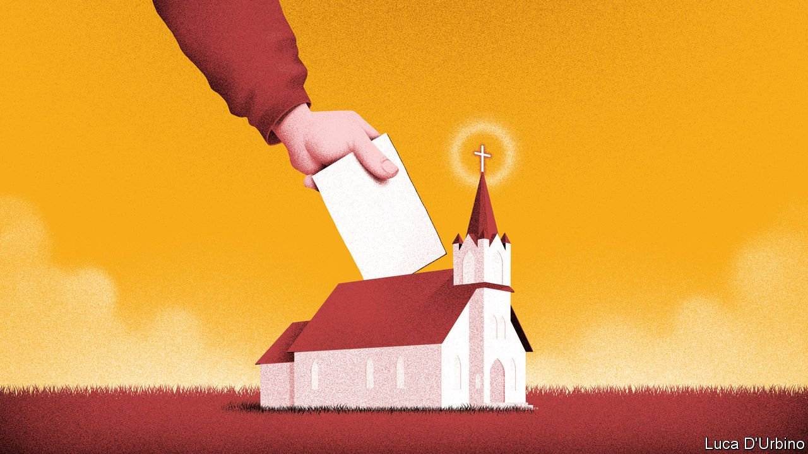

###### Chosen ones

# In the Church of Sweden it is one Lutheran, one vote 

##### A church election showcases a tradition of Christian democracy 

 

> Sep 23rd 2021 

UNLIKE ENGLAND, Thailand or Iran, Sweden no longer has a state religion. The Church of Sweden, Europe’s biggest Lutheran denomination, was formally severed from government back in 2000. But its roots are deep: it traces its history to a 16th-century squabble between King Gustav Vasa and the Pope. About half of Swedes still belong to it. And true to the country’s democratic spirit they get to vote on who runs it. On September 19th some 17% of the church’s 5.7m members cast ballots for its governing synod.

Some issues in the election were religious, such as a proposed ban on new confessional schools. But others were more secular, including climate change, immigration and gay marriage. That is partly because most of the “nomination groups” that put up candidates for the synod are linked to political parties. The left seems to do better in church elections. The Social Democrats got 28% of the votes and 70 of the synod’s 251 seats, similar to their share in parliament. But the right-wing Sweden Democrats took just 8% in the church election, about half their result in the national election.


One subject of contention is whether political parties should be involved at all. The synod’s second-biggest group is POSK, a non-partisan outfit. “We have become more of an opinion communion instead of a communion of faith,” argues Amanda Carlshamre, POSK’s chairwoman. This year the archbishop came out against a language-test requirement for Swedish citizenship. Olle Reichenberg, the chairman of Borgerligt Alternativ (“Bourgeois Alternative”), the biggest centre-right nomination group, thinks that should be left to parliament. Others counter that worldly engagement is part of church tradition. As one of Sweden’s biggest owners of farmland and forest the church can hardly ignore climate change, notes Jesper Eneroth, chairman of the synod’s Social Democrats.

It is not clear how much the synod can do about the church’s biggest problem, declining interest. Just 3% of Swedes attend services regularly. Most of the big doctrinal disputes are over. The church has performed same-sex marriages since 2009. Conservatives want to continue to let a few old-fashioned priests opt out. Progressives do not. It seems a small point, but churches have split over less.

