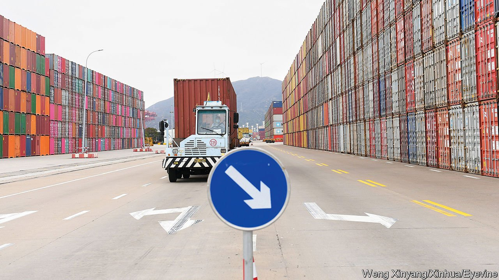

###### Wiping America’s eye

# China throws a wrench into a transpacific trade pact 

##### Its application to join the CPTPP may not prosper, but it creates mischief 

 

> Sep 25th 2021 

CHINA’S REQUEST to join the Comprehensive and Progressive Agreement for Trans- “ 1999 a meeting between the trade ministers of two small export powerhouses, New Zealand and Singapore, kicked off what became one of the world’s largest free-trade areas.

When that alliance was first mooted, China was a nascent trading nation and its economic heft was piddling. Its share of global merchandise exports was 3.4%. Last year, that figure ran to 14.7%, making China the only country in the world which accounts for a double-digit share.

America, which signed up to join a forerunner of the CPTPP, before pulling out in 2017, often sought to portray the bloc as a tool to keep China from exercising influence over trading rules. It is still difficult to imagine China’s application being successful in the short term. The CPTPP is a detailed agreement requiring deep economic integration, and new members must be admitted by unanimous approval. “China is surprisingly close to meeting CPTPP conditions in many areas. But where there are gaps, they’re huge,” according to Jeff Schott of the Peterson Institute for International Economics (PIIE), a think-tank in Washington, DC. He reckons the country has made huge strides in recent years on intellectual-property and investment rights. But the dominance of state-owned enterprises (SOEs), weak labour rights and concerns about data privacy leave a lot of ground to catch up.

The treatment of SOEs is a perpetual bugbear of many of China’s trading partners. To gain membership of the CPTPP, Vietnam in particular had to agree to restrictions on support for its own state-run firms and increased transparency on their operations and structure, which China would be expected to mirror. Data governance is a case where China is, if anything, moving in the opposite direction to the one which would be needed for membership. The CPTPP countries have committed themselves to promoting the cross-border transfer of information. In contrast, China has become the global exemplar of data localisation: a data-protection law passed last month will make it harder for foreign companies to move data out of the country.

Moreover, China is not the only country with a pending application. The Taiwanese government lodged an application to join the bloc less than a week later. Its diplomatic status vis-à-vis China makes its membership of any trade deal fraught, but on strictly economic grounds, it would have fewer hurdles to clear.

Despite the difficulties, some member countries might look eagerly on the potential economic gains of having China on board. Once it was thought that America would be the economic powerhouse in the bloc. Today, among CPTPP members, only Canada and Mexico trade more with America than with China. A PIIE paper published in 2019 estimated global income gains from the CPTPP as it stands run to $147bn a year. If China were included, that would rise to $632bn. The benefits to many of the members would run to more than 1% of their national income.

China is already the largest member of the Regional Comprehensive Economic Partnership, a larger but shallower trade deal agreed last year. It contains fewer conditions for membership, but unlike the CPTPP includes every big South-East Asian economy, as well as South Korea. Membership of both, if it were to happen, would make China a formidable leader of commercial diplomacy in Asia.

Most bets are that its bid to join the CPTPP will fail. And yet not long ago few would have wagered that China would show more interest in membership than America. If the application means little else, it remains a stark illustration of just how quickly America’s commercial influence in Asia has waned. ■

For more expert analysis of the biggest stories in economics, business and markets, , our weekly newsletter.

