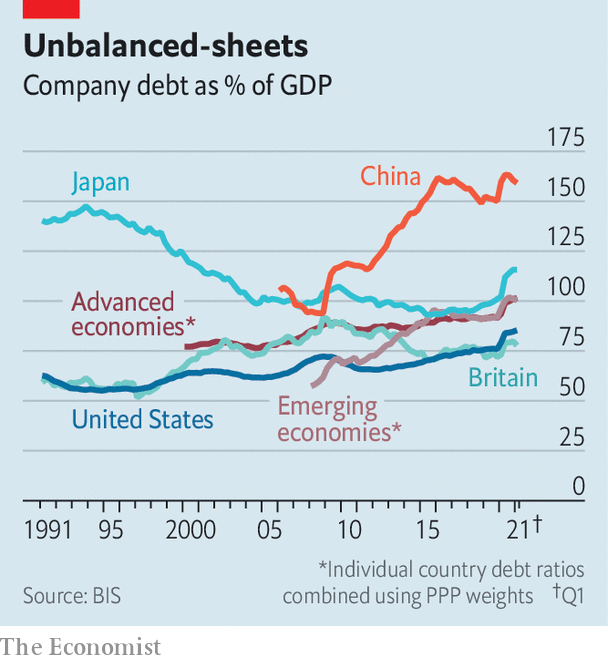

###### A mountain but not a volcano

# How threatening are the high levels of corporate debt? 

##### Research suggests property-related borrowing is the biggest headache 

 

> Sep 23rd 2021 

ON SEPTEMBER 20TH the Bank for International Settlements (BIS), the central banks’ central bank, released data showing that corporate borrowing around the world remains at an all-time high. A notable case is in China, where there is even more business borrowing as a share of GDP than in Japan at the peak of its bubble-related borrowing spree in the 1990s. But it is high everywhere (see chart). Corporate debt in the rich world stood at 102% of GDP at the end of March, compared with 92% before the outbreak of the covid-19 pandemic. Could high levels of debt threaten the recovery in advanced economies?

Many regulators were sounding the alarm about elevated company debt even before the covid-19 pandemic. Since then, the hit to firms’ incomes has led to a wave of rating downgrades: between March 2020 and March 2021, Fitch, a ratings agency, downgraded 460 firms, or almost 20% of its corporate portfolio. While defaults have eased this year as economies have recovered, many firms will be burdened by higher levels of debt for years to come. Even if interest rates remain low, this “debt overhang” could affect their willingness to invest or to hire new staff.


Intriguingly, however, hangovers from corporate-debt booms rarely cause significant economic damage, even if creditors themselves suffer when firms default. A recent paper by Moritz Schularick, of the University of Bonn, and several coauthors, examines data on business cycles for 17 advanced countries over more than a century, and compares corporate-debt busts with those associated with household borrowing (like the 2008-09 financial crisis).

 


The authors argue that lenders often have an incentive to restructure old corporate loans, reducing the risk of “zombie” companies persisting, and freeing up finance to support the next recovery. For household debt, however, restructuring thousands of individual loans is often impossible, and lenders may be more inclined to keep the loans on their books in the hope that house prices eventually recover. The risks to the economy are higher after commercial-property busts than for corporate debt where lenders mainly have their eyes on firms’ cashflows. This is one reason why the property-related debt woes in China are potentially disturbing.

In much of the rich world, there are reasons to be cautiously optimistic. The largest lenders are in much better health than in 2008. All of the major regulatory authorities carried out stress tests during 2020, using macroeconomic scenarios much more severe than have actually transpired, but their banking systems were able to absorb large corporate losses and carry on lending. And the parts of the economy that have had the toughest time during the pandemic only account for a relatively small share of corporate debt. For example, modelling by Benoît Mojon, Daniel Rees and Christian Schmieder of the BIS projects that defaults will increase in the hospitality industry over the coming years, but they note that the sector only accounts for between 1.5% and 8% of corporate credit in the nine major economies they model.

There will be a mountain of corporate debt in many countries for some time. But that does not mean the recovery will necessarily falter. ■

For more expert analysis of the biggest stories in economics, business and markets, , our weekly newsletter.

