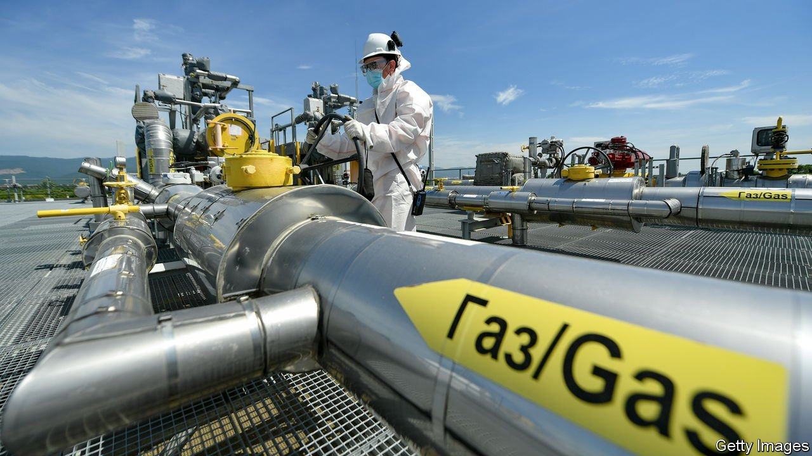
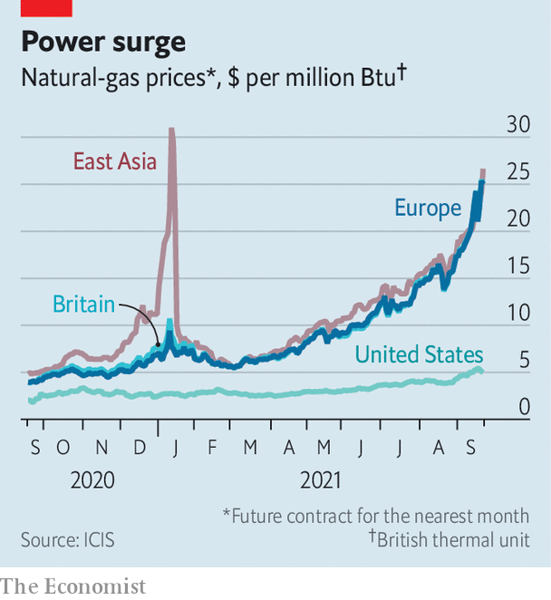

###### Boiling over

# Natural-gas prices are spiking around the world 

##### Unusual weather and supply outages are to blame 

 

> Sep 21st 2021 

ACROSS THE world, a natural-gas shortage is starting to bite. Prices of power in Germany and France have soared by around 40% in the past two weeks. In many countries, including  and Spain, governments are rushing through emergency measures to protect consumers. Factories are being temporarily switched off, from aluminium smelters in Mexico to fertiliser plants in Britain. Markets are frantic. One trader says it is like the global financial crisis for commodities. Even in America, the world’s biggest natural-gas producer, lobby groups are calling on the government to limit exports of liquefied natural gas (LNG), the price of which has climbed to $25 per million British thermal units (mBTU), up by two-thirds in the past month.

In one sense , with a mosaic of factors from geopolitics to precautionary hoarding in Asia sending prices higher. Viewed from a different perspective, however, its causes are simple: an energy market with only thin safety buffers has become acutely sensitive to disruptions. And subdued investment in fossil fuels may mean higher volatility is here to stay.

The shortfall has taken almost everyone by surprise. In 2019 there was plenty of gas on the international market, thanks to new LNG plants coming online in America (see chart). When the covid pandemic struck and lockdown constrained demand, much of the excess gas went into storage in Europe. That came in handy last winter, which was particularly cold in northern Asia and Europe. The freeze pushed up demand for heating. In Asia gas prices quadrupled in three months. Buyers, such as national gas companies, looked to the LNG market to fill out supply. Many Europe-destined cargoes were diverted to Asia. Europe, by contrast, drew down on its reserves. Prices there only inched up.

 


This year odd weather has featured again. A hot summer has added to booming gas demand in Asia. The region accounts for almost three-quarters of global LNG imports, according to AllianceBernstein, a financial firm. China led the way, thanks to its swift economic recovery. In the first half of 2021 its power generation jumped by 16% compared with the previous year. Three-fifths of China’s power is generated by coal; a fifth comes from hydropower. But hydropower generation has been low because of a drought. And coal demand fell partly because of environmentally friendly policies, such as replacing coal-burning boilers with gas ones. Investment in mining coal has also been low. That meant more reliance on natural gas. In the first half of the year, gas generation grew quicker than coal or hydropower. Chinese LNG imports grew by 26% from the previous year.

Other countries have seen higher demand too, partly because of the warm summer in Asia. In addition, Japan, South Korea and Taiwan have been topping up their storage facilities. Meanwhile, a drought in Latin America, which gets half its power from hydro, has increased the need for gas there. The region’s LNG demand has almost doubled in the past year.

Booming demand has been met with lower supply of LNG. A long list of small disruptions has nibbled away at global output. Some of the outages were caused by maintenance work delayed during the covid pandemic. Others, such as a fire at a Norwegian LNG plant, were unplanned. The combined effect of all these disruptions was to cut global LNG supply by roughly 5%, estimates Mike Fulwood of the Oxford Institute for Energy Studies (Mr Fulwood’s daughter works at The Economist).

With LNG being sucked into Asia, less has been left for European buyers. LNG imports into Europe are about 20% lower than they were last year. Gas inventories are about 25% below their long-term average. Gas production has also dropped in  and the Netherlands. Analysts had expected Russia’s Gazprom, which supplies a third of Europe’s gas, to make up the difference. But even though it met all of its long-term gas contracts to Europe this year, it has not sold additional gas in the spot market. Some suspect Gazprom wants to speed up the launch of Nord Stream 2, a big gas pipeline.

Europe has been hit by peculiar weather in other ways. Across the north-west of the continent the air has been still, reducing wind generation. In Germany, for example, during the first two weeks of September wind-power generation was 50% below its five-year average. Moreover, usually European utilities respond to high gas prices by using more coal. But the price of coal is also at near-record highs on the back of demand for electricity and production bottlenecks. The cost of European carbon permits is at record highs too. These give the holder the right to emit an amount of greenhouse gases. Because burning coal emits more than burning natural gas, expensive carbon permits add even more to the price.

America’s gas market has responded to international demand. In the first half of the year America exported about a tenth of its natural-gas production, a 42% increase on the year before, according to the Energy Information Administration, a government statistical agency. But even if America produced more domestically, it would not help to balance the international LNG market. LNG facilities in America are running nearly at full capacity. So are liquefaction facilities in other big gas-producing countries, such as Australia and Qatar. Expanding LNG plants is possible (Qatar plans to increase its capacity by 50%) but takes years to do.

What could bring the heat out of the market in the short term? One possibility is substitution. That has begun to happen in some places. Europe is burning more coal than this time last year. Some power plants in Pakistan and Bangladesh switched to oil from LNG. Another possibility is an increase in supply from Russia. But it is unclear how much more Russia can produce. A final possibility is warmer weather. But meteorologists are already forecasting a cold winter. Gas prices are unlikely to come down to earth soon.■


