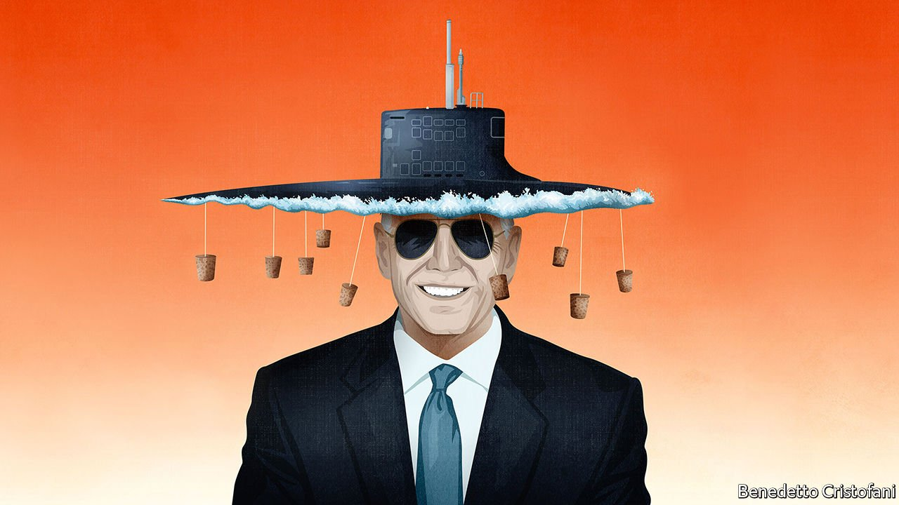

###### Resurfacing

# America is at last getting serious about countering China in Asia 

##### But strengthening military alliances is not enough 

 

> Sep 25th 2021 

ALMOST TEN years ago President Barack Obama visited Australia’s parliament to announce a pivot to Asia. “The United States is a Pacific power and we are here to stay,” he declared. This week the White House will echo with similar sentiments, as the leaders of the Quad countries—America, Australia, India and Japan—gather in person for the first time. There will be talk of a “free and open Indo-Pacific”, code for facing down an assertive China. The rhetoric will be familiar, but the reaction may not be: this time both friend and foe may actually believe it.

The reason is AUKUS, an agreement announced last week for America and Britain to supply Australia with at least eight nuclear-powered submarines. The deal has caused waves because of its huge size and because it caused an unseemly row with France, which had a  of its own with Australia that has now been abandoned.


This belies , which is as a step towards a new balance of power in the Pacific. In a region where alliances have sometimes seemed fragile, especially during the presidency of Donald Trump, AUKUS marks a hardening of American attitudes. It is a decades-long commitment and a deep one: America and Britain are transferring some of their most sensitive technology. The three countries’ co-operation promises to embrace cyber capabilities, artificial intelligence, quantum computing and more besides.

For this the Biden administration deserves credit. And yet the deal still amounts to only half a strategy. America’s relations with China involve more than a military stand-off. In the search for coexistence, America also needs to combine collaboration over issues like climate change with rules-based economic competition. The missing parts involve all of South-East Asia, home to some of the countries most vulnerable to Chinese pressure. And here American policy is still struggling.

Lest that seem grudging, first consider AUKUS’s merits. After Mr Obama’s pivot, America’s friends in Asia suffered a decade of disappointment. China seized and fortified rocks and reefs in the South China Sea, despite competing claims from countries like the Philippines and Vietnam. Last year its soldiers brawled with India’s on the border. Its warplanes and battleships are constantly ratcheting up pressure on Taiwan, which it routinely hints it might invade. China has punished South Korea for perceived affronts with ruinous commercial boycotts. Many Asian countries were beginning to fear that America was too inconsistent and half-hearted to provide a counterweight.

AUKUS offers a rebuttal. One dimension is military. Amid the sea-lanes and islands that are flashpoints with China, nuclear submarines are more versatile than diesel-electric ones. They can gather intelligence, deploy special forces and lurk for months in deep water in the Pacific or the Indian Ocean, a threat that Chinese planners will have to factor in. In addition, AUKUS sets the stage for American forces to operate around Australia, which could serve as a haven from China’s increasingly threatening missiles. The fact that Australia ditched the French deal for the Anglo-American one is evidence of strategic seriousness.

AUKUS’s other dimension is diplomatic. In recent times Australia has borne the brunt of aggressive Chinese tactics, especially after it called for an investigation into the possibility that covid-19 escaped from a Chinese laboratory. As punishment for this and other grievances, China imposed an unofficial embargo on a series of Australian exports. China’s belligerence is typical of the “wolf warrior” diplomacy that has caused consternation across South-East Asia and beyond. By reinforcing Australia, AUKUS sends a signal to the region that America has no qualms about backing allies that are resisting Chinese bullying.

The question is how America should complement the hard power of AUKUS with the engagement needed to trade with China and to work with it. President Joe Biden signalled his aspirations this week in his speech to the UN General Assembly in New York. Making clear that he did not want a cold war with China (although he did not refer to it by name), the president called for “relentless diplomacy” to solve the world’s problems.

On the face of it AUKUS threatens this aim. And yet in the long run China will join global efforts to fight global warming not as a sop to America, but because it judges them to be in its interest. Just this week China said it will . That was an easy promise, because such financing had already dwindled—but it was one China could have withheld to signal its anger.

Harder will be to strike the balance over commercial competition. Mr Biden’s economic policy towards China sets out to increase national security by creating jobs at home, with a Maginot line of industrial aims, regulation and government intervention. His Build Back Better World, a mechanism for financing development, (which he did name-check at the UN) is a pale imitation of China’s Belt and Road Initiative.

Meanwhile China, already the biggest trading partner of most countries in the region, is strengthening its ability to shape the world’s economic and commercial architecture. It is getting its people into important jobs in international institutions. It is exporting its domestic regulatory norms, as with, say, its claim to jurisdiction over international legal disputes. This week it applied to join the successor to the , a trade pact America championed to counter China and then withdrew from under Donald Trump.

South-East Asia looks to China for its prosperity, so for America to act as a counterbalance calls for deftness and imagination. One sign of how far America falls short is that even the most obvious path—joining the successor to the TPP—is seen in Washington as hopelessly ambitious. Almost as worrying, when America is attempting a ferociously complex balancing act, Mr Biden’s diplomacy with France over AUKUS and his European allies over the pull-out from Afghanistan has been inept.

Celebrate AUKUS therefore. By signalling to China that its assertiveness has consequences, the pact stands to make South-East Asia safer. But remember that a deal over nuclear-powered submarines is just a down-payment on a broader China strategy that from here on will become increasingly hard to pull off. ■

