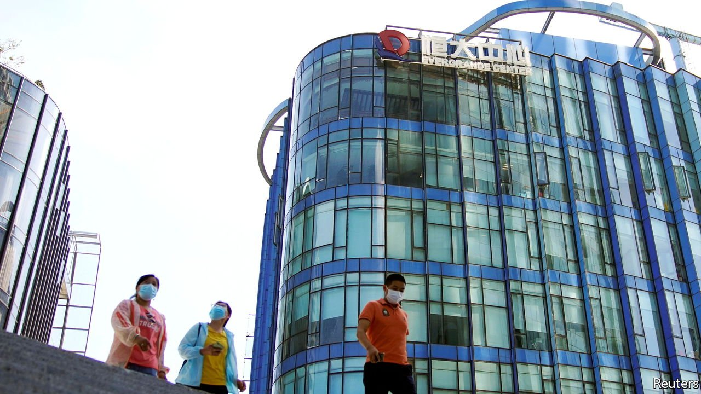

###### Bail-outs and bedlam

# Evergrande’s crisis highlights China’s shortcomings 

##### Can “common prosperity” lead to financial stability in China? 

 

> Sep 25th 2021 

CHINA’S VAST and opaque financial system has long posed a threat to its economy and the world. The agonies of Evergrande, a property firm with towering debts, are a reminder of how hard it is to manage the risks. The government is attempting to impose an orderly default on some of its creditors but . The episode also highlights a bigger question of whether President Xi Jinping’s crackdown on business will make it even harder to create a reformed financial system that is safer, more open and more efficient.

Part of what makes China’s financial industry daunting is its size. Banking assets have ballooned to about $50trn and they sit alongside a large, Byzantine system of shadow finance. Total credit extended to firms and households has soared from 178% of GDP a decade ago to 287% today. The industry suffers from opacity, a lack of market signals and the erratic application of rules. Property is part of the problem. Families funnel their savings into apartments rather than casino stockmarkets or state-run banks. Real-estate developers raise debts in the shadow-banking system in order to finance epic construction booms.


As well as being big, the system is inefficient at allocating capital, dragging down growth. Nor is this a problem the world can ignore. Chinese firms have issued roughly $1trn of dollar bonds, many of them snapped up by foreign investors. A liquidity crunch in China’s economy would hurt global activity, from commodity markets to the sales of luxury goods.

With an illiquid portfolio of property projects financed by $300bn of liabilities, 80% of them short-term, Evergrande has a huge liquidity mismatch. It has struggled to cope with new government rules designed to curb excessive borrowing in the real-estate industry but which may now have backfired.


Bailing out financial firms can be distasteful but necessary—just ask the officials who rescued AIG and Citigroup. China’s government is worried that a default could cause contagion in the bond market and shadow-banking industry and lead to job losses and stalled projects in the property sector, which underpins a fifth or so of GDP. As we went to press, it was unclear whether the government would blink and rescue the firm.

While the dilemma of “too-big-to-fail” is common, many elements of the Evergrande saga highlight China’s shortcomings. Evergrande’s statements about whether it has missed interest payments have been confusing, leaving investors in the dark. It is unclear if the formal hierarchy of creditors matters or whether the Communist Party’s view of who counts will override it. The sense of opacity and political machination is part of a pattern. Huarong, a state-owned financial firm suffering from fraud, hid a $16bn loss for months. It was eventually bailed out in August.

Evergrande shows the importance of deeper financial reforms. But what might they look like? Liberal reformers have longed for a clean-up of bad debts, a loosening of controls over prices (including the exchange rate), transparency and independent courts that can enforce property rights. Such a system would allocate capital better and be less prey to moral hazard.

Mr Xi’s authoritarian regime helps financial stability in some ways: he sees excessive borrowing as a security risk and may terrify debt-hungry tycoons into being more cautious. The centralisation of power may make it easier to control crises at sprawling organisations such as Evergrande.

But his broad agenda to reassert control over the economy, information flows, courts and regulators cuts against the thrust of financial reform. Why would he want a more open capital account, which would raise the risk of capital flight following political purges, or private creditors to have stronger rights, or to delegate the role of picking tomorrow’s industries to investors? Even if Evergrande escapes calamity, the consequences of Mr Xi’s policies for the long-term health of the financial system are only just starting to sink in. ■

For more expert analysis of the biggest stories in economics, business and markets, , our weekly newsletter.

