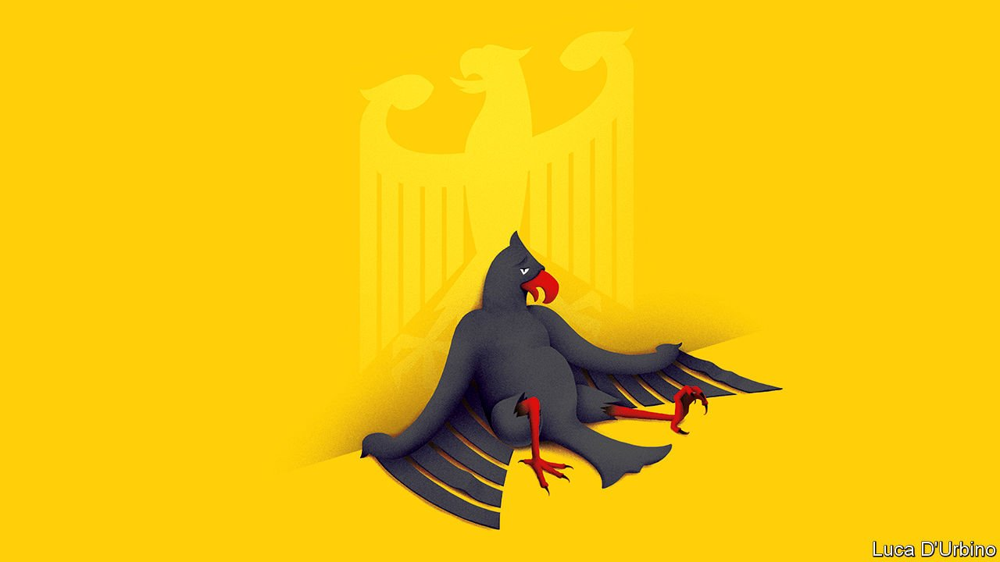

###### A giant departs

# The mess Merkel leaves behind 

##### The successor to Germany’s much-admired chancellor will face big unresolved problems 

 

> Sep 25th 2021 

ONLY OTTO VON BISMARCK and Helmut Kohl served longer as Germany’s chancellor than Angela Merkel has. Bismarck forged an empire, and invented Europe’s first public-pension and health-care systems along the way. Kohl oversaw the reunification of East and West Germany and agreed to the replacement of the beloved Deutschmark with the euro.

Mrs Merkel’s achievements are more modest. In her 16 years in the chancellery she has weathered a string of crises, from economic to pandemic. Her abilities as a consensus-forger have served her country and Europe well. But her government has neglected too much, nationally and internationally. Germany has got away with it, for now; the country is prosperous and stable. Yet trouble is brewing. And as Mrs Merkel prepares to leave office when a new government forms after an  this weekend, admiration for her steady leadership should be mixed with frustration at the complacency she has bred.


The list of neglected issues is long (see our ). Germany looks like a purring luxury car; pop the bonnet, though, and the signs of neglect are plain to see. The public sector has failed to invest adequately or wisely, falling behind its peers in building infrastructure, especially the digital sort. This hampers not just whizzy new tech firms, but every other company, too. It also makes government less effective, a problem exacerbated by a failure to hire enough staff. Penny-pinching is hard-wired into the state. In 2009, on Mrs Merkel’s watch, Germany hobbled itself with a constitutional amendment that makes it illegal to run more than a minute deficit. With interest rates so low, sensible governments ought to have been borrowing for investment, not fainting at the first spot of red ink.

Germany’s most severe domestic problem is a failure to reform its pension system. Germans are ageing fast, and the baby-boomers will place an even heavier burden on the budget later this decade as they retire. On climate change, Germany has also been sluggish, and still emits more carbon per head than any other big EU country, not helped by Mrs Merkel’s shutdown of Germany’s nuclear industry after the Fukushima disaster in Japan in 2011.


In Europe, where German influence matters most, Mrs Merkel’s reluctance to wield it has been especially disappointing. The EU has not grappled sufficiently with the weakness of its indebted southern members. Only during the pandemic did it create a financial instrument that lets the EU issue jointly guaranteed debt, and dispense some of the cash as grants, rather than yet more loans. But this was designed as a one-off. Worse, the  that will force countries back into austerity to shrink their stocks of debt are ready to revive, unless amended. Germany, always the most powerful voice at the EU table, should have argued harder for a more sensible approach.

In EU foreign policy, Germany could and should have been doing more to force a quicker adjustment to a less comfortable new world. China is an increasingly challenging economic and strategic rival, Russia an unpredictable threat and America a distracted and uncertain ally. Yet Germany has dithered. Despite recent increases, it spends too little on defence. It cosies up to Beijing in the hope of better trading terms. It is giving Vladimir Putin, Russia’s president, a chokehold over European energy supplies by backing the new Nord Stream 2 gas pipeline which, as it happens, makes landfall in Mrs Merkel’s own constituency. It has fallen to others, principally France’s president, Emmanuel Macron, to make the case for Europe to do more.

Which German candidate, though, could do better than Mrs Merkel? The polls suggest that Germany is set for a messy new parliament, with no single party, or even two, able to form a government. Instead, some sort of ideologically incoherent three-way coalition is on the cards—one that, by combining high-spending greens and pro-business liberals, may struggle to agree on anything ambitious.

This is another symptom of Merkelian complacency. Comfortable, cautious Germans seem uninterested in serious debate about the future. Crisis-management has become a substitute for initiative. Candidates have no incentive to highlight their country’s looming problems. The result has been one of the least substantive campaigns for decades: all about the horse-race and not about the issues.

Of the , two seem most likely. One is a coalition headed by Mrs Merkel’s party, the Christian Democrats and their Bavarian sister-party (the CDU/CSU), led by Armin Laschet. The other is a coalition led by , of the Social Democrats (SPD), who is Germany’s finance minister. In either case, the coalition would be joined by the  and by the pro-business . Both outcomes will have serious shortcomings, but of the two, The Economist narrowly prefers the second: a “traffic-light” coalition, headed by Mr Scholz.

That is because the CDU/CSU, frankly, has blown it. Sixteen years in power has been enough. The party has run out of ideas and drive, as its decision to choose the gaffe-prone and uninspiring  for chancellor makes clear. An affable lightweight, he has run a dismal campaign, and is predicted to lead his team to its worst result since the second world war. The polls say that Mr Scholz is preferred by twice as many voters.

The tug from the left

Are they right, though? There are reasons to hope so, but also plenty to fear. Mr Scholz has been an effective finance minister. The German people trust him. He is better placed than a CDU chancellor would be to work with the Greens on climate change. The problem is that although he belongs to the business-friendly wing of his party, the SPD is stuffed with left-wingers. They may try to drag him further in their direction than the Free Democrats will wear and enterprise can comfortably bear.

The world should expect the coalition talks to last for months, poleaxing European politics while they drag on. And at the end of it all, Germany may well end up with a government that fails to get much done. That is the mess Mrs Merkel has left behind. ■

For more coverage of the German elections, visit our dedicated 

