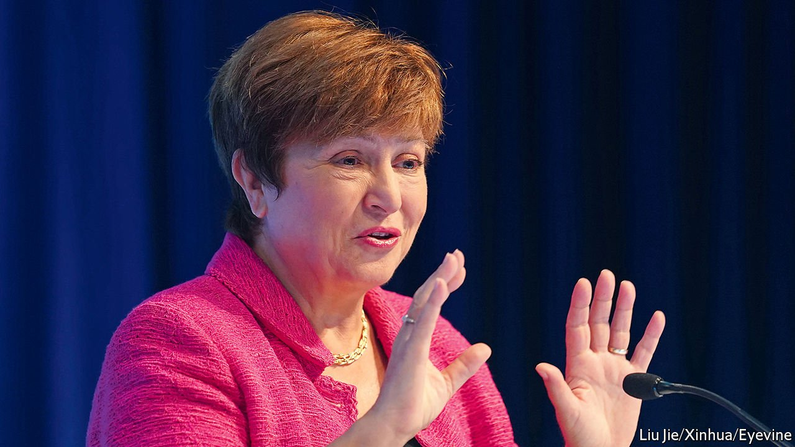

###### The World Bank and China

# Why the head of the IMF should resign 

##### A scandal over data and China has undermined her credibility 

 

> Sep 25th 2021 

IN 2003 THE WORLD BANK launched a league table that assessed the ease of doing business in different countries around the world. By 2017 Li Keqiang, China’s prime minister, grumbled that his country was lagging behind its peers. At his urging, officials began freeing entrepreneurs from red tape—and crimson ink. They cut fees, streamlined approvals, and began to use electronic seals instead of the traditional ink stamp on many documents.

China’s progress illustrates the power of the bank’s Doing Business rankings. Leaders have used them to motivate and monitor regulatory reforms, and like to boast about their country’s progress. The IMF cited the rankings last year in arguing for lending to Jordan. The data help guide investors. And they have informed 676 of the World Bank’s own projects (worth $15.5bn) in the past decade, according to an as-yet-unpublished internal evaluation.


But with that profile came pressure. A new investigation has found that bank staff improperly altered the scores of China and three other countries. They wanted to spare China an embarrassing fall in the rankings in 2017, just as its reforms were gathering steam. According to the investigation, the China tweaks were carried out at the behest of the bank’s then president, Jim Yong Kim, and his second-in-command, Kristalina Georgieva, who is now head of the IMF.

In a statement, Ms Georgieva has said she disagrees “fundamentally” with the findings and interpretation. In a meeting with IMF staff, she said she only asked bank researchers to triple-check the data. But the investigators found that she and the team explored a change in the bank’s method (ie, including only one city per country) to engineer a better result. And, according to the bank’s own review, the tweaks that were finally implemented introduced errors rather than removing them.

In her defence, it was her boss who initiated the extra tyre-kicking. She had the higher motive of strengthening multilateralism. Scope for discretion had crept into the Doing Business indicators as they grew more elaborate over time. And a senior researcher assured her he could “live” with the revised report, although it is likely that neither he nor she knew exactly what tweaks had been made.

It is also true that institutions like the bank suffer from an inherent tension between their diplomatic duties and their scientific aspirations, as Paul Romer, a former chief economist of the bank, has pointed out. Reconciling the two is always difficult. Once the Doing Business rankings became so politically important to the bank’s member countries, it should have brought in outside institutions, like think-tanks or universities, to help oversee them.

But although Ms Georgieva deserves sympathy, the episode does not sit easily with her present role at the IMF. The fund has an influential research department of its own. It is also the custodian of data standards for the world’s macroeconomic statistics. The head of the IMF must hold the ring while two of its biggest shareholders, America and China, confront each other in a new era of geopolitical rivalry. Critics of multilateralism are already citing this affair as evidence that international bodies cannot stand up to China. The next time the IMF tries to referee a currency dispute, or helps reschedule the debt of a country that has borrowed from China, the fund’s critics are sure to cite this investigation to undermine the institution’s credibility.

That is why Ms Georgieva, an esteemed servant of several international institutions, should resign. After China’s embarrassment was averted, she thanked a senior researcher for “doing his bit for multilateralism”. Now she too should do her bit for multilateralism by falling on her sword. ■

