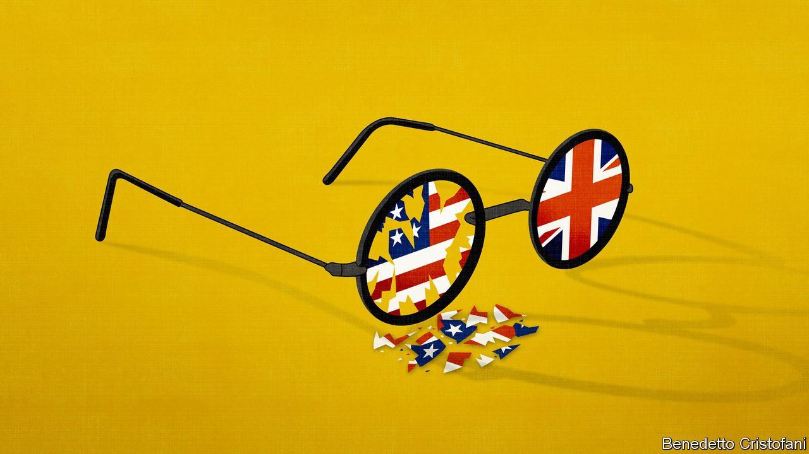
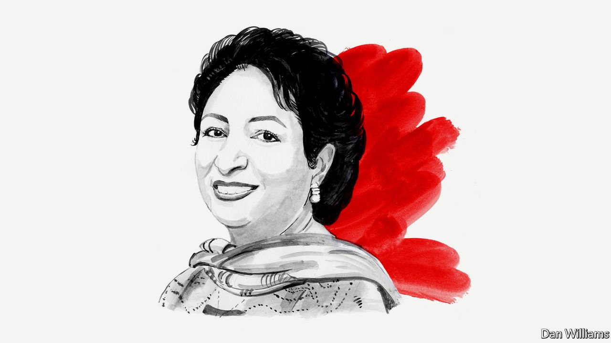
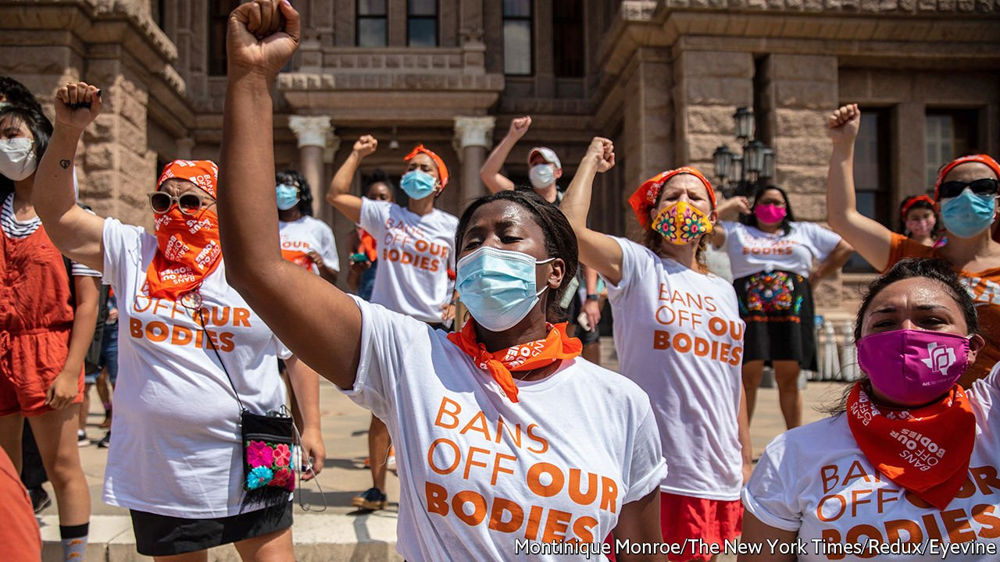
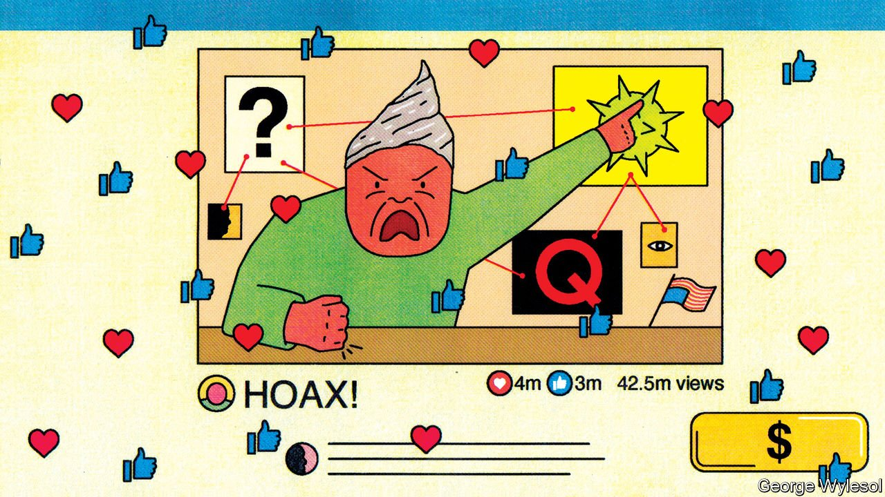
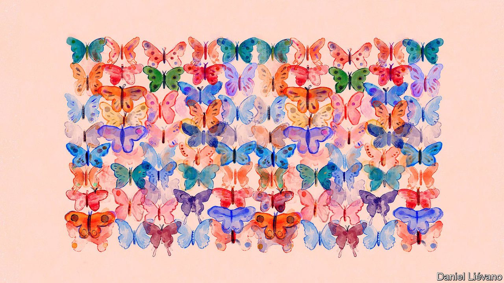
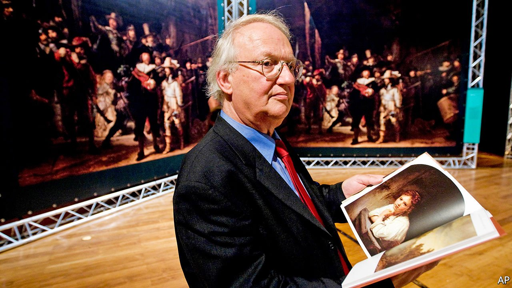
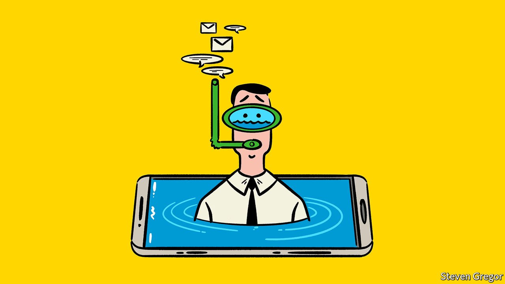

###### On war, Joe Biden, Pakistan, abortion, social media, Aristotle, The global normalcy index, Rembrandt, holidays

# Letters to the editor 

##### A selection of correspondence 

 

> Sep 25th 2021 


When is it a war?

Members of Congress may “regret their votes” on the second Gulf war, but faulty intelligence was not to blame (“”, September 4th). The admittedly flawed estimate on weapons of mass destruction in Iraq influenced few votes. The Senate voted 77-23 to authorise the use of force. Only six senators actually read the estimate and another dozen were briefed. The key factor was Democrats who did not want to vote against an ultimately successful war, as they had in 1990.


MARK LOWENTHAL

Assistant director of central intelligence for analysis, 2002-05

Reston, Virginia

You correctly concluded that there should be greater congressional oversight over the conduct of war. In fact it is not as difficult to “undeclare war” as you think. The “wars” against al-Qaeda and Iraq were never actually declared by Congress; it merely authorised the use of force. As Oona Hathaway has recently argued, the solution should be for Congress to include sunset clauses in any future authorisation, which ought also to comply with international law.

All use of force should be brought within the rule of law. War powers are assumed by the American president and other powerful executive branches around the world with timid or no oversight from legislative or judicial branches. We should be asking more questions when politicians claim to be “at war”.

ANDREW CLAPHAM

Professor of international law

Graduate Institute of International and Development Studies (IHEID)

Geneva

 


Speed dial number 3

Joe Biden’s first telephone call as president to a foreign leader was to Justin Trudeau, not Boris Johnson (“Y”, August 28th). Indeed, Mr Johnson was not even number two. That honour went to Andrés Manuel López Obrador.

NICHOLAS COGHLAN

Salt Spring Island, Canada

 


Pakistan and the Taliban

Maleeha Lodhi cherry-picked her facts when lecturing America on how to deal with the Taliban (, digital editions, September 9th). We may not expect a former Pakistani diplomat to discuss the role of her country’s intelligence services in grooming the Taliban or in harbouring Osama bin Laden. Yet since Ms Lodhi mentioned how furious Pakistanis were over the American operation that took bin Laden out, she might also have shown some empathy with the American people, who received a measure of closure (and not only Pakistani officials, who “were privately relieved”).

Perhaps American involvement in Afghanistan made Pakistani officials nervous, not only because it hampered their own designs on their unfortunate neighbour, but also because they feared they might be next to be targeted by American military might. Pakistan is suspected of supplying nuclear secrets (or worse) to regimes nobody would want to see with atom bombs.

AVEDIS HADJIAN

Venice

 


Legislate, don’t adjudicate

Regarding the anti-abortion law in Texas, you quoted Justice Sonia Sotomayor on the Supreme Court, who decried the Texas state legislature for undermining abortion-rights rulings (“” September 4th). But the core problem is with Roe v Wade, the court’s ruling from 1973. By stepping in to legalise abortion, that decision warps the checks and balances at the constitution’s very heart, shifting policymaking authority from the most politically accountable branch of government, Congress, to the least, the Supreme Court. Remember Thomas Sowell’s more general caution in “Knowledge and Decisions”, all the more looming 40 years on: the Supreme Court “neither obeyed a constitutional compulsion nor filled an institutional vacuum; it has chosen to supersede other decision-making processes.”

So when you say in a follow-on article that the court’s decision not to intervene in Texas is “bad…for the rule of law” (“Courting trouble”, September 11th), I’d respond that the court, precisely in Roe, long beat Texas to the punch.

DAN BRENDEL

Alexandria, Virginia

 


Fake/not fake

Social-media companies can help prevent the viral spread of conspiracy theories, you argue (“”, September 4th). Recall that Facebook spent months tagging discussion of the covid-19-origin lab-leak hypothesis as “false” and “debunked”; it is now taken seriously and could be correct. YouTube and Twitter have similar egregious examples.

CARL SCHWAB

Arlington, Virginia

 


Animal philosopher

More needs to be said about Aristotle’s contribution to the science of life (Biology brief, “’”, August 28th). Around a quarter of the extant Aristotelian corpus is devoted to the first systematic, scientific investigation of the animal kingdom. Many of the 18th- and 19th-century biologists discussed in your essay were astounded at his accomplishments.

On Aristotle’s “History of Animals”, Georges Cuvier wrote that “it is difficult to understand how the author could have obtained, from personal observations, so many generalisations and aphorisms whose accuracy is perfect.” In a letter to William Ogle, Charles Darwin noted that “Linnaeus and Cuvier have been my two gods, though in very different ways, but they were mere schoolboys to old Aristotle”. And Richard Owen, perhaps the greatest comparative anatomist of the 19th century, declared in 1837 that zoological science sprang from Aristotle’s labours: “we may almost say, like Minerva from the head of Jove, in a state of noble and splendid maturity.”

As someone who has spent decades translating these works, I can attest that none of the praise of Aristotle as a zoologist is overstated.

JAMES LENNOX

Emeritus professor of history and philosophy of science

University of Pittsburgh

Covid-19 data

We have read with interest the reports in The Economist and other media about the “”, a tool that offers a framework to assess changes in behaviour associated with the emergence of the covid-19 pandemic in 50 of the world’s largest economies.

It is very important to track the progress that those economies are making toward returning to pre-pandemic behaviour. However, it is striking that all eight criteria used to assess that progress are behaviours related strictly to the economy and not to the more complex behaviours found in sectors such as health.

Covid-19 shows that disease outbreaks can overwhelm entire health systems, leading to the loss of lives both as a direct result of the pandemic and indirectly because of disruption of routine health services. We believe that the indicators used to create the global normalcy index should address this reality.

For example, adding behaviours that are directly linked to public health interventions such as seeking and providing vaccines (through robust national immunisation programmes) would highlight a routine public health service that has been disrupted in many countries by the necessary emphasis on pandemic control. This would also emphasise the role that vaccination will have in reaching several of the Sustainable Development Goals (SDG) that the United Nations has outlined as a blueprint for achieving a better and more sustainable future for all. A third result would be a better baseline for assessing “normalcy”. Such a baseline would be especially useful were the index extended to all economies and not only to the most powerful 50.

As it stands, the index criteria paint an incomplete picture of what normalcy should look like going forward. That partial view could be misleading to political leaders as they prioritise post-pandemic actions; their choices now will make a difference if and when the next emerging respiratory virus pandemic occurs. Those decisions will also shape the impact of the next seasonal influenza epidemic, particularly if it arises amid ongoing efforts to manage covid-19 and its variants.

Before the covid-19 pandemic, many economies, including some among the 50 most powerful measured by the index, faced a constant struggle to meet basic health requirements. During the pandemic it has become clear that each nation and region, no matter what the strength of its economy, is integral to our collective health security. As highlighted by the G20 High Level Independent Panel on Financing the Global Commons for Pandemic Preparedness and Response June 2021 report, resilient national systems remain the foundation for stopping an emerging outbreak.

We therefore suggest that the global normalcy index be extended to refer to all economies and that health-based criteria be added to the tool that is used to establish the index. Such criteria should capture the in-country status of vaccination programmes. The latter is especially important as we approach the next seasonal influenza outbreaks, hopefully with new and improved influenza vaccines, and would also help ensure the immunisations required to attain the SDGs.

MARIE MAZUR

Director

Ready2Respond

MASHAL M. ALSHAZI

Assistant Professor of Pharmaceutical Biotechnology, College of Pharmacy and the Research Chair of Vaccines for Infectious Diseases

King Saud University


DAVID HEYMANN

Professor

Infectious Disease Epidemiology

London School of Hygiene &amp; Tropical Medicine

MICHAEL OSTERHOLM

Director

Center for Infectious Disease Research and Policy (CIDRAP)

MAHMUDUR RAHMAN

Independent Consultant; Former Director

Institute of Epidemiology, Disease Control and Research (IEDCR)

 


Art detectives

Ernst van de Wetering had a brilliant precursor who could also spot a Rembrandt (, August 28th). Hubert von Sonnenburg, a paintings conservator at the New York Metropolitan Museum of Art, carefully examined all the works attributed to Rembrandt in museums around the world. It took him 45 minutes to assess a painting. He came to similar conclusions to those of Van de Wetering and wrote a book about his findings, but lost the manuscript in a New York cab. He later published another book on the subject, “Rembrandt/Not Rembrandt”.

LUCIEN KARHAUSEN

Brussels

 


Muddled thinking

In considering whether to expect their employees to work while on holiday (, August 21st), bosses might also like to reflect on the probable effects of 30-degree-plus heat, several beers at lunchtime and general “holiday brain” on people's decision-making abilities. I know mine would not have been very trustworthy.

SYLVIA ROSE

Totnes, Devon

