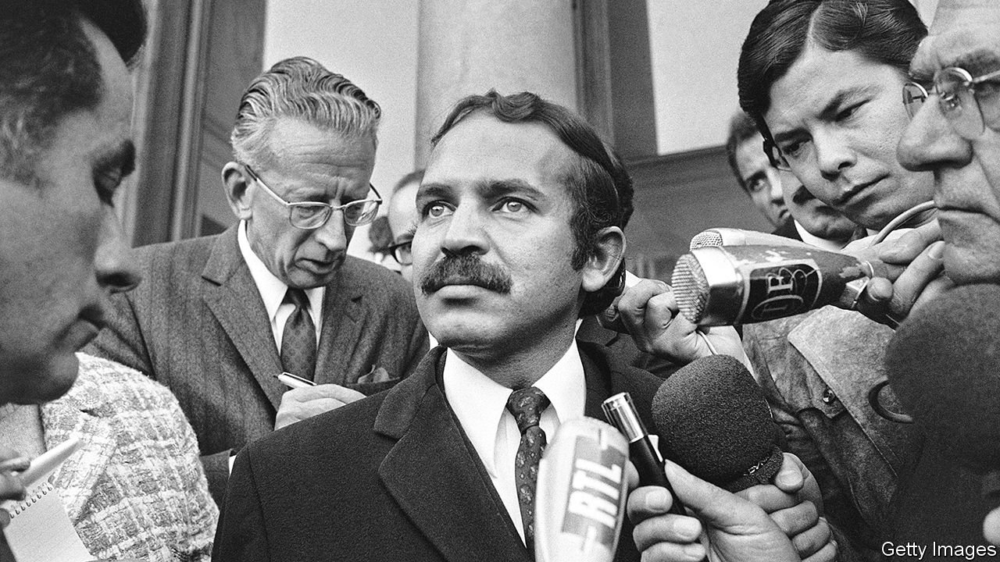

###### Bye-bye, Bouteflika

# Algeria’s ex-president is dead, but his regime lives on 

##### To the dismay of many Algerians 

 

> Sep 25th 2021 

FINALLY THE rumours are true. For years Algerians whispered about the health of Abdelaziz Bouteflika, their president from 1999 to 2019. After suffering a stroke in 2013 he was rarely seen in public, often leading to speculation that he was dead. When the whispers grew too loud, officials would roll him out in his wheelchair to sit before the cameras, a vacant look in his eyes. The people wondered who was really in charge. By 2019 they had had enough of the charade and toppled the old man.

Mr Bouteflika died on September 17th, aged 84. The young people who make up most of Algeria’s population will probably remember him as that decrepit president—and lament that little has changed since his ousting. It is telling that the government buried him at a cemetery for independence fighters, with few of the honours accorded to past leaders.


Older Algerians may remember Mr Bouteflika more fondly. He was barely an adult when he joined the National Liberation Army in the war against French rule. A year after independence in 1962, he became Algeria’s first foreign minister, still in his mid-20s. He would hold the position for 16 years. Witty and dashing in his three-piece suits, Mr Bouteflika helped establish the country as an influential member of the Non-Aligned Movement and a beacon of the anti-colonial struggle, earning it the nickname “the Mecca of revolutionaries”.

Che Guevara visited Algeria hoping to stir revolutions in Africa. A young Nelson Mandela received military training from Algerian soldiers. Mr Bouteflika, in the role of president of the UN General Assembly, invited Yasser Arafat to address the body in 1974, a historic moment for the Palestinian cause. When Carlos the Jackal took oil ministers hostage in an attack on OPEC headquarters in Vienna in 1975, the terrorist demanded to be flown to Algiers. Mr Bouteflika met him and negotiated the release of some of the hostages.

Passed over for the presidency in 1979, Mr Bouteflika left Algeria to avoid corruption charges (which were eventually dropped). He returned but kept a low profile during Algeria’s civil war in the 1990s, when some 200,000 people were killed in fighting between Islamists and the army. In 1999 the ruling cabal of generals and security men, known as le pouvoir (the power), turned to him. Five months after winning a rigged presidential election, Mr Bouteflika pushed through a referendum on national reconciliation that granted amnesty to Islamists and militia members. Criticism of the army’s conduct was prohibited. Many credit him for guiding Algeria out of its “black decade”.

The regime would invoke the civil war and the need for stability whenever it wanted to justify its repression. Unfair elections were held—Mr Bouteflika won four of them. Le pouvoir siphoned off the country’s vast hydrocarbon wealth, while the young struggled to find jobs. The public’s frustration had been growing for years when the regime announced in 2019 that Mr Bouteflika would seek a fifth term. Tens of thousands of protesters took to the streets, chanting “Bye-bye, Bouteflika”. Finally the regime gave in. Slumped in his wheelchair, the president passed his letter of resignation to a colleague. It was the last time most of the public would see him.

Yet any hope that Mr Bouteflika’s resignation would bring real change has dimmed. The army remains the dominant power in Algeria. Abdelmadjid Tebboune, a former prime minister seen as the generals’ choice, was elected president in 2019. The poll was shunned by most Algerians. Meanwhile, the number of political prisoners is thought to be rising. The government has tried to sow discord in the pro-democracy movement, known as the Hirak. It blames opposition groups and Morocco, with which it recently cut diplomatic ties, for fomenting unrest.

Sometimes the government still uses Mr Bouteflika, but now as a scapegoat. Covid-19 has taken a toll and the economy continues to stall. With few answers, officials also point to the villainy of France or other foreign conspirators. Most Algerians, born after independence, are unmoved by these tired anti-colonial narratives. They wish Mr Bouteflika’s regime would expire with him. ■

