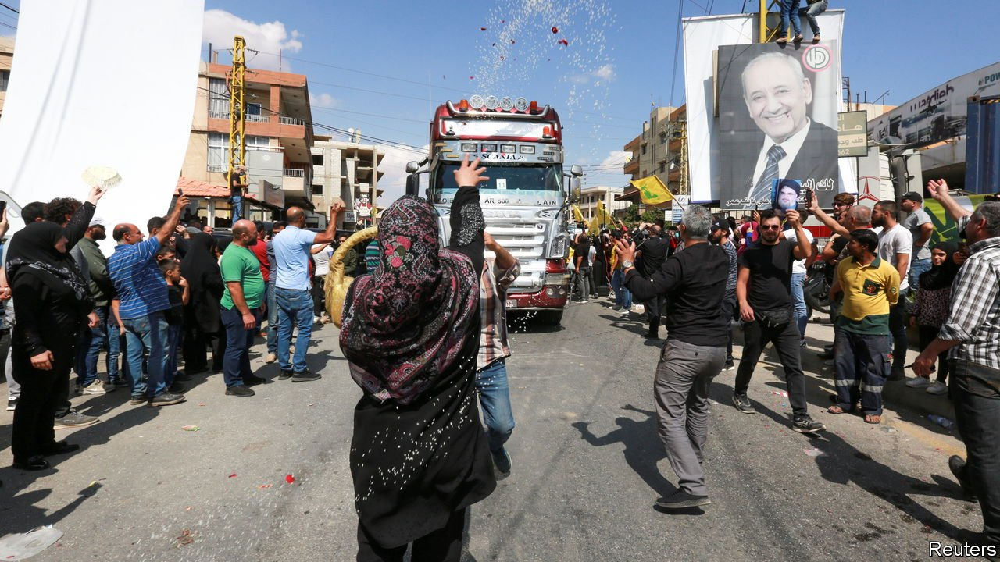
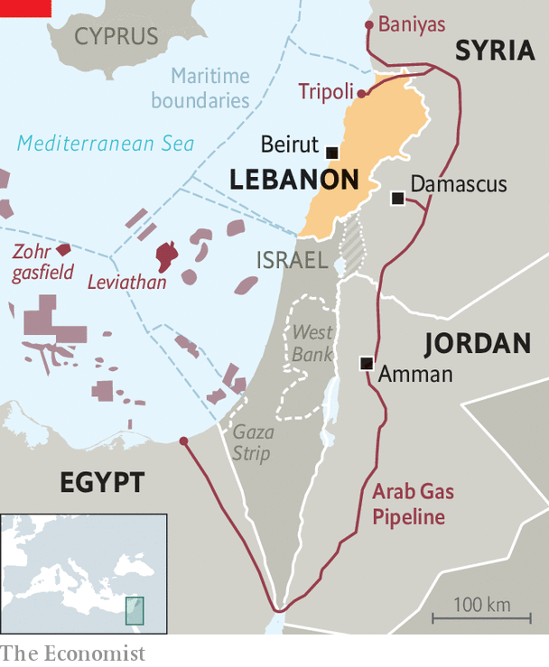

###### Power politics

# The tangled diplomacy of Lebanon’s energy crisis 

##### Friends and neighbours have offered to help, but mostly to help themselves 

 

> Sep 23rd 2021 

THE CELEBRATIONS seemed fit for a conquering hero returning home. As the trucks crossed the border, women showered them with flower petals and rice. Banners hailed the mastermind of the operation for “breaking the siege” imposed on his country by malevolent foreign powers. A few men fired bullets and rocket-propelled grenades in the air—a particularly ill-advised form of salute given that the trucks were carrying 4m litres of diesel.

It says much about today’s Lebanon that a few petrol-tankers were greeted with such jubilation. The fuel is meant to ease an energy crisis that has paralysed the country. But 4m litres is less than a day’s consumption. Moreover, it will exacerbate the long political crisis in Lebanon. The shipment, arranged by Hizbullah, a Shia political party and militia, came from Iran to the port of Baniyas in Syria (see map), where it was transferred to trucks. It violates a range of American sanctions on Iran, Syria and Hizbullah itself. America, in turn, has put forward its own plan to keep the lights on in Lebanon—yet that proposal, ironically, will also fall foul of American sanctions on Syria.


Lebanon needs fuel, whatever the source. It is two years into a financial crisis that has left the currency all but worthless. Foreign reserves plunged from $38bn in 2019 to $15bn this summer. The government is struggling to import fuel and make it affordable for an impoverished population. It has steadily reduced subsidies. Twenty litres of petrol now cost 30% of the monthly minimum wage.

 


That is when fuel is available, which often it is not. Petrol queues stretch for kilometres. At home many Lebanese receive just two hours of electricity from the grid, while back-up generators that long filled the gaps have run out. Water authorities and the telecoms monopoly have cut service in some areas because they cannot power pumps and mobile-phone towers.

None of this is caused by a Western “siege”, as Hassan Nasrallah, the leader of Hizbullah, is fond of claiming. American sanctions on Lebanon are mostly limited to his party. In fact, some of Lebanon’s energy woes can be traced to Hizbullah’s role as a guardian of a corrupt political system.

Founded in the 1980s, Hizbullah is now the most powerful force in Lebanon, with a militia that outguns the army and an ever-stronger position in politics (it helps to be able to assassinate your critics). Yet it insists that its focus is national defence. Domestic policy, it says, falls to others.

But some of those others are its closest partners. In recent years it has forged an alliance with the Free Patriotic Movement, a Christian party led by Gebran Bassil, the president’s son-in-law, which has controlled the energy ministry for a decade. Mr Bassil served as minister from 2009 to 2014. He pushed a widely criticised scheme to build a power plant in Selaata, a Christian-majority village that is not even connected to the national grid. He also hired power plants on barges, which were meant as a stopgap but have become permanent, at great financial and environmental cost.

Loth to let Hizbullah pose as a saviour, America and its friends have offered their own energy plan, which relies on the 1,200km Arab Gas Pipeline. Though built to export Egyptian natural gas to other Arab states, for much of its history it has sat idle. After the Egyptian revolution in 2011, militants repeatedly bombed the feeder pipeline. Then Egypt ran into gas shortages caused by falling output and surging demand. By 2015 it had halted exports and become a net importer.

The picture is quite different today. The eastern Mediterranean is awash in natural gas thanks to massive finds such as the Zohr field in Egypt, which went online in 2018, and Israel’s Leviathan, which started production in 2019. Last year Israel began piping gas to Egypt, some of which can be liquefied and shipped to customers in Europe. (A few Lebanese wags have asked how their government will ensure that none of the gas arriving through the Arab pipeline contains Israeli hydrocarbons.)

Yet this American plan also faces American obstacles. Since the pipeline crosses Syria, Bashar al-Assad’s regime stands to collect transit fees. Rather than paying in cash, Syria could be paid in kind. One option would see it receive electricity from Jordan, which has a surplus, to help ease blackouts in regime-held territory. Either approach, however, would infringe the Caesar Act, an American law passed in 2019 which prohibits business with the regime.

Much of this is hypothetical. Syria must first fix its decrepit infrastructure, which will take months. But it underscores the fecklessness of an America that is hooked on using sanctions as a weapon. The Caesar Act was meant to give Mr Assad a choice between political reform and economic isolation. He chose the latter—not surprising for a man who destroyed his country to stay in power. But America is struggling to keep him isolated. Egypt, Jordan and the Gulf states—all American partners—are restoring ties. Now Syria is set to become Lebanon’s energy broker.

As for the Iranian fuel shipments, they violated a host of American sanctions. Yet short of seizing tankers at sea, America had no power to stop them. It could impose sanctions on the Lebanese state (which insists that the imports were a private transaction), but that would only add to the country’s misery. Sanctions have already failed to change the behaviour of regimes in Syria and Iran, and America will find it ever harder to enforce them consistently.

Lebanon has long been buffeted by larger geopolitical struggles. A few tankers of fuel from Iran, or a trickle of gas from Egypt, will not repair its long-mismanaged energy industry. As ever, though, fixing Lebanon’s problems is not the real goal. ■

