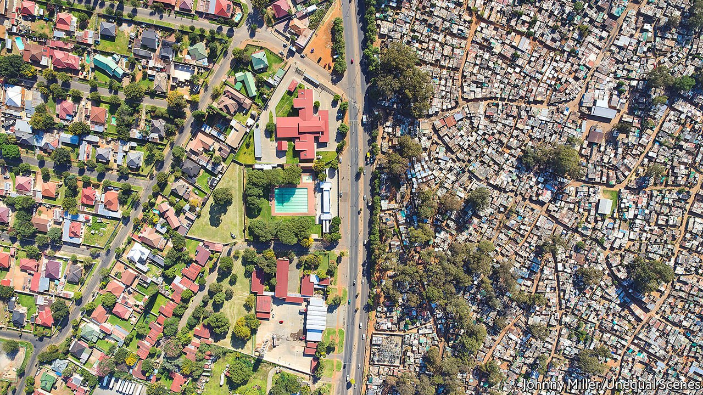
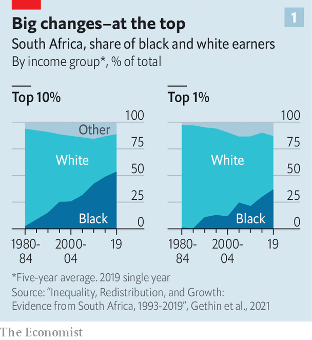
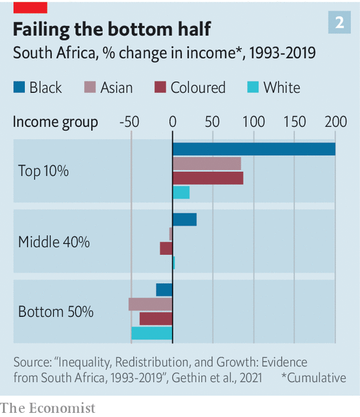

###### Not so black and white

# Unpicking inequality in South Africa 

##### The racial income gap has narrowed since 1994. But the gains went largely to the black elite 

 

> Sep 25th 2021 

JOHNNY MILLER, a photographer, began taking drone footage of South African cities in 2016. Shots from Cape Town, Durban and Johannesburg depict adjoining neighbourhoods—but different worlds. On one side of a photograph might be a verdant suburb spattered with azure swimming pools; on the other a slum with tightly packed shacks.

Economic research into South African inequality has produced a less granular picture. Reports from the World Bank and other bodies draw on benchmark measures of income inequality, such as the Gini coefficient, to conclude that South Africa is one of the world’s most unequal countries. But they often say little about wealth, the role of government policy or, crucially, what has happened to the gap between blacks and whites since the end of apartheid in 1994.


Two recent papers from the academics Aroop Chatterjee, Léo Czajka and Amory Gethin fill some of these holes. In doing so they offer perhaps the most detailed picture of the haves and have-nots in South Africa in the democratic era. The research is crucial to understanding the profound discontent felt by many South Africans.

In their latest paper the economists combine household surveys, tax data and national accounts to track incomes from 1993 to 2019. They start by noting that, before taxes, the share of income going to the top 10% of earners grew from 57% to 66%—levels higher than in any other comparable country. The average income of the top 1% increased by 50%, while that of the poorest half fell by more than 30% after inflation. Even after taxes and transfers are included, the share of income going to the top 1% is roughly the same as it was at the end of apartheid—nearly one-fifth.

Since 1994 the ruling African National Congress (ANC) has raised taxes and introduced welfare grants for pensioners and children. It has expanded public health care and education, which researchers count as “in-kind” income for the beneficiaries. On paper these transfers largely make up for the loss in pre-tax incomes for the poorest half of South Africans.

Yet it would be wrong to think that social policies have pushed back the tide of inequality. For a start, the authors note that regressive consumption taxes such as VAT mean the poorest have high effective tax rates. The child-support grant is not enough to buy nutritious food. Unemployment benefits are paltry and patchy; hence the growing campaign by NGOs for a universal basic-income grant. The “income”, as defined by the researchers, that the poor receive from public services is not the same as a pay cheque. And given the poor quality of schools and hospitals, it may be valued less by South Africans than by the authors of the study.

One seemingly positive trend identified by the economists is the narrowing of the underlying racial income gap. In the 1990s whites earned about seven times more than blacks. By the end of the 2010s they made about four times more.

But this narrowing is “mostly attributable to the emergence of a new Black elite”, notes the paper. Once in government the ANC introduced affirmative-action laws, which have helped increase the share of well-paid jobs held by blacks, especially in the public sector, where trade unions have won above-inflation pay rises. Another policy, called “black economic empowerment” has steered business towards black-owned firms and enriched a small number of black investors.

 


Partly as a result of policies like these, the share of blacks in the top 10% of earners has risen sharply (see chart 1), though it is still less than their share of the overall population (81%). Poorer blacks have done less well. While the gross income of the top 10% of black earners has tripled, that of the bottom 50% has fallen (see chart 2). When the researchers looked only at the ratio of white earnings to those of the bottom 90% of black earners, the racial gap had increased slightly since apartheid.

 


An earlier paper by the same authors found similar trends. It noted that concentration of wealth in South Africa is greater than in any other country for which there are comparable estimates. The 3,500 households making up the top 0.01% have more net wealth than the bottom 90% combined. The share of wealth held by the top 10% is roughly the same as at the end of apartheid; that owned by the top 1% and 0.01% has, if anything, risen.

Many of the inequalities of the present stem from the white-supremacist past, when blacks were systematically denied a good education and prevented from accruing wealth. Today whites on average are eight times richer than blacks—twice as large an overall gap as for income. Inheritance, notes Mr Gethin, helps old inequalities endure.

Taken together, the two papers underline not just the legacy of white rule, but also the ANC’s failure to help most black South Africans overcome it. Redistribution and elite empowerment are no substitute for growth and jobs. Unemployment, as work led by Murray Leibbrandt of the University of Cape Town has repeatedly found, is at the heart of South African inequality. South Africa’s GDP per person has been declining since 2015—a result of corruption and bad policies. In the second quarter of 2021 joblessness reached a record 34.4%.

On November 1st South Africa will hold local elections. For the first time, the ANC may win less than half of the vote in a nationwide contest. If that happens, it will be easy to point to the party’s dysfunction, or a surge in opposition turnout following civil unrest in July. Yet there are deeper forces at play. The party of Nelson Mandela promised “a better life for all”. So far it has delivered a much better life for a few. ■

