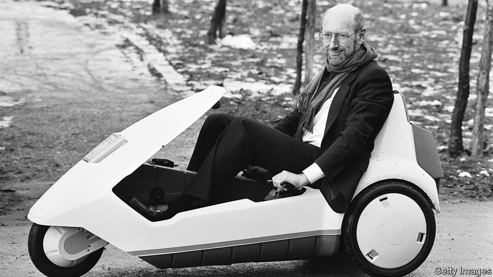

###### Invent or bust

# Obituary: Clive Sinclair foresaw the future too soon 

##### The tireless innovator died on September 16th, aged 81 

 

> Sep 22nd 2021 

UNUSUALLY, THE portrait of Clive Sinclair most Britons had in their heads was not vertical, but half-horizontal. He was reclining, with balding head, glasses and gingery beard, in his C5 electric tricycle. His legs were stretched out to work the pedals, in case the battery packed up, and his knees were raised, in order to steer the machine. It was January 1985, and snow lay on the ground. That accounted for the scarf round his neck, oddly teamed with a suit, but not entirely for his slightly anxious expression.

He was driving his dream: an electric vehicle for the masses. It was cheap, only £399, and you could buy it at the supermarket or even in Woolworth’s. Anyone over 14 could legally drive it without tax, a licence or insurance. It was stylish and light, with a body of tough polypropylene and wheels of nylon reinforced with glass. After a night of charging, it could go 20 miles. How easy now to pop to the shops, nip into a parking space and buzz happily about!


Yet the reason he was not smiling much himself, on launch day, was that the C5’s drawbacks were becoming clearer. First, the wobbling driver was so low to the road that he or she was below the sightline of any vehicle alongside. Second, the engine was slow and could not cope with hills. And third, without a roof or sides to speak of, what happened when it rained?

He had invested millions in the C5, and in the end only about 5,000 were sold. His mistake; he’d been in too much of a rush. He lost pretty well everything then: Sinclair Vehicles went bust, and he had to sell his computer company to Amstrad. But was it the end of the world? Lord no. He had never pretended to be a businessman. He was an innovator, whose job was to spot opportunities and think up devices that people badly wanted but could not imagine. On top of that, he was a high-stakes poker-player. The C5 had been a good idea, and still was. So, on to the next thing.

A whole raft of successes lay behind him. He had realised early that people liked gadgets, and liked them small. At 18 he was already devising miniature radio kits, and at 22 was selling them by mail order. Then, after a whirl with mini-amplifiers, came Sinclair pocket calculators. At a time (1972) when calculators were the size of bricks, these were a mere 9mm thick, powered by a microchip. They made his name. A pocket TV came next, not much bigger. His best wheeze of all, though, was to miniaturise computers. People thought of them as bulky, baffling machines that cost the earth. He set out to show that they could sit on a desk, no bigger than a book, and that every home in the land could afford to have one.

His first attempt, the ZX80 (in 1980), was a flat box without a screen that stored data on a cassette. But it was only £99.95, a fifth of the usual price of a home computer, and it could do, he promised, “quite literally anything”. Anyway, he soon devised a better one. The ZX81 had only 1k of memory, but it was even cheaper; you could type Basic programmes on it and you could make the display do interesting things. They sold in thousands, and Sinclair Radionics was soon turning profits of £14m a year. His real triumph, though, came in 1982 with the ZX Spectrum 48K. It had colour and sound, even if the colours clashed and the sound was buzzes and farts. With much patience, and a spark of ingenuity, you could make all kinds of games on it. A generation of coders and programmers learned their craft on the “Speccie” and worshipped him as Uncle Clive, a sort of amiable boffin—though he himself was pretty annoyed to see his devices used for “Manic Miner” and “Chuckie Egg”, rather than for properly intellectual pursuits.

He was no mild boffin, either. It was true that his first hero had been the inventor-character in “Toytown” on the radio, and he spent a serious, solitary childhood designing submarines and rigging up telecoms systems for his hideout in the woods. But he had a wild side. He held famously drunken parties, made no secret of his shapely girlfriends and once beat up a colleague with a rolled-up copy of the Daily Telegraph. He liked the tag “genius” no better, though he was chairman of British Mensa and had an IQ of 159. His most comfortable public role was as the British inventor who could take on the world, or in his case Atari, Commodore and IBM, who despite their appalling designs were hot on his heels. The tabloids embraced him, Margaret Thatcher loved him, the queen knighted him and Cambridge, his base, thanked him for transforming the town into Britain’s Silicon Valley.

His apogee was brief, as apogees are. His rivals soon overtook him, and the C5 debacle did the rest. Cracks had shown up already, mostly caused by his insistence on few and cheap components. The switch contacts in his pocket calculators tended to oxidise, so that they could not be turned off and sometimes caught fire. His plastic digital watch, the first with a single chip, looked elegant but had problems working. Even the Spectrum displayed his corner-cutting with a rubber-moulded keyboard that felt, some said, like pressing dead men’s flesh. But that was how it was so cheap.

Glitches, in short, were part of progress. He was showing the public where the future lay, and teaching them to engage with new technology rather than fear it. So on he went. Personal transport remained his favourite field; he produced an electric bike wrapped in an acrylic bubble, sadly a little too like the C5, and an A-bike so very light and foldable that it proved impossible to ride. The dream of a little electric car continued, and he liked to drop hints that he was still devising one. But something always delayed its coming.

In his later years he lived in a world where almost every pocket contained a calculator, TV, worldwide communications and infinite games, all combined in a device half the thickness of his calculator. Electric cars and scooters purred on the roads, and digital timepieces were the norm. He was not bitter to see his future coming to pass too late. But nor did he embrace it. He couldn’t be bothered with computers, email or the internet, preferring print, paper and his constant companion, a slide-rule. Anything technical near him just distracted him from inventing. He liked classical music, poetry and good wine; and, for personal transport, preferably his two feet running, no battery required. ■

