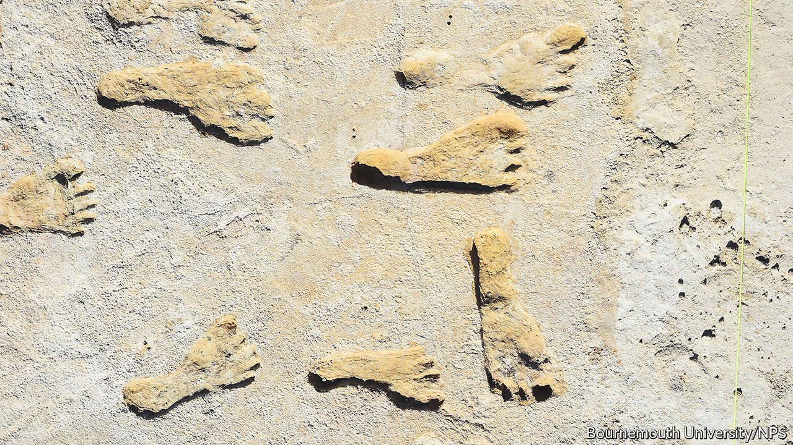

###### Early Americans

# An old lake bed reveals evidence of America’s first inhabitants 

##### They walked there at least 23,000 years ago 

 

> Sep 25th 2021 

THESE TRACKS, from a dried-up lake bed in New Mexico, are one of several sets which radiocarbon evidence suggests were made between 21,000 and 23,000 years ago. They are described in this week’s Science by Matthew Bennett of Bournemouth University, in Britain, and his colleagues, and are the oldest undisputed evidence of human beings in North America. Few doubt that the first Americans crossed from Asia, probably over the Bering Strait when low sea levels during the last Ice Age meant it was dry land. Exactly when, though, is unclear. The oldest human fossils in North America date from 13,000 years ago. But evidence from stone tools suggests the presence of people there as far back as 30,000 years in the past. The stone-tool evidence is, however, controversial. Such tools are hard to date directly, and may be moved into sediments older than the date of their creation by animal activity. Footprints, by contrast, stay put.

