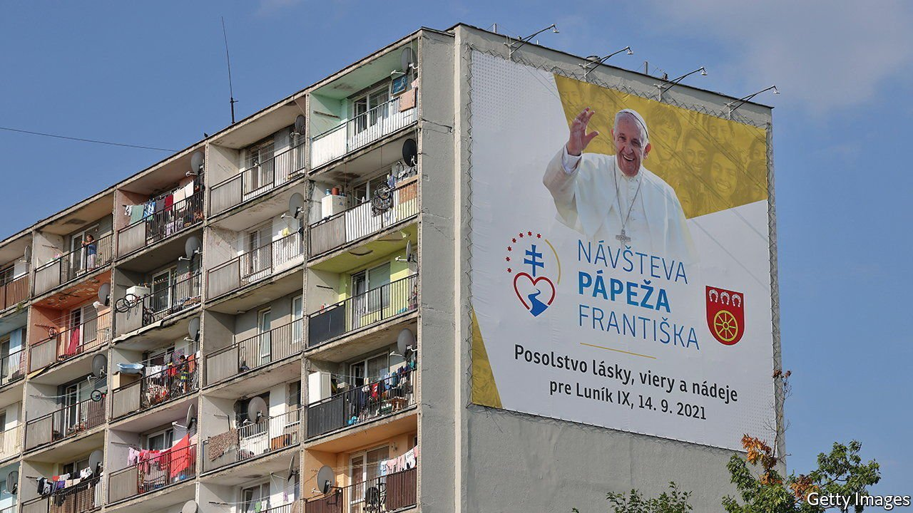

###### The comforts of religion

# Religious belief really does seem to draw the sting of poverty 

##### Whether the cause is spiritual or social remains to be determined 

 

> Sep 22nd 2021 

“RELIGION IS THE sigh of the oppressed creature…it is the opium of the people.” So wrote Karl Marx in 1844. The idea—not unique to Marx—was that by promising rewards in the next life, religion helps  bear their lot in this one.

A paper published in the Proceedings of the National Academy of Sciences by Jana Berkessel of the University of Mannheim, in Germany, and her colleagues takes a statistical look at the claim. Ms Berkessel's curiosity was piqued by a counter-intuitive finding in development economics. Researchers know that low socioeconomic status correlates with . The assumption was once that, as places became richer, this effect would weaken. Being poor in a rich country was presumed better than being poor in a .


But that has turned out not to be true. Abundant evidence suggests the  is stronger, not weaker, in rich countries than in poor ones. Ms Berkessel, who studies the psychological effects of religion, noticed that economic development is also inversely correlated with religiosity—the richer a country, the more godless it tends to be. Perhaps that was driving the change?

To check, she and her colleagues analysed three surveys covering 3.3m people in 156 countries. This set of data reproduced the finding that economic development amplifies the link between  and status. It also supported the idea that religiosity could attenuate that effect. Among rich countries, for instance, those with higher levels of self-reported religious belief had a weaker relationship between status and mental health.

Other evidence buttresses the theory. One study covering 11 European countries, all rich, found the link between personal income and well-being was stronger in irreligious places than devout ones. After much statistical crunching, Ms Berkessel concluded that declining religiosity accounted for about half of the effect of growing wealth on the relationship between status and psychological well-being.

The upshot is that religion seems to protect people from at least some of the unpleasant effects of poverty. Exactly how is less clear. One hypothesis is that religious doctrine is directly protective. After all, many of the world’s biggest religions have a sceptical attitude to wealth. Alongside the well-known biblical verses about camels, needles and a rich person’s chance of entering the pearly gates, the researchers point out that the Bhagavad-Gita, a Hindu holy book, says “The demoniac person thinks: So much wealth do I have today, and I will gain more.” Similar sentiments can be found in the Koran and in some Buddhist texts. If God teaches that the wealthy are spiritually corrupt, or will get their comeuppance on Judgment Day, then poverty may seem less of a burden.

But there are other possibilities. Ms Berkessel points out that organised religion offers a social-support network which might help attenuate the effects of low status, whether or not its members really believe everything their holy texts say about wealth. Her next research project, she says, will look at exactly this point.

In the meantime, if religion really does help relieve poverty’s burden, one question is what, if anything, to do with that knowledge. The world is, after all, getting steadily richer, meaning relative poverty’s sting will only get sharper. A cynic might recall another well-known quote about religion, this time from Seneca, a Roman philosopher. “Religion”, he wrote, “is regarded by the common people as true, the wise as false, and the rulers as useful.” ■

