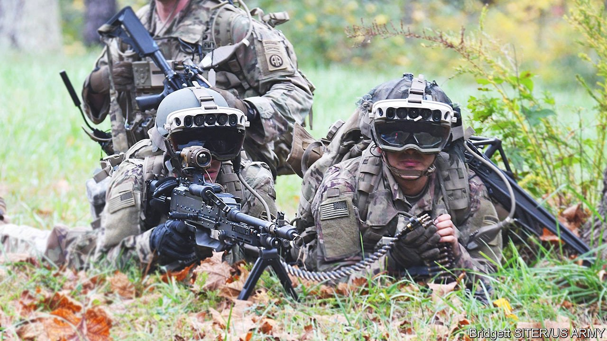

###### The future of warfare

# Tomorrow’s soldiers will have their reality augmented 

##### Relevant data will appear on their view of the battlefield 

 

> Sep 22nd 2021 

SUCCESS OR FAILURE in war often hinges on how much soldiers know about the enemy and the areas in which it operates. Tactical intelligence of all sorts helps. Locations of culverts where bombs may lie hidden. Spots from which snipers have scored kills. Water sources likely to have been polluted by agricultural runoff after heavy rain. Identities of locals suspected of aiding insurgents. Armed forces compile such intelligence and store it on computers. But making full use of it in the heat of battle has never been easy. This is now poised to change, thanks to display technology known as augmented reality (AR).

AR is the art of superimposing computer graphics on a view of the real world. It is popular in applications ranging from video games to selling furniture. America’s army would like tactical intelligence pertinent to a soldier’s mission to pop up similarly on a transparent visor attached to his helmet, no hands required. And for this capability, it is spending big. In March it announced a deal with Microsoft to build such a system. This could, over the course of a decade, cost a staggering $21.9bn.


The army has dubbed the kit IVAS (Integrated Visual Augmentation System). David Marra, who runs Microsoft’s end of the project, describes it as a holographic computer. The displays produced, he says, appear “locked to the real world”, even as a wearer moves and shifts gaze.

IVAS pulls off this wizardry by crunching and synthesising several types of data. A GPS receiver locates the wearer within centimetres. Instruments fitted with accelerometers and gyroscopes provide information on how he is moving around. Cameras track eye movements. IVAS must also be aware of a soldier’s environment. This relies on lidar, an optical equivalent of radar. An array of sensors record the time it takes infrared laser pulses bounced off nearby objects to return. That allows those objects’ distances to be calculated. Machine-vision software that recognises those objects then keeps track of how they move. Mr Marra describes the process as a “continuous rendering of the xyz co-ordinates of everything”.

IVAS must calculate with extraordinary speed where on a headset’s visor to display graphics. A latency of just seven milliseconds risks causing vestibular ocular discomfort, a type of dizziness that has long plagued the development of realistic displays of augmented and virtual reality. In most circumstances, Mr Marra says, IVAS operates well within that limit.

Theatre of war

To build the system, Microsoft has modified an AR headset called HoloLens that it has so far sold mostly to businesses and research outfits. The militarised version of this has been “ruggedised” and souped up with a computing and battery “puck”, a bit bigger than a smartphone, that the user carries on his chest.

Tactical intelligence can be uploaded before an operation, with updates transmitted wirelessly as needed. AR text and graphics guide soldiers through unfamiliar terrain, highlight the whereabouts of friendly forces and mark the enemy’s known and suspected positions. The headsets will also employ facial-recognition technology to append information on possible persons of interest who come into view. As Susan Fung, the army’s deputy head of IVAS technology at Fort Belvoir, in Virginia, puts it, soldiers freed of the need to look down at a screen will be able to “focus on moving and engaging targets”.

IVAS will also exchange data with Azure, Microsoft’s computing cloud. This will permit additional features, such as language interpretation, to be included. Production of the headsets, which weigh about a kilogram, has begun. The first of an expected 120,000 or so units are to be deployed this year.

Others besides the army are also interested. America’s marine corps is a partner in the IVAS programme. Undisclosed allies are seeking to join. And modified HoloLenses may also see use on warships. Britain’s Royal Navy has paid $25.5m to BAE Systems, a local defence giant, to adapt them to show pictures currently displayed on screens on the bridge to officers elsewhere on a vessel.

The benefits of AR may be even greater inside tanks, from which crew typically peer at the world through periscopes. That, says Daniel Covzhun, chief technologist at Limpid Armor, an AR firm in Kiev, Ukraine, is like viewing the world “through a length of metal pipe”. Limpid’s system, dubbed LPMK, superimposes graphics on video images collected by cameras and infrared sensors mounted on an armoured vehicle, and will soon be able to do the same for images relayed by nearby flying drones.

A handful of armoured vehicles belonging to Ukraine’s army have already been fitted with test versions of LPMK. Before an operation, these are fed intelligence from a battle-management system. Commanders choose what they wish to be marked with icons, says Colonel Vadym Slyusar of the Central Scientific Research Institute of Armament and Military Equipment, in Kiev. Options include sewers and other underground infrastructure, preferred landing zones for medical-evacuation helicopters, culturally important buildings, and spots where attacks have been recorded or are feared. The systems start at about $50,000. Ukraine recently ordered more than 50 for delivery this autumn. The United Arab Emirates and an undisclosed Asian country have placed orders with Limpid, too.

AR can also expand the capabilities of optical gear already used by soldiers. In September 2019 the American army began to use a new AR feature added to its Enhanced Night Vision Goggle—Binoculars (ENVG-B), which are attached to a soldier’s helmet and flip down over his eyes when needed. The new feature, made by L3 Harris, a firm in Florida, highlights sources of heat and amplifies what light is available to render objects visible in the dark.

ENVG-B works out the portion of the world within its wearer’s field of view. It then superimposes icons on things like friendly and enemy troops, or the route to a rally point, drawing their co-ordinates from a wireless network called Nett Warrior. Soldiers especially like an AR mode called “rapid target acquisition”, says Lynn Bollengier, head of “integrated vision” at L3 Harris. This pulls data from an inertial-measurement unit in a soldier’s rifle to place crosshairs over whatever it is pointing at. That means a soldier can shoot from behind a corner without sticking his head out to put an eye to the rifle’s sight. America’s army and marine corps have bought more than 6,000 of the systems..

A sight to behold

This is heady stuff. Even so, enhancing combat operations with AR will remain, for some time, beyond all but the most technologically sophisticated armies. Marcel Baltzer, of the Fraunhofer Institute’s campus in Wachtberg, who co-chairs an AR-research team for Germany’s armed forces, believes that even the European armies most advanced in the art (which are, by his reckoning, those of Britain, Germany, Lithuania, the Netherlands and Norway) will need another decade. Using AR for training, and for the maintenance and design of military hardware, he adds, is easier and will become common sooner.

Ambition, at any rate, is not lacking. Mojo Vision, a new Californian firm that has received money from DARPA, an American government military-research agency, is developing an AR system embedded in contact lenses. Tiny batteries power sensors that track a wearer’s gaze and the movement of objects in view. An array of LEDs roughly the size of a grain of sand projects images received via a wireless link onto the wearer’s retina. The brightness of these is adjusted according to the ambient light. Steve Sinclair, Mojo’s head of marketing, expects a usable version of the system to be ready in a few years’ time.

Whether or not that proves feasible, the use of AR of any sort in combat will introduce risks. Designers must identify the point at which further visual augmentation will lead to confusing information overload—and what happens in training may not mirror the messiness of real battle. An imprecise data overlay could lead to a blunder. And if an AR system proves hackable, soldiers could be tricked by the enemy, with grim consequences.

A different sort of pitfall also looms. AR will make it easier for distant commanders to tell soldiers in battle what to do. The risk is that officers sitting far away from the fight will “feel like they’ve got puppets on the ground”, says Axel Dyèvre, of Avisa Partners, a consultancy based in Paris that has studied AR for France’s defence ministry. He calls the phenomenon a “squashing of chains of command” which robs troops of the degree of autonomy needed to fight effectively. AR for combat, then, offers perils as well as promise. ■

