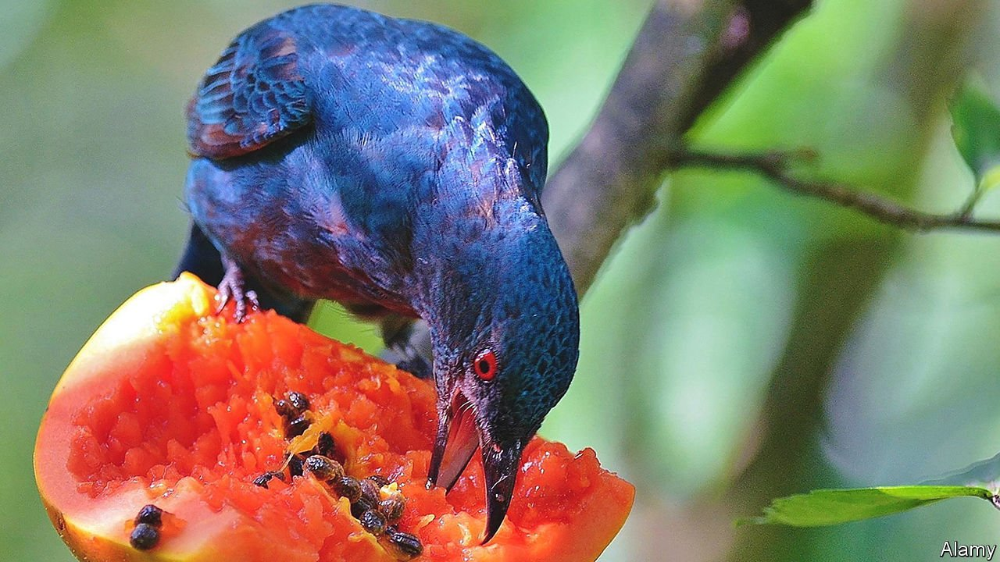

###### The evolution of fruit

# Why some fruits ripen on the branch 

##### It is all about finding the right animal customer 

 

> Sep 22nd 2021 

BANANAS, APPLES and avocados continue to ripen after they are picked. Cherries, blackberries and grapes do not. The difference between climacteric fruits (the former) and non-climacteric fruits (the latter) matters to fruit growers and greengrocers, who must make sure their wares are in tip-top condition when they arrive at the marketplace. But how those differences originally came about remains unclear.

In a paper in Biology Letters, Fukano Yuya and Tachiki Yuuya of the University of Tokyo proffer a suggestion. Fruits, they observe, exist to solve a problem faced by all plants—how best to spread their progeny around. Wrapping their seeds in a sugary pulp, to provide a tasty meal, serves as a way to get animals to do this for them. They do, however, need to make sure that their fruits favour the animals most likely to do the distributing. Dr Fukano and Dr Tachiki propose that climacterism, or its absence, is a way to achieve this. If ground-dwelling animals are the main distributors, then the continuing ripening of fallen fruit (ie, climacterism) is beneficial. If, by contrast, those distributors are arboreal or aerial, and so can feed on unfallen fruit, then non-climacteric fruits will do well.


To test their idea, the two researchers combed through 276 papers reporting on 80 sorts of fruit, and noted which animals each depended on for its propagation. Thirty-five of these fruits, they discovered, were eaten by both ground-dwelling animals and arboreal and aerial ones. But of those where one group or the other were the predominant consumers, 15 of the 19 eaten principally by ground dwellers were climacteric, while 21 of the 26 fed on by arboreal or aerial animals were non-climacteric.

That is a suggestively strong correlation. And the authors’ hypothesis is fortified by other evidence. They point out that non-climacteric fruits tend to have vivid colours, especially reds and purples. This may help them stand out amid the foliage of their parent plants, advertising their presence. Climacteric fruits are generally better camouflaged. That makes them harder to spot until they have fallen to the ground.

The main limitation of their work, say Dr Fukano and Dr Tachiki, is that most of the papers they looked at concerned fruits eaten by people. This has probably contaminated the sample, for thousands of years of selective breeding for traits that human beings find appealing may have blurred any signal optimised by natural selection. The next step, therefore, should probably be to confine the analysis to wild fruits.

