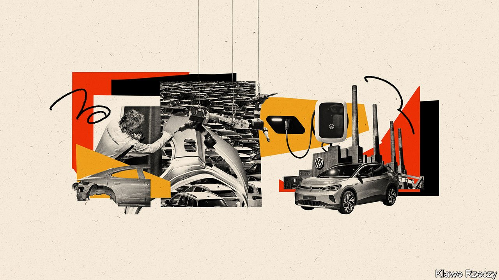
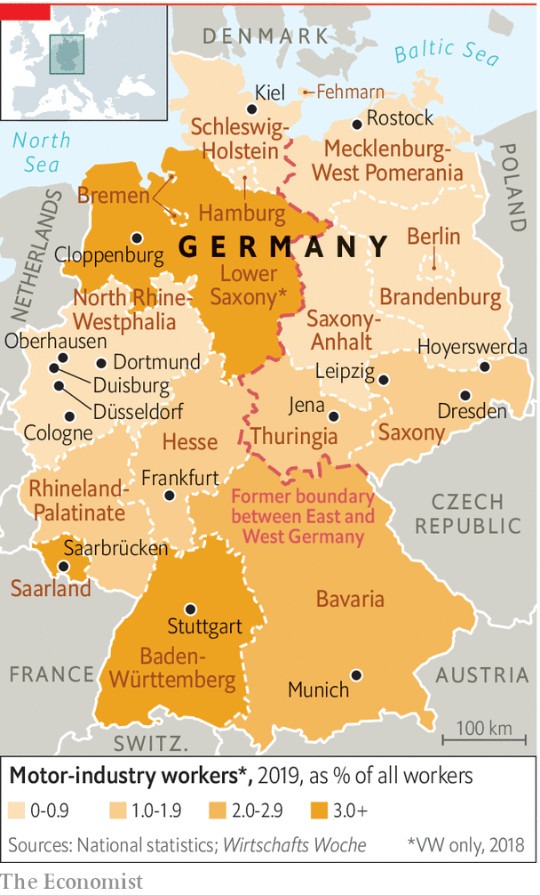
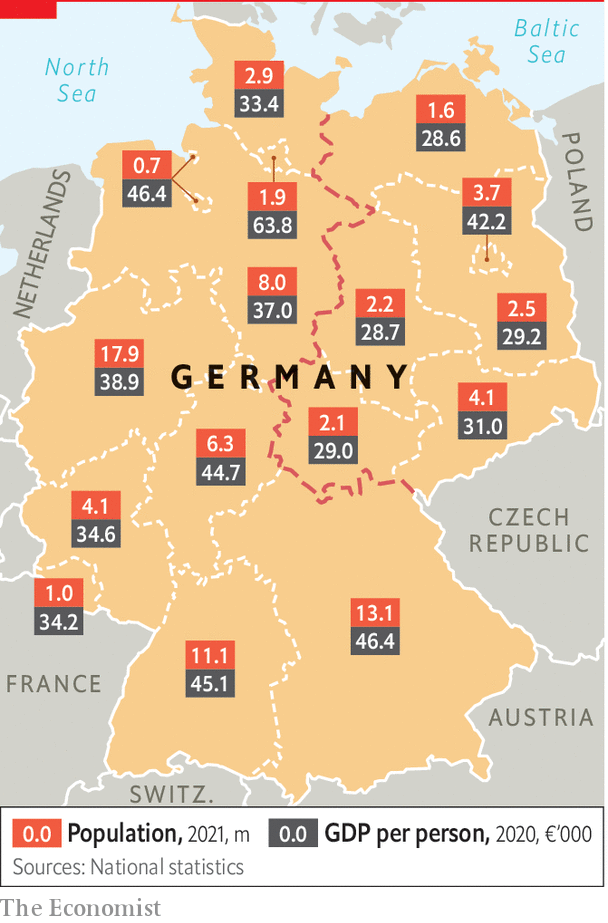

###### The car industry

# A troubled road lies ahead for German carmakers 

##### The all-powerful automotive sector faces a challenging future 

 

> Sep 20th 2021 

SAARLAND IS NO stranger to transition, jokes Thorben Albrecht, policy director for the IG Metall trade union. The second-smallest of the 16 states, for a century Saarland bounced back and forth between Germany and France, establishing itself inside the federal republic only in 1957. Coal deposits and steel made it rich, but also left it exposed to job losses when globalisation came knocking in the 1970s. A booming car-parts industry provided a cushion, but Saarland now faces a third shift, as industrial transformation and climate policy come after its two big sources of jobs: cars and what remains of steel.

The government wants 14m electric vehicles (EVs) on German roads by 2030, up from 1m today. But the slow death of the internal combustion engine undercuts the business model of gearbox, cooling-system or fuel-injection pump makers—suppliers that dot Saarland and other states. Almost 20,000 people work in Saarland’s car industry, mostly in small and medium-sized firms. The state has neither a large company headquarters nor a big city with a thriving service sector. “A huge reduction in car-sector jobs will mean social problems of a very large order,” says Hans-Christian Herrmann, who charted previous waves of deindustrialisation as the chief archivist in Saarbrücken, the state capital. An IG Metall survey found that 42% of German car workers fear for their future.


Workers at steel plants, which account for around 6% of German carbon emissions, are as worried. “You can see my grey hairs”, chuckles Stephan Ahr, who chairs the works council at Saarstahl, a steelmaker in Völklingen. The plant has already lost tens of thousands of jobs. The main decarbonisation plan, in which polluting coke is ditched in favour of hydrogen obtained from renewables, will require far fewer workers. Other developments, including uncertainty over the carbon price and EU policy on steel imports, add to Mr Ahr’s worries. “Everything affects us without us having any influence,” he says. “It’s take it or die.”

 


Germany’s industrial model rests on the full employment that buys consensus between firms, workers and government. Labour relations are harmonious. But the impulses to create what unions call a “just” transition can lead to ruinously expensive deals like the “coal exit” agreed in 2019: a €40bn programme to manage the slow elimination by 2038 of the final coal mines, which employ 20,000 people, slightly fewer than the country’s yoga teachers.

The transition is also a challenge to big companies. If carmakers were late to the electric game, Volkswagen, which has almost 300,000 employees in Germany, is scrambling to make up for lost time (and perhaps to repair the damage to its reputation from the diesel-emissions scandal in 2015). Under its charismatic boss, Herbert Diess, and with an eye on Tesla, soon to open a battery gigafactory outside Berlin, VW has gone all-in on electric. It says EVs will account for half its vehicle sales by 2030. By 2035 vw, which reckons to account for 2% of global carbon emissions, will cease selling petrol-powered cars in Europe.

 


EU rules and climate targets are forcing tough decisions. But talk to VW insiders and you see how deep the shift has gone. To power the next generation of cars, VW plans by 2030 to build six lithium-ion battery plants in Europe. Entire plants are given over to EV production. The “MEB” chassis (or platform) will be spread across models, ensuring cars are built around batteries rather than vice versa, and may be licensed to other manufacturers. “Think of this as a system, with suppliers, batteries, services and infrastructure,” says Andreas Walingen, VW’s chief strategy officer. “Only then will customers go electric”. Mr Diess has also linked executives’ bonus payments to VW’s share price, a decision one employee says “changed the DNA of the governance.” VW’s profits surged in the first quarter of 2021, and investors seem satisfied.

The car industry faces the biggest disruption in its history, says Ferdinand Dudenhöffer, head of the Centre Automotive Research in Duisburg. Electrification is just a start. Audi, a VW brand, is trying a car-subscription model aimed at younger drivers, a growing market that could upend revenue models. Software systems require digital skills and fresh ways of working. “We are strong on the hardware side of cars, not so good on data and AI,” says Danyal Bayaz, the Green finance minister of Baden-Württemberg, another big car state. Some fear VW will never catch up with Tesla—or the Chinese firms muscling in. Fully autonomous vehicles, should they arrive, may bring the biggest change yet.

As for the jobs, the scares are overblown, insists Mr Diess (who faces powerful unions and workers’ councils). “Seats remain seats, steel remains steel, wheels remain wheels, brakes remain brakes,” he recently told the German Press Agency. A study by the Boston Consulting Group and the German think-tank Agora Verkehrswende projects no net loss of jobs by 2030, although other surveys are less sanguine. But the headline figure conceals massive churn, as component making gives way to battery production and coding. Almost half the country’s 1.7m car workers will need reskilling, especially the SME suppliers. This, warns the study, will mean “considerable expense” for firms and workers.

And for the state, too. Carmakers rely on the government to set carbon targets, roll out EV charging infrastructure and tweak regulations to make it easier to harmonise refuelling payment systems across the country. Until 2025 the federal government will subsidise EV buyers to the tune of €6,000 per car. The incentives have lifted the share of EVs and hybrids to over a fifth of all new sales, but they are regressive and expensive. Deutsche Bank calculates that each EV could over its lifespan cost the state €20,000 in subsidies and taxes forgone.

Beyond the jobs churn, Saarland looks hopefully to new industries spawned by industrial transformation, rather as cars provided a safety net during the previous wave of deindustrialisation. SVolt, a Chinese battery maker, plans two plants in the state which it says could create 2,000 jobs, although locals are sceptical. Hydrogen, an untested fuel central to the government’s climate plans, is another hope. One thing everyone agrees on is that the transition needs to be oiled with public money. The industry reckons some €30bn will be required to make the full transition to decarbonisation. Some politicians pledge that climate protection will be the next engine of prosperity. At least in Saarland, many are unconvinced. “We have just eight years to change a region,” says Ralf Reinsteadtler at IG Metall. “That’s tomorrow.”■

Full contents of this special report


The car industry: A troubled road lies ahead*


