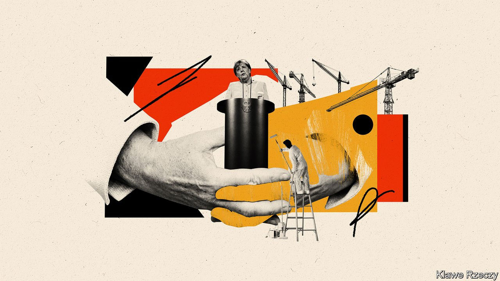
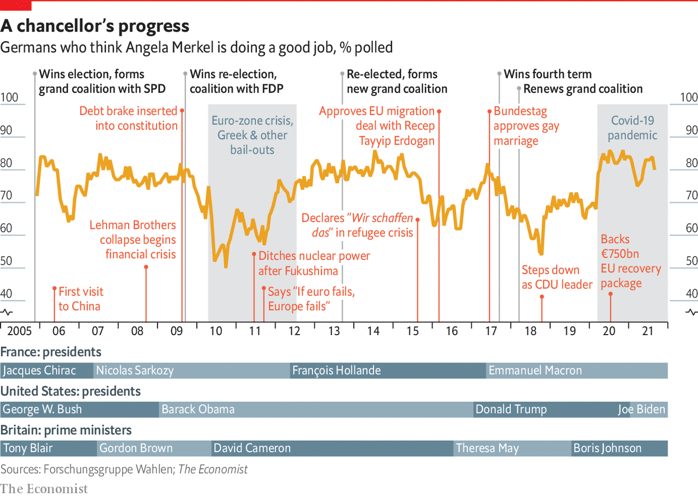

###### Germany

# After Merkel 

##### Angela Merkel’s departure will leave a big hole in Germany—and much for her successor to do, says Tom Nuttall 

 

> Sep 20th 2021 

IN JUNE A newly surfaced segment of a German talk show from 1997 set the internet alight. The clip shows Angela Merkel, a fresh-faced environment minister in Helmut Kohl’s government, explaining the urgency of action on climate change. Her fellow panellists listening closely, Germany’s future chancellor says delay will only incur higher costs. The dangers of failure, she warns, include hunger, drought and the mass movement of refugees.

The clip highlights a contradiction familiar to observers of Mrs Merkel’s 16-year reign, which will end once a new coalition is formed after the election on September 26th. On one hand is the diligent scientist-stateswoman, blessed with the ability to understand complex issues and explain their consequences. On the other is the hesitant politician who struggles to convert analysis into action. A quarter of a century on, Germany emits more carbon dioxide per head than most other EU countries, and relies on fossil fuels for 44% of its electricity. After the clip emerged Mrs Merkel, at her final annual press conference as chancellor, conceded that she had failed to act decisively on climate change.


The pattern keeps recurring. Campaigning for the chancellery in 2005 Mrs Merkel promised to slash bureaucracy and promote innovation, pledges that still appear in the manifesto of her Christian Democratic Union (CDU). Her biennial speeches at the Munich Security Conference were compelling tours d’horizon of the global security landscape but rarely heralded meaningful changes in German foreign policy. During the covid-19 pandemic the chancellor was a solid, reassuring presence, but she struggled to impose her will on the restive premiers of Germany’s states.

Mrs Merkel has at times seemed more monarch than chancellor. She will leave office with sky-high approval ratings. Three of the four coalitions she led were “grand” ones with the Social Democratic Party (SPD), which suited her centrism but tranquilised politics. She has so dominated the centre that outright criticism of her has come to seem almost lèse-majesté. That has inspired a wave of free-speech martyrs on the conservative fringes, the closest Germany gets to a culture war. In Europe Mrs Merkel has been the indispensable leader. Beyond it, her stout defence of liberal values and her modest demeanour have been reassuring in an age of noisy populism and nationalist showmen.


As Mrs Merkel prepares to leave office some have wondered if a Wechselstimmung (mood for change) is taking hold in her country. The ascent since the 2017 election of the Green Party, which wants to upend strict public-debt rules and rethink foreign policy, seems to offer evidence for this. In May the Bertelsmann Foundation found that a record two-thirds of voters wanted significant political change, and almost as many wanted a new government.

Some recent events have shaken the faith of voters in their state and its institutions. One was the chaotic management of the second wave of covid-19, which undercut a narrative of success during the first in 2020. Then came catastrophic floods in parts of western Germany in July, where the apparent negligence of a few local politicians may have contributed to a death toll of almost 200. The debacle in Afghanistan, where 150,000 Bundeswehr troops had served since 2002, was also hard to swallow.

 


Yet for all this, a Wechselstimmung is not evident. Germany has weathered the pandemic better than most. The death rate was low and the government’s fiscal response, including policies like the much-imitated Kurzarbeitergeld furlough scheme, cushioned the economic impact. The economy is set for one of Europe’s more robust recoveries. More than two-thirds of Germans say their economic situation is good. Nor did the floods mark an inflection point. Rather, a lacklustre campaign punctuated by trivial rows suggests that none of the parties, including the increasingly cautious Greens, sees much mileage in promising rupture.

Just as German companies excel at incremental innovation but struggle with the disruptive sort, change in public opinion is slow and hard to detect. Spotting this is one of Mrs Merkel’s strengths, aided by her office’s relentless polling and focus-grouping. Her policy shifts, when they came, were usually subtle but on occasion decisive: nuclear power, gay marriage and, most recently, common European Union debt.

Her riskiest step was her decision not to close German borders to over 1m asylum-seekers and other migrants in 2015-16. Even this was an improvised response to an unexpected crisis. Tellingly, this short-term fix entrenched long-term difficulties: it opened the door to the far-right Alternative for Germany (AfD) and, by toxifying the migration debate, made it harder to liberalise skilled-labour laws. Five years on, a bitterly divided EU is still unable to reform its asylum rules, leaving it exposed to another crisis.

Fear of the unknown

There is a palpable nervousness about Mrs Merkel’s imminent departure. This is the country’s first post-war poll in which the sitting chancellor is not seeking re-election. The campaign has been volatile, with the lead bouncing between the Greens, the CDU and its Christian Social Union (CSU) Bavarian ally, and the SPD. A fragmented vote looks likely to make a two-party coalition impossible for the first time since the founding of the republic. Rarely has the identity of the next chancellor and the make-up of any coalition been so uncertain. That may mean long post-election negotiations and an ideologically incoherent government that finds it hard to get anything done.

The rest of the EU is even more apprehensive. Mrs Merkel has shaped its response to crises, from euro-zone bail-outs through Russia’s invasion of Ukraine to Brexit. Germany sits at the continent’s heart, and one of the chancellor’s priorities has been to resist forces driving its governments apart. She has forged useful relationships with figures as disparate as Alexis Tsipras, the far-left prime minister who nearly took Greece out of the euro, and Viktor Orban, the autocratic leader of Hungary (who will take over Mrs Merkel’s mantle as longest-serving EU leader).

Politically, Germany seems an island of stability in a jumpy world. Although this election may be the most open for a generation, none of the parties likely to enter government disagrees over such fundamentals as the social-market economy or the commitment to the EU. Contrast this with France, which may again flirt with Marine Le Pen in next year’s presidential election; perennially unstable Italy, where populist parties command near-majority support; or Poland, a deeply polarised country led by a government undermining the rule of law.

Few of Europe’s crises have upset Germans’ security or given them reason to push for change. Political chaos, overspending or trade deficits are others’ problems. Growth in the Merkel era was solid, if rarely spectacular, and when challenged German institutions have been robust. Five years on, there are even grounds for optimism over the integration of migrants from 2015-16. And it is not modern Germany’s habit to engage in military adventurism abroad.

Critics are wary of handing too much credit to Mrs Merkel. “Germany’s economic success was more luck than policy,” says Marcel Fratzscher, who leads the German Institute for Economic Research (DIW) in Berlin. Conditions were propitious. China’s accession to the World Trade Organisation in 2001 opened a vast market for mighty German exporters. The EU’s eastward expansion a few years later created a pool of cheap labour and extended supply chains, and a source of skilled, working-age immigrants. Controversial labour-market reforms pushed by Gerhard Schröder, Mrs Merkel’s predecessor, kept unemployment down. American power has held the peace that was a condition for German trading success. Transatlantic spats over nugatory German defence spending have had few serious consequences.

Yet a strong economy and Germany’s heft in Europe have concealed a darker side at home: a swelling low-wage sector, growing income inequality, ragged housing markets and persistent child poverty. A misjudged energy policy has given Germans the highest electricity bills in the EU. A strict approach to the public finances, expressed since 2009 by a deficit-limiting debt brake in the constitution, has created vast fiscal surpluses even as public infrastructure decays. Covid-19 has revealed other weaknesses in the public sector, especially its slow digitalisation. There are reasons to fear that the next decade could expose deeper failings.

For if Mrs Merkel was a steady hand during crises, she has been less successful in setting a longer-term course. Astonishingly, it is hard to find a single far-reaching reform passed by any of the four governments that she has led. This brings to mind a second German term that ought to preoccupy the next government: Zukunftsfähigkeit, or the ability to face the future. For many, it is something they sorely miss in the country that Mrs Merkel will bequeath.

Weaknesses in the German model are starting to show. Dependence on trade means vulnerabilities to deglobalisation. Growing tensions between America and China leave Mrs Merkel’s engagement-first policy increasingly threadbare. The mighty car industry is highly exposed to technological disruption. Germany’s skills shortage will worsen as a demographic crunch looms in the mid-2020s. New climate targets will require deep-rooted changes to industry, buildings and the power industry. Perhaps most worrying, the political class seems to have learned from Mrs Merkel that it is better not to scare voters with too much talk of transformation, leaving only a limited mandate for change.

Germany is a strong, rich, democratic country that should have a bright future. This special report will act as a stress-test, prodding its industrial, bureaucratic, demographic and security policies at their most vulnerable points to assess where change is most urgently needed. It begins with a look at the country’s perennially low public investment.■

Full contents of this special report

Germany: After Merkel*


