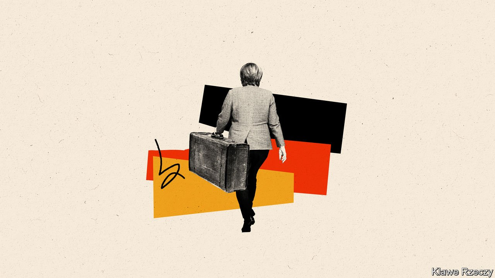

###### The future

# Germany needs a reforming government 

##### Unfortunately, it may not get one 

 

> Sep 20th 2021 

ANGELA MERKEL has steered Germany and Europe through difficult years. Although it may come as news to some, she will leave a country more at ease with itself than at any time since the republic was set up in 1949. Germany rests on solid foundations, from its universities and basic research, to its world-beating Mittelstand and undisputed engineering prowess. Its researchers invented the first diagnostic test for covid-19 and the first vaccine to use the messenger-RNA technology. Its democracy is robust, it sits at the hub of a strong network of alliances, and its European and global brands are stronger than ever. Few of the deficiencies this special report has sought to highlight seem irremediable.

For all that, suggests Thorsten Benner of Berlin’s Global Public Policy Institute, “We may see the Merkel years as the last hurrah of the German model.” If its foundations are strong, parts of the interior have started to show their age. For many voters, the old verities on debt, industry and Germany’s place in the world retain a vintage charm. But they are increasingly out of step with a decidedly contemporary set of challenges.


Take covid-19. Although Germany suffered a lower death rate and a gentler economic blow from the pandemic than many other countries, the experience also exposed Germans to failings in the operation of their state. Many were shocked to see how schools failed to get to grips with online learning, or the endless bickering between federal and state politicians. The fax machines used by health offices to communicate test results became emblematic of a primitive public sector. Aggregating timely, consistent data proved elusive. Without the ability to impose common IT standards, the federal government was left to watch what Mr Spahn calls “400 digital islands” manage fragmented and incompatible systems.

The weaknesses of a tripartite governing system—federal, state and municipal—partly explain such woes. A €3bn fund approved by the federal government to help states observe an online-access law in 2020 took over a year to divide up. By the end of last year less than €500m of the government’s €6.5bn “digital pact for schools” fund, approved in 2019, had been disbursed. Even less had been spent, as understaffed local governments struggled to understand the rules. One difficulty is a constitutional bar on the federal government directly funding municipalities in most circumstances. Workarounds muddy lines of responsibility and accountability. “Everyone knows that we need a federalism reform, and everyone knows that we won’t get one,” says Steffen Kampeter of the BDA.

Another problem is the quality of administration. If all bureaucracies battle with complacency and dead wood, Germany’s is worse than most. “All that German officials want to do is develop tactics of risk avoidance,” says one consultant, a claim borne out in international comparisons. Recruitment practices are stodgy, strict silos mean functions are duplicated, and lawyers dominate everything. Bureaucratic jobs have mushroomed; the price of unhappy grand coalitions where places must be found for everyone. One mid-level official says he marvels at the ability of his colleagues to bounce the simplest external request around for days.

The aspirants to replace Mrs Merkel all pledge to make the country more zukunftsfähig, as is customary before all elections. The climate imperative in particular will force them to think more seriously about such arcane matters as planning procedures and municipal staffing. But René Geissler, professor of public administration at the Technical University of Applied Sciences in Wildau, is sceptical. “We’ve been having the same debates for years,” he says. “I really don’t see change coming.” Once governments are in place, serious reform of the public administration often falls prey to more pressing matters.

Germany’s increasingly fragmented politics will not help. The next government could see growing tensions between the usual emphasis on consensus and the pressing need for action. In theory, once it is in place—which may not be until early 2022—a three-party coalition, an unfamiliar experience at federal level but the likeliest election outcome, could unite the best aspects of each party’s programme: Green zeal on climate and investment; a liberal focus on digitalisation, innovation and bureaucracy; and so forth. But at least as likely is internecine bickering and political gridlock, especially in the absence of a chancellor with Mrs Merkel’s clout.

Beyond Berlin

Should it turn out that way, Germany will not be the only casualty. Emmanuel Macron, if he survives his own re-election bid next spring, will at least for a time emerge as the EU’s central figure. But as the French president has always recognised, his country is too weak, and in some quarters too mistrusted, to lead Europe alone; it needs a strong German partner committed to domestic reform and a more assertive posture abroad. And as American attention continues its long shift to China and the Pacific, the pressure on Germany to play a more active role in the EU’s troubled neighbourhood, beyond its (relative) comfort zone of providing deterrence inside Europe, can only increase.

What are the prospects for success? To judge by the election campaign, which has been dominated by trivial scraps, personal peccadillos and arcane discussions about coalition configurations, they look slim. Debate on foreign policy has been especially thin; Europe has been almost entirely absent. Renewal in Germany rarely follows arrow-like from a new government; and even less so from the promises politicians make to an electorate that is hardly enthused by the prospect of disruptive change.

The optimist might claim that the challenges for Germany have become impossible to ignore. Those voices advocating reform, from a more realistic fiscal approach to a grown-up security policy, have started to earn a hearing inside government; some of them may even join the next one. Yet as Germans prepare for a new chancellor for the first time in 16 years, the danger of the complacency for which Mrs Merkel will surely be remembered has become starkly clear. Overcoming it will be the biggest task for whoever takes her place.■

Full contents of this special report


The future: Germany needs a reforming government*

