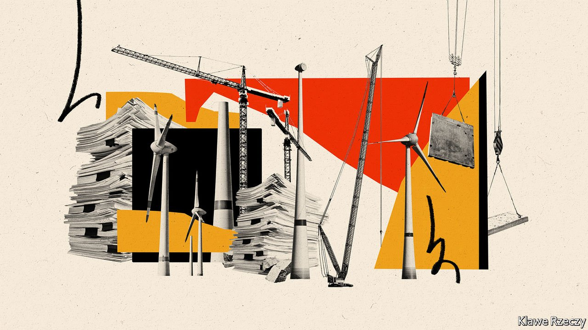
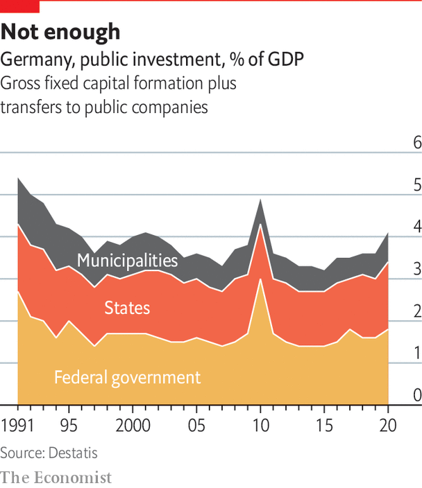

###### The public sector

# Germany’s urgent need for greater public investment 

##### Infrastructure suffers from a lack of public investment 

 

> Sep 20th 2021 

“WE’RE WORKING at the limit,” says Apostolos Tsalastras, treasurer of Oberhausen, a town in the Ruhr valley. Like many places in this region, Oberhausen sits on a vast debt pile, mostly accrued when the mines closed and the steel jobs went. Unemployment stands at 10.6%, almost twice the national rate. Last year Olaf Scholz, the SPD finance minister (and its chancellor-candidate), sought to relieve municipalities like Oberhausen of their old liabilities, but was thwarted by his CDU coalition partner. “It’s time for a fresh start,” pleads Mr Tsalastras. His town is locked in a vicious circle of declining investment, slumping tax revenue and a shrinking population.

A federal bail-out meant most municipalities avoided disaster last year. But by 2023 many will face a fiscal crunch, says Jens Südekum, economics professor at the University of Düsseldorf. The commercial taxes that are their main independent source of income are volatile, and covid-19 creates new demands. National laws limit their ability to cut current spending, one of Mr Tsalastras’s bugbears. That puts capital investment in the firing line.


The country’s 11,000-odd municipalities are responsible for a big chunk of public investment. The KfW, a state-backed development bank, puts the municipal-investment backlog at €149bn ($172bn), a number that has risen even as tax revenues pour in. School buildings account for nearly a third of the shortfall; roads just under a quarter. Endlessly delayed mega-projects like Berlin’s airport may have made the country a laughing stock, but it is rusting bridges, shaky phone signals and decrepit school toilets that are the staple of daily conversation.

Ask anyone in local government what the problem is, and the answer is always people. A report by the Friedrich Ebert Foundation, which is linked to the SPD, finds a huge decrease in municipal staff over 30 years. Immigration has helped, but a quarter of posts remain unfilled, says Henrik Scheller, one of the authors. Planning and engineering are especially affected, and local governments struggle to compete with private firms. Two-thirds of municipalities expect it to get even harder to find town planners. Surveys find construction companies working at capacity. With such supply constraints, spending more without proper planning merely risks stoking inflation.

Bureaucracy and nimbyism play a role. Companies struggle with a patchwork of planning and building rules. Opponents delay public-infrastructure projects with endless litigation. The number of projects blocked by citizens’ initiatives has doubled since 2000. This is problematic for roads, railways and bridges. But it is a “real hurdle” to climate transformation, says Mr Scheller. The recently revised climate law mandates a reduction in carbon emissions of 65% from 1990 levels by 2030, and their net elimination 15 years later. The share of renewables in electricity production must also reach 65%. And overall demand for electricity for batteries to power electric cars, for heat pumps in buildings, and for “green” hydrogen to help decarbonise industry may rise by a quarter.

Agora Energiewende, a think-tank, estimates that Germany will have to install an extra 5GW of onshore wind power every year until 2030, and 7GW a year after that. In 2020 it managed just 1.4GW. A visit to Schleswig-Holstein shows how hard it will be. As far back as the early 1990s, wind power in this northern state began to revitalise what had been some of the poorest communities in western Germany. Today turbines dot the landscape. Schleswig-Holstein has 8.5GW of installed wind-power capacity, and produces 160% of the electricity it consumes from renewables. It can export the excess via new power lines, including to Scandinavia.

In December the state government published new rules for wind-farm construction, after a five-year moratorium imposed amid growing local tensions. The new rules set aside 2% of land for wind energy, but this may not be enough to meet wind-power targets. Add long waiting times for permits and other restrictions and these targets seem unattainable, says Marcus Hrach of the Kiel branch of Germany’s Wind Energy Association. Industry insiders despair at all the hoops they must jump through. “Few people here oppose wind power, but those who do have loud voices,” says Anton Rahlf, a frustrated wind-farm owner on Fehmarn, an island in Schleswig-Holstein.

 


Other states are even more restrictive. Rules to protect endangered species vary from state to state. A few years ago litigation, regulation and complex tendering slowed the construction of wind farms to a crawl, although 2021 has offered flickering hints at a revival. The mismatch between the federal government’s ambitions and the reality of local regulation, says Mr Hrach, will make it impossible for Germany to reach its commitments under the Paris climate agreement.

Another difficulty, says Alexander Reitzenstein from Das Progressive Zentrum think-tank, is constructing the power lines needed to transport electricity from the windy north to southern industrial states like Baden-Württemberg and Bavaria. Local communities can be given a financial stake in wind farms, but that is harder to do for power lines simply transporting electricity. And under Germany’s federal system, states cannot be bossed around by the government in Berlin. “Lots of politicians who agree on climate in Berlin act differently when a line comes to their local community,” says Tim Meyerjürgens, chief operating officer of TenneT, an electricity-transmission operator, adding that the “salami-tactics” of regular legislative changes harm trust.

There is a near-consensus that the next government must do more to satisfy vast public-investment needs. The debate is over how. For some, tackling the country’s austerity bias is a priority. The debt brake now in the constitution limits opportunities for deficit spending. Critics of German tightfistedness are legion. The European Central Bank has long urged countries with “fiscal space” to exploit it. But all such suggestions have tended to run into an austere wall of fiscal orthodoxy.

Austerity excesses

Since 2013 the annual public-investment budget has risen from around €93bn to €137bn. This, argues Jens Weidmann, head of the Bundesbank, suggests the debt brake is “a bit of a straw man”. Better to tackle bureaucracy, capacity constraints and municipalities’ volatile revenues by changing the federal structure. But Sebastian Dullien at the IMK, a union-linked research group in Düsseldorf, counters that a guaranteed, long-term income stream of just the sort the debt brake inhibits might give municipal authorities, construction firms and engineers the planning certainty they need to reduce bottlenecks and increase staff.

Last year the government invoked an escape clause in the debt brake to finance corporate-support, furlough and other schemes during the pandemic, running up a deficit worth 4.2% of GDP. It will be bigger this year. The CDU/CSU wants to reimpose the debt brake once circumstances allow, probably in 2023. So does Mr Scholz, who presents himself as a safe pair of hands (plenty in his SPD would like a more expansive approach). The most interesting proposals come from the Greens, who want to add a “golden rule” allowing a debt-funded ten-year €500bn investment programme, focused on climate and digital infrastructure.

Yet the two-thirds parliamentary majority needed to change the constitution is a formidable hurdle. A more likely prospect is the establishment of public-investment companies, essentially off-budget special-purpose vehicles (SPVs), devoted to capital spending on, say, broadband provision in schools or upgrading railways. SPVs are legally complicated and democratically iffy, frets Mr Südekum. They would incur borrowing costs at a time when investors actually pay to lend to the federal government. But by not adding to the public-debt stock they offer a way of getting round the debt brake. The CDU/CSU chancellor-candidate, Armin Laschet, has flirted with what he calls Deutschlandfonds.

More radical ideas are afoot, notably a proposal by Dezernat Zukunft, a think-tank led by Philippa Sigl-Glöckner, a former finance-ministry official who calls SPVs “a declaration of defeat to silly fiscal rules”. Dezernat Zukunft wants to shift the fiscal debate away from arbitrary debt limits towards the goal of full employment. Low headline unemployment, the group notes, masks low labour-force participation rates among women and part-time workers seeking more hours.

Although the debt brake limits deficits to 0.35% of GDP, the calculations rely on a complex estimate of “potential” output. In the short run, Dezernat Zukunft reckons tweaks that require legal but not constitutional tampering could allow more deficit spending worth €50bn-60bn a year. In the long run Ms Sigl-Glöckner hopes to see off the debt brake for good. That such ideas now get a serious hearing suggests the fiscal debate has at last begun to shift. ■

Full contents of this special report


The public sector: The urgent need for greater public investment*


