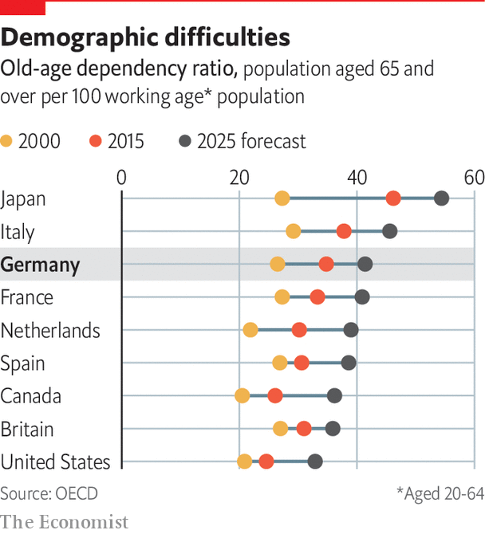

###### The demographic challenge

# Parts of Germany are desperate for more people 

##### Coping with ageing and shrinking populations is hardest in the east 

 

> Sep 20th 2021 

ON THE FACE of it there is little to separate the two towns. Cloppenburg, near the Dutch border, and Hoyerswerda, 40km from Poland, each has a population of 30,000-40,000. Both, say local officials, offer respite from the strains of urban life: cheap housing and plenty of kindergarten places, the shortage of which is a huge source of stress for metropolitan parents. Neither is near a big city; both offer visitors a friendly, somewhat sedate, face.

But the similarities end there. With one of Germany’s highest birth rates, Cloppenburg is growing at a steady clip, whereas Hoyerswerda has moved in the opposite direction. “This is a family-friendly region,” beams Johann Wimberg, Cloppenburg’s district administrator. “You can build a home here.” Hoyerswerda, a former coal-mining hub, lost half its population after reunification in 1990, largely to westward emigration. The district of Cloppenburg has grown by nearly 50%. Hoyerswerda’s “new” town (built during the communist era) is pockmarked by vacant plots on which GDR housing blocks once stood. Industrial parks on the outskirts of the town are half-empty.


Until a small, covid-induced decline last year, the German population rose steadily over the 2010s, reaching a record 83.2m in 2019. This was the result of high net immigration, running at an annual average of 400,000, mainly from southern and eastern Europe. Even the birth rate, long one of the lowest in the world, ticked up. But now a crunch looms. The birth rate peaked in 1964, and the baby-boomers are preparing to retire. In 2000 there were 26.5 over-60s for every 100 aged between 20 and 65. By 2025 this ratio will have shot up to 41.4. Immigration and labour-force participation rates aside, the working-age population will shrink by over 4m in the coming decade. Within the OECD club of mostly rich countries, only Italy and Japan have older populations.

 


Some parts of the country will do worse than others. Germany is no stranger to the town-and-country divide, but in some regions its economic structure mitigates against rural decline. Cloppenburg, like many small places, benefits from the success of “hidden champions”: the profusion of SMEs, often based in the middle of nowhere, that keep well-educated locals close to home. These Mittelstand firms, which often operate in specific niches, are a peculiar feature of the industrial landscape. The area round Cloppenburg also offers less salubrious work in the form of meat-processing plants, which attract transient eastern European workers.

Hoyerswerda has no such luck. This correspondent’s visit coincided with one from the Dresden branch of the Helmholtz Centre, which was considering where in the Lausitz region to locate a new research centre. Torsten Ruban-Zeh, the mayor and irrepressible cheerleader for his city, presented his vision of a vibrant, future-minded place ripe with opportunities for medical research and tourism. He noted that Hoyerswerda could not hope to hold on to the 200 or so students who leave its high-end Gymnasium for university each year, but needed prospects for the next tier of school-leavers, largely in technical work. The experts were not convinced; Hoyerswerda dropped out of the reckoning.

Parts of formerly communist East Germany face almost insurmountable demographic hurdles. Although people are no longer leaving for the west, so many of them did so after reunification (a net 1.74m by 2006), especially the educated young, that the demographic damage is now baked in. All five eastern states are older than all 11 western ones. If some “lighthouse” cities like Leipzig or Jena, on which state governments have showered attention, are muddling through, or better, it is a bleaker picture for smaller towns and the countryside.

Yet few regions are immune. By 2035 only 31 of Germany’s 401 Kreise (districts) will have a working-age population comparable to today’s, according to projections from the Berlin Institute for Population and Development. (The east will suffer disproportionately: 23 of its regions will lose one-fifth of their people.) The public sector is highly vulnerable: almost a third of government employees are due to retire in the next decade, according to Gerhard Hammerschmid at the Hertie School in Berlin.

Help from abroad

Immigration can help only so much. It has already slowed inside the EU, as eastern countries have their own demographic woes. In 2020 Germany modestly relaxed entry requirements for skilled workers from outside the EU. But as Johannes Vogel, a Free Democratic Party (FDP) MP, notes: “Every expert knows it won’t be enough.” The Federal Employment Agency reckons the country needs 400,000 immigrants a year to plug its skilled-labour gap.

The public-pension scheme is also threatened. Since 2007 the number of recipients has risen by more than 1m to above 21m, over a quarter of the population. The system sucks around €100bn a year from the federal budget, over 30% of total spending. A strong labour market and earlier incremental reforms, including a slow rise in the retirement age to 67 by 2031, have somewhat eased the situation. Uncertainty over growth and immigration make long-term predictions hazy. But the coming crunch is as clear as day.

What to do? The IMF calls for indexing the retirement age to life expectancy, as Denmark does. More likely are smaller tweaks, including increases in the contribution rate from today’s 18.6% of gross wages. Payments may have to fall, too: last year a pension committee suggested the ratio of average pensions to income would probably have to drop from 48% to 44% after 2025. Jens Weidmann, head of the Bundesbank, adds: “It doesn’t seem very convincing to rule out changes to the retirement age while life expectancy continues to increase.” Failure to reform will only increase the burden on the federal budget, exposing the system to recessionary risks, notes Christian Dudel at the Max Planck Institute for Demographic Research in Rostock.

Yet change will not be simple. Pension reforms do not, as a rule, inspire France-style mass protests. But an ageing electorate will not roll over easily, and in consensus-oriented Germany the government will need to prepare the ground carefully. In June politicians howled when advisers to the economy ministry warned that the state pension system could face serious financing problems as early as 2025. “My hope is that we start reform before it becomes a political battle in which many participants will be wounded,” says Steffen Kampeter, general manager of the BDA employers’ association. Four in five Germans think their state pensions will not be enough to live on in old age. It will fall to the next government to ease their fears.■

Full contents of this special report


The demographic challenge: Parts of the country are desperate for more people*


