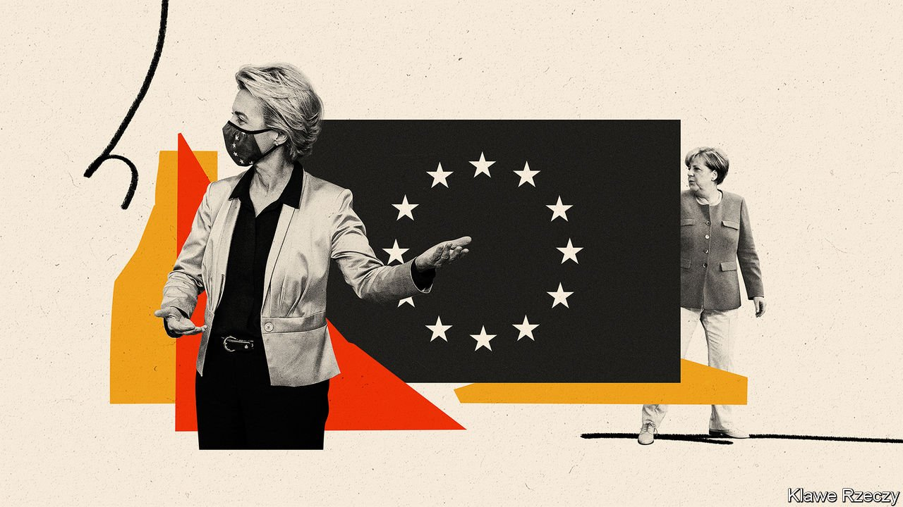

###### The European dilemma

# The European Union will badly miss Angela Merkel 

##### There is no obvious replacement for the chancellor 

 

> Sep 20th 2021 

ANGELA MERKEL’S first EU summit, in December 2005, was a sign of things to come. Tony Blair and Jacques Chirac were locked in combat over the seven-year budget. The chancellor, in office for three weeks, took stock of others’ red lines, schooled Mr Blair and Mr Chirac in the finer details and, after negotiating for hours (and oiling the wheels with German money), brokered a compromise. If the rest of Europe is nervous over Mrs Merkel’s departure, it is because she has made herself the indispensable European: brilliantly briefed, invested in personal relationships, and possessing almost superhuman negotiating stamina.

Mrs Merkel has held Europe together when it counts: leading the charge against Russia after its attack on Ukraine, holding the line on Brexit and now assenting to joint EU borrowing for its post-pandemic recovery fund. But a fair accounting would also find much to criticise. In the euro-zone crisis she forced countries like Greece into punishing austerity and entrenched a narrative of fiscal indiscipline that deepened and lengthened Europe’s recession. In 2015-16 her unilateralism on border policy and negotiations with Turkey infuriated her partners, deepening an east-west split. Many also believe she could have done more to resist the authoritarian drift in Poland and Hungary.


Mrs Merkel is no starry-eyed European. Campaigning in 2005, she said the EU ought to think about returning some powers to governments. Five years later, in a speech to the College of Europe in Bruges, the chancellor expressed scepticism about the “community method”, in which EU institutions like the European Commission and European Parliament (which she is said to dislike) drove integration. As the EU bounced from crisis to crisis, she backed the alternative “union method”, with power shifting back to national governments—none more important than her own.

The European Council, where leaders thrash out deals often shaped by domestic political currents, has become the EU’s central decision-making institution. Presidents of the commission, like José Manuel Barroso and Jean-Claude Juncker, have often had to take a back seat (although the current one, Ursula von der Leyen, a former German defence minister, has quietly strengthened her institution). Mrs Merkel’s approach has not been to everyone’s taste. “She hasn’t been a neutral crisis manager; she’s actively worked against Europe,” complains Alexander Graf Lambsdorff, an FDP MP and former MEP.

Yet the EU and the euro have worked for Germany—so well that it is not obvious why any chancellor should push for radical change. If joining the European project was the condition for readmission to the club of civilised nations after the war, more recently it has been the engine for German prosperity. The trading freedoms of the single market; skilled migrants from, and low-wage labour in, central Europe; and the cheap euro have all been a boon. EU countries account for over half of German exports, even after Brexit. And its economic strength has made the country the most important partner for almost all other EU members.

The next chancellor will face a big test when the commission reviews the EU’s Stability and Growth Pact, which limits fiscal deficits and public-debt stocks. Demand for change will meet fierce resistance from German conservatives. (The subject is sufficiently touchy that officials in Brussels are under instruction to keep their thoughts to themselves until after the German election.) But many governments, including France’s, believe the old rules are ill-suited to an era of low long-term interest rates and pressing investment demands. Some foresee a grand bargain, in which Germany accepts longer-term joint borrowing for the EU in exchange for a return to something closer to the pact’s existing rules.

A bigger question is whether the next government will sign up to ideas associated with Emmanuel Macron’s “strategic autonomy” agenda. In a recent paper Jana Puglierin and Mark Leonard of the European Council on Foreign Relations draw on opinion polling to conclude that Germany “may be on the cusp of a nationalist turn”. The remedy, they argue, is for the next government to make a patriotic case for investment in European sovereignty on matters like screening foreign investments, the international role of the euro and competition policy. Boosting European resilience as a hedge against American unpredictability and Chinese aggression, they argue, may become a condition for ensuring voters’ continuing support for the EU.

Many will take some persuading. And yet as it becomes clearer that the global circumstances that allowed Germany to thrive are disappearing, parts of the establishment are embracing European ideas that would not previously have earned a hearing. Take industrial policy. In 2019 Germany joined France in seeking unsuccessfully to persuade Margrethe Vestager, the EU’s competition supremo, to allow a merger of Alstom and Siemens, two industrial giants, so that it could compete against the Chinese.

Germany has also backed the EU’s “important projects of common European interest”, subsidies for “strategic” investments in hydrogen projects, battery production and the like. It is inching slowly towards translating abstract support for common European defence into reality via joint weapons projects. These developments and others hint at a dawning awareness that economic policy has a geopolitical dimension. And that may suggest the country’s foreign and security policy needs a complete reboot.■

Full contents of this special report


The European dilemma: The European Union will badly miss Angela Merkel*


