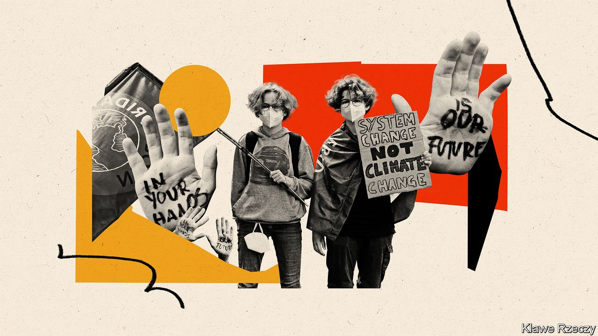

###### Merkelkinder

# The attitudes of Germany’s young 

##### New German voters have no memory of life before Mrs Merkel 

 

> Sep 20th 2021 

THE LITANY of foreign leaders Angela Merkel has outlasted is impressive. Since she took office in 2005, America and France have been through four presidents each, Britain has seen five prime ministers and Italy no fewer than eight. But at home an entire generation has grown up with no memory of another leader. In September 2.8m of these Merkelkinder, making up nearly 5% of the electorate, will be eligible to vote for the first time in a federal election. The Economist met a few at the Sophienschule, a Gymnasium (grammar school) in Hanover. All are near or have just finished their final year of schooling.

For some, the experience of covid-19 was a harsh reminder of political reality in a country where the over-60s make up well over a third of eligible voters. “The pandemic showed how unimportant younger voters really are,” says Marie Sophie Scholz. “Apart from our teachers, no one cared.” All the students have harrowing accounts of failed technology, disrupted home lives, lost motivation and loneliness. Some say their pandemic experiences will influence their vote.


Climate concern looms large. Many students have participated in Fridays for Future climate marches. “The average voter is in their 50s, so for us it’s not enough to vote,” says Julian Köppen. “But we can demonstrate.” Marie is infuriated by condescending politicians who dismiss such actions as excuses for truancy: “If they don’t act now, politics will become a very dark place.” Hannah Sprengel grumbles: “They see what we do, but don’t act.”

Julian is excited by a court ruling that partly struck down the climate law for not taking sufficiently into account the rights of future generations. This approach to sustainability, he reckons, must extend beyond climate to areas like the digitalisation of schools. Max Brinkmann wants more focus on inequality and pensions—and thinks change comes from collective movements (he has joined the SPD). For Julian, a big issue is “security”, by which he means “avoiding international conflicts and not provoking other leaders.”

Mrs Merkel was good at that, he reckons. All students appreciate the chancellor’s calm, rational approach to politics, in contrast to what Max fears has become an “emotional and populist” campaign. “We will miss her,” he says, while conceding that the chancellor “pushed away problems” that seemed too hard to solve. There is some scepticism about assuming Mrs Merkel’s departure will mean rupture. “We don’t have to be nervous,” says Hannah. “No one person will make or break a system.” Still, adds Marie, life after Merkel is “looking into the unknown”.

Full contents of this special report


Merkelkinder: The young’s attitudes*


