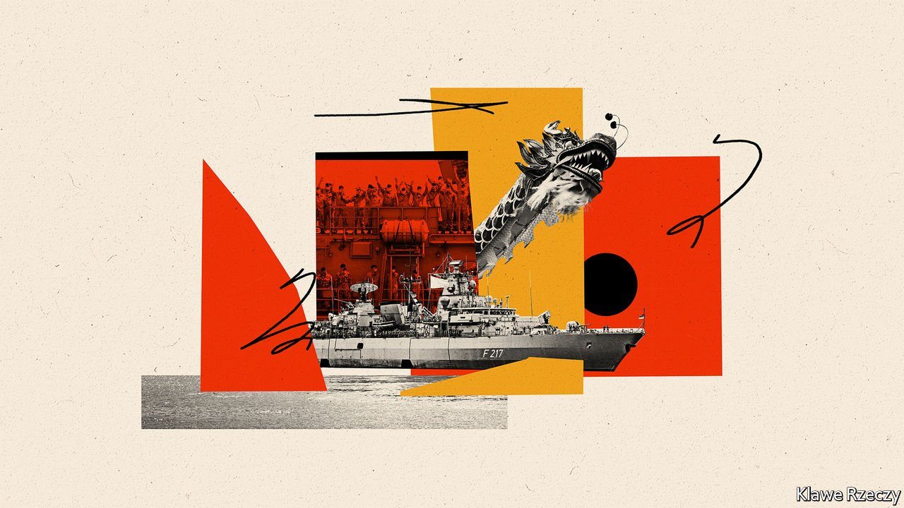

###### Foreign and security policy

# The world needs a more active Germany 

##### A passive (and pacifist) country considers a more active role 

 

> Sep 20th 2021 

ON AUGUST 2ND the Bayern, a Brandenburg-class frigate, set sail from the North Sea coast with over 200 troops aboard and a novel mission. Over seven months the warship would traverse the Suez canal and Red Sea, dropping anchor in places like Mumbai before reaching the South China Sea, where an assertive China is intimidating neighbours with unfounded territorial claims.

“Germany has a strong interest in stability, security, and rules-based politics in the region,” says Annegret Kramp-Karrenbauer, the defence minister. “We are not a regional power, but we support our partners.” This is unusual talk from a German politician. The frigate’s dispatch was a signal of intent to China and reassurance to allies. It also tells a story of a political class struggling to make sense of Germany’s role in a changing world.


Ms Kramp-Karrenbauer, once considered a successor to Mrs Merkel, suggested sending a frigate in 2019. But peacenik SPD MPs objected. Wary of upsetting her grand coalition’s balance and ill-disposed to provocations, Mrs Merkel leaned on her former protégée to compromise. True to form, the internal problem was externalised: the Bayern would steer clear of disputed territories in the South China Sea and seek permission to dock in Shanghai. The decision confused Germany’s allies, including America. What exactly was Germany trying to achieve?

The next government will face serious foreign-policy challenges. Some are familiar: a Russian menace, an underfunded Bundeswehr, cyber threats, the risk of a fresh migrant crisis, perhaps from Afghan refugees. The first test for the next chancellor, speculates one official, may come from a French request to shore up Germany’s presence in Mali, already its largest overseas military deployment.

The biggest strategic issue will be the recalibration of relations with China. Over the years Mrs Merkel fostered an agreeable coupling between the growing Chinese market and German exporters. China has been the country’s biggest trading partner since 2016. But this was not glorified mercantilism. Spotting China’s potential earlier than most, and fearing European decline, Mrs Merkel has sought to manage China’s rise, not contain it.

But the relationship has started to sour. The trophy of Mrs Merkel’s engagement, an EU-China investment treaty she pushed last year, is in the deep freeze because the European Parliament will not ratify it. The Greens, likely to join the next government, are human-rights hawks on China. Even the CDU manifesto is tougher than previous iterations. There is a sense that, as Mikko Huotari, head of the MERICS think-tank, puts it, “Germany’s China policy will have to be recalibrated on most fronts.”

Big industries like cars and chemicals have not withdrawn their long-term bets on Chinese growth. But other sectors have grown tired of the costs of doing business with China. In 2019 the Federation of German Industries (BDI) issued a paper calling China a “systemic competitor” and urging policy changes. Such developments have inspired German support for a bolder EU industrial policy. “We see China as a partner, a rival and a competitor,” says Jens Spahn, the CDU health minister, describing the EU’s taxonomy of relations. “None of this includes dependence—and this worries me.”

Mrs Merkel’s attempts to bring China into the multilateral fold were grounded in a conviction that globalisation could work only if the biggest economies signed up to its rules. But the emerging competition between America and China, which extends far beyond the military sphere, makes this harder. Some firms have started to hedge. Carmakers are ramping up battery production in Europe. Companies will have to think how to navigate patchwork rules, where to locate R&amp;D centres and how much distance to keep between head office and Chinese subsidiaries. Even the semiconductor shortage—a product not of trade wars but of supply-chain hiccups—is a reminder of latent vulnerabilities. All this, says Mr Huotari, shows that “China is no longer an all-in bet”. And some officials fret about Chinese economic and diplomatic pressure.

Belts and roads

Take Duisburg, a debt-ridden former industrial hub fallen on hard times. Home to Europe’s largest inland port and part of one of its most densely populated states, Duisburg is seeking redemption through China’s Belt and Road Initiative, an infrastructure-and-influence programme for which it is the European terminus. Some 70 trains make the 17- to 22-day journey between China and Duisburg every week, bearing electronics, vehicles and other goods for European consumers (and returning with machine tools, car parts and food). “Duisburg has become very famous in China,” says Jinheng Feng, who gave up an academic job in 2017 to set up a consultancy for Chinese firms interested in doing business in the city.

“The New Silk Road is a big chance for Duisburg to build a new economy,” says Rasmus Beck of the city’s economic-development agency. If the results beyond container trade have been limited, officials speak brightly of building “bridges of knowledge”, with China offering tech expertise while learning from Duisburg’s experience of post-industrial transformation. Having found a model that holds promise for Duisburg’s reinvention, few are interested in having it tested by shifts in geopolitics. They point out that, unlike Greece and Italy, Duisburg has been careful to avoid selling big stakes in infrastructure to Chinese investors.

A forthcoming paper by Roderick Kefferpütz, also at MERICS, says China has become adept at leaning on officials in decentralised Germany. In North Rhine-Westphalia, home to Duisburg, America and Britain have given quiet warnings of Chinese economic influence. In 2018 critics howled when the city signed a deal with Huawei—a now-ailing Chinese tech giant with its European headquarters in nearby Düsseldorf. Elsewhere, cities that fly Tibetan flags or allow Falun Gong protests have been criticised by the Chinese embassy. Andree Haack, head of Duisburg’s economic department, sums up China’s insertion into multiple dimensions of governance. “You can see big politics is coming to the local level. But we have been given no European answer to the digital transformation.”

Germany has grown rich on the back of a benign global order it did little to support. If challenged, it could sprinkle on its trade policy a dash of Wandel durch Handel (“change through trade”, the notion that growth will liberalise autocratic states), a hypocritical idea it suited everyone to pretend to believe. Leaders agonised endlessly over foreign deployments or giving the Bundeswehr armed drones. An idealistic worldview “prevented them from acknowledging that some powerful players do act in amoral, cynical and militaristic ways,” argues Maximilian Terhalle at King’s College London.

Under pressure from allies, this picture has slowly changed. The defence budget, though short of the NATO target of 2% of GDP, has risen since 2015. Germany spearheaded the EU’s diplomatic response to Russia’s attack on Ukraine, and its troops head a NATO “tripwire” force in Lithuania. Some 2,500 soldiers contribute to 11 multilateral missions abroad, and Germany is a partner in joint European defence ventures like the Future Combat Air System.

Yet this hardly adds up to a strategic outlook grounded in a sense of the national interest. It is not hard to conjure scenarios that would send officials into a tailspin, says Claudia Major, who works at the German Institute for International and Security Affairs. What if America withdraws its nuclear weapons? What if dithering over arms-export rules or new technologies hinders the development of European defence schemes? What if tensions over Taiwan threaten global free trade? The recent Afghanistan debacle, fears Ms Major, may make the country even more inward-looking by strengthening those who argue that interventions never work.

After the Bayern’s departure, the Chinese government issued a hostile statement asking Germany to clarify its intentions before it extended an invitation to Shanghai. Officials in Berlin who had struggled to resolve the ambiguity of the mission were relieved: Beijing had, in a sense, done the job for them. But the country cannot rely on others to fix its problems for ever. “More and more Germans realise that their prosperity, freedom and security require more strategic thinking and acting,” says Ms Kramp-Karrenbauer. “Most important, they realise that doing nothing and being the good guy are not always the same thing.”■

Full contents of this special report


Foreign and security policy: The world needs a more active Germany*


