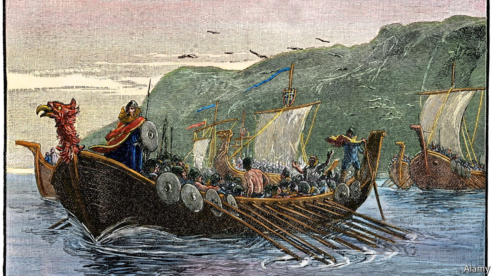

###### Medieval mapping

# A monk in 14th-century Italy wrote about the Americas 

##### That was long before Christopher Columbus set sail 

 

> Sep 25th 2021 

 THAT VIKINGS crossed the Atlantic long before Christopher Columbus is well established. Their sagas told of expeditions to the coast of today’s Canada: to Helluland, which scholars have identified as Baffin Island or Labrador; Markland (Labrador or Newfoundland) and Vinland (Newfoundland or a territory farther south). In 1960 the remains of Norse buildings were found on Newfoundland.

But there was no evidence to prove that anyone outside northern Europe had heard of America until Columbus’s voyage in 1492. Until now. A paper for the academic journal Terrae Incognitae by Paolo Chiesa, a professor of Medieval Latin Literature at Milan University, reveals that an Italian monk referred to the continent in a book he wrote in the early 14th century. Setting aside the scholarly reserve that otherwise characterises his monograph, Mr Chiesa describes the mention of Markland (Latinised to Marckalada) as “astonishing”.


In 2015 Mr Chiesa traced to a private collection in New York the only known copy of the Cronica universalis, originally written by a Dominican, Galvano Fiamma, between around 1339 and 1345. The book once belonged to the library of the basilica of Sant’Ambrogio in Milan. In Napoleonic times, the monastery was suppressed and its contents scattered. The owner of the Cronica let Mr Chiesa photograph the entire book and, on his return to Milan, the professor gave the photographs to his graduate students to transcribe. Towards the end of the project one of the students, Giulia Greco, found a passage in which Galvano, after describing Iceland and Greenland, writes: “Farther westwards there is another land, named Marckalada, where giants live; in this land, there are buildings with such huge slabs of stone that nobody could build them, except huge giants. There are also green trees, animals and a great quantity of birds.”

Mr Chiesa says that giants were a standard embellishment of faraway places in Norse folklore and, indeed, Galvano cautioned that “no sailor was ever able to know anything for sure about this land or about its features.” The Dominican was scrupulous in citing his sources. Most were literary. But, unusually, he ascribed his description of Marckalada to the oral testimony of “sailors who frequent the seas of Denmark and Norway”.

Mr Chiesa believes their accounts were probably passed on to Galvano by seafarers in Genoa, the nearest port to Milan and the city in which the Dominican monk is most likely to have studied for his doctorate.

His thesis raises a new question: why does the eastern seaboard of America not feature on any known Genoese map of the period? But it could help explain why Columbus, a Genoese, was prepared to set off across what most contemporaries considered a landless void.■

