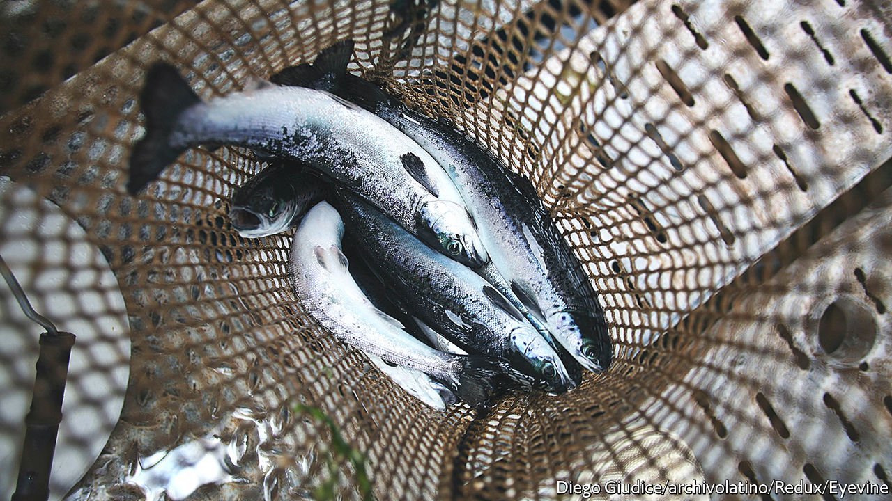

###### Fishing for compliments

# Chilean salmon take a vigorous leap towards sustainability 

##### Fish farmers are feeding them fewer drugs 

 

> Sep 23rd 2021 

IN 2015 ALEXIS SÁNCHEZ, a Chilean footballer, scored the decisive penalty in the Copa América final against 14-times winner Argentina, ending Chile’s 100-year dry spell in the tournament. Now Chilean officials hope he will give the country’s export market a similar boost. He is the face of a campaign launched in June by ProChile, a government agency. Arturo Clément, the president of SalmonChile, an industry body, hopes it will depict the country as a world-class exporter of sustainable fish.

Fish farming is supposed to provide cheap piscatorial protein while also relieving pressure on the oceans. But critics say its environmental virtues are overstated, because carnivorous farmed fish, such as salmon and trout, are given feed derived from wild fish. Globally much of the industry has become more sustainable over the past two decades, by putting salmon on a partially plant-based diet or reducing the use of antibiotics to treat their diseases.


Chile’s fish-farming industry still has a way to go. It uses more antibiotics than its competitors: for every tonne of salmon produced, fish are showered with an estimated 500g of bacteria-killing medicine, compared with hardly any at all in Norway. Chile lags in standards for the discharge of nutrients into waste water, which are around 15 times stricter in Europe, Australia and the United States. In 2016 two harmful algal blooms, caused in part by unusually high ocean temperatures, poisoned shellfish and killed millions of farmed salmon. Many accused producers of exacerbating the problem by dumping into the ocean 4,500 tonnes of rotting fish that died in the first bloom. A government report dismissed the possibility that the salmon industry fuelled the blooms, but an independent task-force said it was possible that rotting biomass had contributed.

The country’s environmental rules are a hangover from the dictatorship of General Augusto Pinochet. The military junta wanted to diversify the country’s exports from copper; salmon farming was seen as a valuable way of doing so. It is now Chile’s second-biggest export. But fishing policies rarely took the environment into account. Over the past decade reforms have benefited fish producers rather than try to mitigate farming’s ecological impact, argues Beatriz Bustos at the University of Chile.

Some producers are trying to change. Between 2017 and 2019 antibiotic use declined by nearly a third. More than half of the 155 members of Chile’s constitutional assembly, elected this year to write a new constitution, want to boost environmental protections. This reflects a growing demand for greener policies. If the fish farmers do not mend their ways, they risk being regulated out of existence.■

